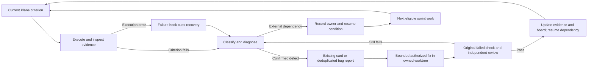

# Claude Code operation and configuration

Configuration audit: 2026-09-09. Current product state remains in [COMPLETION_PLAN.md](COMPLETION_PLAN.md). This runbook connects the Claude CLI to the existing project contracts, worktrees, Plane and evidence; it is not another release plan.

## Instruction layout

| Surface | What belongs here | This repository |
|---|---|---|
| Root `CLAUDE.md` | Short startup path, durable constraints, command/routing pointers | Imports `docs/PROJECT_CONTRACT.md`; avoids importing the Codex-specific OMX control surface wholesale |
| Scoped `CLAUDE.md` | Directory-specific contract | `windows-pilot/CLAUDE.md` and `extensions/moe-principal-assistant/CLAUDE.md` import their existing `AGENTS.md` |
| `.claude/rules/*.md` | File-path-specific working rules | TypeScript/React, Windows scripts, CLI/CI tooling, documentation/evidence |
| `.claude/skills/*/SKILL.md` | On-demand repeatable workflow | Existing domain skills and `ga-sprint-driver`; load the selected skill, not the whole catalog |
| `.claude/agents/*.md` | Bounded specialist role, tool scope, output contract | Existing build/recovery/acceptance specialists; author and reviewer are separate contexts |
| `.claude/settings.json` | Shared hook and plugin configuration | Quoted WhatsApp Bash guard with a timeout; worktree base `head`; three official plugins |
| Local/user configuration | Machine tools, provider authentication, personal plugins/MCP | Keep secrets and private endpoints out of git; inspect metadata without copying raw configuration |

Claude reads `CLAUDE.md`, not `AGENTS.md` automatically. Path-scoped rules load when matching files are read; workflow skills provide on-demand context. Keep root instructions concise and use imports for shared contracts. These are instruction mechanisms, not hard permission enforcement. [Official memory guidance](https://code.claude.com/docs/en/memory), [skills](https://code.claude.com/docs/en/skills), [subagents](https://code.claude.com/docs/en/sub-agents).

## Match tools to the actual files

Audit baseline, tracked files before these edits: 550 `.ts`, 81 `.tsx`, 102 `.ps1`, 70 `.mjs`, 15 `.sh`, 11 `.py`, 423 `.md` and 105 `.json`. `src/` owns renderer flows, `electron/` owns Main/runtime, `extensions/` owns domain tools, and `windows-pilot/` owns Windows operations. [Repository map](REPOSITORY_GUIDE.md).

| Files | Selected practice/tool | Required proof |
|---|---|---|
| TypeScript/React | Official `typescript-lsp` for definitions/references/symbols; existing TypeScript, Vitest and ESLint commands | Focused behavior tests, `pnpm typecheck`, `pnpm lint:check`; applicable harness/E2E |
| PowerShell | Existing SSH/IAP skill and copied parameterized scripts; honor Windows PowerShell 5.1 requirements | Parse checks plus actual Windows execution and typed receipt; Mac execution is a different environment |
| Python, shell, Node scripts | Argument arrays, explicit cwd/deadlines, preserved exit status, redacted receipts | Targeted script tests or syntax checks; required runtime behavior separately |
| Markdown, YAML, JSON | Instruction-management plugin, scoped rules, schema/frontmatter/link checks | Parse and consistency checks; evidence claims checked against receipts |
| Product PDF/Office skills/assets | Keep existing shipped OpenClaw skill/package inventory | Installed application acceptance; installing a developer CLI plugin does not upgrade the product |

LSP diagnostics complement the compiler and tests. TypeScript's `noEmit` supports checking without generating output. PowerShell modules can differ across platforms and runtimes. [TypeScript](https://www.typescriptlang.org/tsconfig/noEmit.html), [Microsoft portability guidance](https://learn.microsoft.com/en-us/powershell/scripting/dev-cross-plat/writing-portable-modules), [language-server source](https://github.com/typescript-language-server/typescript-language-server).

## Installed plugin selection

The host inventory contained 149 installed plugins with three enabled: OMC, Claude Mem and the Codex review plugin. This audit adds the following at **project scope**, preserving the existing user configuration:

| Plugin | Purpose | Operation |
|---|---|---|
| `typescript-lsp@claude-plugins-official` | Navigation and diagnostics for the dominant source language | Requires `typescript-language-server` on PATH; verify an actual LSP response |
| `claude-md-management@claude-plugins-official` | Review instruction quality and maintain useful project memory | Invoke for an instruction-maintenance task, not on every turn |
| `claude-code-setup@claude-plugins-official` | Reassess automation against the repository | Invoke when tooling or project needs change |

The official TypeScript plugin carries its LSP configuration in the marketplace entry (`strict: false`); absence of a standalone `.lsp.json` in its cache is not itself a defect. The executable prerequisite was missing. Installed `typescript-language-server@6.0.0` and `typescript@5.9.3` under the operator's `~/.local` prefix; the project compiler dependency was not changed. Node 26.7.0 meets the server's declared Node requirement.

Reproduce on a developer host after checking its runtime versions:

```sh
npm install --global --prefix "$HOME/.local" typescript-language-server@6.0.0 typescript@5.9.3
claude plugin install typescript-lsp@claude-plugins-official --scope project
claude plugin install claude-md-management@claude-plugins-official --scope project
claude plugin install claude-code-setup@claude-plugins-official --scope project
claude plugin list --json
```

Ensure the developer CLI's PATH includes the prefix's `bin` directory. At a safe command boundary, `/reload-plugins` reloads plugin skills, agents, hooks, MCP and LSP components. Verify the actual components after reload. A plugin listing is configuration evidence, not proof that its executable started. [Official plugin guide](https://code.claude.com/docs/en/plugins), [plugin reference](https://code.claude.com/docs/en/plugins-reference).

Keep one orchestration owner: existing OMC plus project workflows. Codex review stays additive as assigned; do not silently multiply review rounds. Existing Claude Mem is supplementary history; it does not supersede current plans or receipts. No memory-plugin upgrade or provider change was made by this audit.

## CLI lanes, direct messaging and supervision

Use normal interactive Claude for the lead and for native cross-session messaging/LSP. Use `scripts/claude-runner.py` for bounded independent author/reviewer jobs with explicit source ownership and deadlines. Its bare lane must explicitly read the project contract and selected skill; `--bare` skips automatic hooks, LSP and CLAUDE.md discovery. The audited bare messaging probe exposed neither native messaging tool; a normal project-scoped CLI exposed both. Do not assume an allowlist creates an unavailable tool. [Programmatic usage](https://code.claude.com/docs/en/headless).

Stream programmatic prompts on stdin, as the runner does. A positional prompt after the variadic `--tools` option was consumed as another tool argument in the follow-up probe, producing “Input must be provided.” Correcting prompt delivery produced a valid result. Verify exit status **and** a final result event; launch success or an empty stream is insufficient. For MCP probes, `--strict-mcp-config` must include the selected server explicitly; an empty strict configuration does not test an installed memory server.

```sh
claude agents --json --cwd "$PWD"
python3 scripts/claude-runner.py run --help
```

The normal lead uses `ListAgents` to resolve the exact named session and `SendMessage` to deliver a concise card/ownership/evidence/next-action message. Require the send receipt and distinguish it from recipient acknowledgement. Keep the normal coordinator session alive when replies or idle notices are required: a one-shot `-p` sender exits and its reply socket disappears. This audit verified delivery and a terminal acknowledgement; the reply to the exited relay failed, as recorded in the receipt. `notify_when_idle` provides one-shot completion notices without repeated polling. Bedrock supports same-machine messaging on the audited CLI; cross-machine Remote Control requires a different authentication path. Do not write inbox socket files or impersonate a peer. [Official cross-session messaging](https://code.claude.com/docs/en/cross-session-messaging).

Native worktrees now default to the current checkout's `HEAD`, preserving in-progress source history. For an exact candidate SHA, use `git worktree add` explicitly. Record SHA, branch, worktree, owner and acceptance criterion. Worktrees separate file edits; VM sessions, ports, credentials and external services still require a single operator. Project plugins are shared across linked worktrees. [Official worktree behavior](https://code.claude.com/docs/en/worktrees).

Monitor process liveness and actual progress separately: heartbeat, last output, deadline, observed model/provider, result event, evidence delta and exact remaining criterion. `CLI_SUCCEEDED` only establishes a successful CLI completion. The active lead's requested Fable model automatically fell back to Opus after a recorded refusal; preserve the event and report the observed model. Never use another agent or model to evade a refusal.

## Continuation and hook policy

`ga-sprint-driver` now continues an authorized outcome through checkpoints. A long operation needs a suitable timeout, durable progress and one owner; it does not need to wait for the next scheduler tick. After an interrupted write, inspect the resulting state before retrying. End only at a verified exit, user hold or concrete blocker after useful independent work is exhausted.

Use `/loop` for polling/watchdog work. A fixed timer is not a continuous completion controller. The first configuration pass left the old two-hour GA timer unchanged; a live `/goal` status check on September 9 returned **No goal set**. The follow-up activates the native controller below. [Official scheduling](https://code.claude.com/docs/en/scheduled-tasks), [verification practices](https://code.claude.com/docs/en/best-practices).

The existing project Bash guard now quotes the repository path and has a ten-second timeout. Its tested scope is recognized Bash WhatsApp-send patterns; it is not a universal native-MCP authorization gate. Existing outward-action rules still apply. User hooks were inspected: the SessionStart/Stop gates primarily target another project; they were not disabled. No automatic GUI, build, full-suite or paid-review hook was added.

Use hook stdin `cwd` for active-worktree facts: `CLAUDE_PROJECT_DIR` stays at the launch root. Settings hooks are normally refreshed by the file watcher; use `/hooks` to inspect the effective source. Test hooks with synthetic input and a private temporary ledger. [Hook reference](https://code.claude.com/docs/en/hooks).

### Activate and resume the controller

Use the existing normal Claude lead from the repository root. Inspect `claude agents --json --cwd "$PWD"`, its pending input and `/goal` status before changing anything. Verify its effective permission mode allows the authorized work without tool prompts; this operator already authorized the lead's bypass mode. A goal itself grants no additional permissions. Keep the recorded provider and external-service ownership. The bounded bare runner is for assigned author/reviewer jobs, not the plugin-enabled lead.

Set one native goal with a demonstrable boundary, for example:

```text
/goal Follow ga-sprint-driver and the current Plane GA closure sprint. Complete every executable required acceptance slice with test/artifact evidence and verified board readback. At a blocked dependency, execute eligible independent sprint work. Finish only when no executable required slice remains, with every remaining criterion's evidence, dependency, owner and exact resume action recorded in the existing completion plan and owning card. A blocked disposition remains GA RED. Preserve review, artifact identity, owner holds and action gates. Surface evidence in the conversation for the evaluator; a plan or checkpoint alone is insufficient.
```

Send the actual Return and verify the native `Goal set` receipt, `/goal` status and subsequent tool activity. Prefer a short native command typed directly, with detail in this runbook and the sprint skill:

```text
/goal Complete all executable Plane GA sprint acceptance work using ga-sprint-driver; evidence remaining blockers without claiming GA.
```

Use bracketed paste for long **ordinary messages**, then Return after input renders. In this CLI, a whole slash command inside a collapsed paste reached Claude as ordinary text. The short literal command above produced the native `Goal set` receipt, including while work was active. The first unbracketed bulk attempt after the status panel delivered only its final 153 characters; its low-level truncation cause remains unproven. Dismiss panels and let the prompt return before sending text. Never overwrite pending operator input or interrupt an active external write. Delivery of text alone does not prove a native command handler ran.

The controller asks a separate model to evaluate the conversation after each completed turn. Its verdict is evidence that continuation ran, not an independent test execution or a release approval. Keep test/board receipts visible to that evaluator. Check `/goal` for status; `/goal clear` stops it. Resume the same session with `claude --resume <session-id>` from the root, then check status: an active goal is restored, but an achieved/cleared one is not. Authentication, unavailable-model, credit and unrecoverable-context failures require fixing the cause and setting the goal again. Background work can defer evaluation. [Official goal behavior](https://code.claude.com/docs/en/goal).

Lifecycle limits matter: repeated no-tool turns can pause a still-set goal; interactive background check-ins are capped at three between operator prompts. Inspect the reason and outstanding task receipts before deliberately resuming. Do not assume a goal indicator alone proves progress.

Ask the lead to use `CronList` and cancel only a superseded GA task through `CronDelete`; never edit scheduler state files or cancel other projects' jobs. Do not layer OMC Ralph, a custom Stop loop and `/goal` on the same outcome. Existing protective hooks stay enabled. For a real pending job use its completion event, native idle notice or bounded `Monitor` output before adding a polling timer. `/loop` requires a running host/session and recurring schedules expire after seven days; it does not recover a stopped Mac or replace Windows interactive authentication. [Scheduler lifecycle](https://code.claude.com/docs/en/scheduled-tasks).

### Route tools without loading everything

Discover the lead's actual tools once and select only the row needed for the next decision. Installed/configured is distinct from a successful call. Keep credentials and raw personal histories out of memory retrieval, prompts and receipts.

| Question | Tool path | Bounded use and fallback |
|---|---|---|
| Which acceptance can advance now? | Current plan, live Plane, existing board scripts | Read the selected sprint/card criteria and dependencies; sync after a material delta and verify readback. A blocked VM card does not automatically block independent source work. |
| Did we solve this earlier? | `claude-mem:mem-search` | Project-filtered `search` index → relevant `timeline` → selected `get_observations` IDs. Verify lessons against current source and receipts. If unavailable, search the relevant maintained bug report; do not ingest raw session logs. |
| Where does this code live? | `claude-mem:smart-explore`, official TypeScript LSP | `smart_search` → selected `smart_outline`/`smart_unfold`; LSP definitions/references for typed relationships. Use `rg` for exact strings or unsupported file types. Avoid reading the same large file through every tool. |
| What else could this edit affect? | LSP references or configured `code-review-graph` MCP | Discover tool schema and index scope/freshness; a stale index is advisory. Cross-check affected callers/tests before editing. Fall back to focused repository search. |
| How do we execute this Windows/Microsoft/build step? | Existing project domain skill and scoped contract | Load only the relevant procedure. One VM operator; source fixes and independent reviews may run in separate worktrees. |
| Is an assigned peer/job making progress? | `ListAgents`/`SendMessage`, native background task results, runner receipts | Name card/SHA/owner/output. Keep the sender alive for replies; use `notify_when_idle` for completion. A heartbeat is not acceptance. |
| What should survive the next context? | Existing plan/card/evidence, then concise project memory | Save the verified decision, failed alternative and source reference. Memory supplements those records; it does not create another current plan. |

Memory and exploration tool names above were checked against installed Claude Mem 10.5.2 skill sources. Scope queries to this project and the selected question; empty results do not prove no earlier solution exists. These developer tools do not add features to the shipped OpenClaw application. Guidance maintenance (`claude-md-management`, `claude-code-setup`) is on demand, not an every-turn task.

A normal-CLI probe of that installed MCP server passed a project-filtered memory index query (three observation rows, no full observations fetched) and `smart_outline` on `src/lib/utils.ts`; LSP returned 20 symbols on the same file. This proves those calls in the probe configuration, not that every configured MCP/index is healthy or current in every session. [Dated evidence](evidence/claude-goal-controller-20260909.json).

Claude/Bedrock remains the author/reviewer execution path. Do not invoke the enabled Codex review plugin merely because it is installed. Retain any explicitly assigned cross-model requirement, record availability and avoid duplicate reviews or full suites on unchanged revisions.

### Failure recovery hook

The project `PostToolUseFailure` command hook routes execution errors to **Recover a blocker** in `ga-sprint-driver`. It emits fixed guidance only, never copies tool input/error contents, changes a tool result or runs a repair itself. Claude diagnoses and executes the authorized repair under the existing goal. User cancellations and invalid hook input receive no recovery context. Pre-execution validation/permission denials and logical acceptance failures are not covered by this event; the controller still handles their reported results. [Official failure event](https://code.claude.com/docs/en/hooks#posttoolusefailure).

The hook uses the development host's existing `python3` and has a five-second timeout; check that executable when moving the lead to another host. It is not a shipped Windows application dependency. Bare CLI jobs skip this hook; their supervisor's failure receipt enters the same recovery procedure through the lead.



An unchanged transient idempotent/read-only operation gets one checked retry. A repeated failure needs a different hypothesis or an explicit dependency. Expected negative controls do not automatically create bugs; reviewers remain read-only. A source fix never substitutes for installed or account acceptance. When no executable criterion remains, checkpoint once with GA RED and the exact required external change; do not create a polling loop over unchanged blockers. Live controller status and hook checks belong in [the dated receipt](evidence/claude-goal-controller-20260909.json).

## Research and version checkpoint

Official changelog checked September 9: installed CLI moved to 2.1.266 while the existing lead still ran its already-launched 2.1.265 process. The 2.1.266 entry fixes a gateway/proxy authentication regression; 2.1.265 includes resumed-subagent prompt-cache, interrupted-resume and background-session fixes. Record running and installed versions separately; do not restart an active installer operation to chase a patch. [Official changelog](https://github.com/anthropics/claude-code/blob/main/CHANGELOG.md).

Popular repository sample, GitHub API metadata and primary READMEs checked September 9; stars are a dated discovery signal, not a quality verdict:

| Repository | Stars at audit | Decision for this project |
|---|---:|---|
| [Superpowers](https://github.com/obra/superpowers) | 283,474 | Useful bounded planning, debugging and independent-review patterns; avoid adding a second whole workflow framework |
| [ECC](https://github.com/affaan-m/ECC) | 254,479 | Study modular rules and harness practices; no wholesale configuration import |
| [Anthropic skills](https://github.com/anthropics/skills) | 175,282 | Primary skill examples; select by task and per-skill license |
| [gstack](https://github.com/garrytan/gstack) | 132,172 | Review/QA role separation is relevant; browser ownership and deployment conventions need project-specific adaptation |
| [Claude Mem](https://github.com/thedotmack/claude-mem) | 93,523 | Existing install retained; upstream installation/provider behavior has changed, so no blind upgrade |
| [Awesome Claude Code](https://github.com/hesreallyhim/awesome-claude-code) | 53,724 | Discovery index; verify selected components at their primary source |
| [OMC](https://github.com/Yeachan-Heo/oh-my-claudecode) | 39,062 | Existing orchestration kept; bind work to our Plane acceptance and single VM owner |
| [Official plugins](https://github.com/anthropics/claude-plugins-official) | 36,065 | Selected instruction-maintenance, setup and TypeScript plugins |

## Verify and hand off

Run JSON/frontmatter/link checks, the hook synthetic pass/block cases, and an actual normal-CLI LSP/messaging probe. Check the number of objects each validator inspected: the audited `claude plugin validate .claude` discovered commands but did not enumerate project skills/agents, so that result alone cannot certify their frontmatter. Validate those files explicitly with a YAML parser and check runtime discovery.

Post the meaningful delta on CLWX-128 through the verified Plane writer, verify readback and export the board. Keep runtime/installed GA gaps on the release owner's existing cards. Private audit receipts are under `artifacts/ga-autonomy-audit-20260909/`; the transferable defect record is [CLWX-128 configuration findings](bugs/CLWX-128-claude-session-configuration.md).

Verified audit result: independent Claude review APPROVE; all 49 frontmatter files parse, hook positive/negative controls pass, normal CLI LSP and messaging pass, and the live lead acknowledged plugin reload. [Sanitized validation receipt](evidence/claude-configuration-20260909.json).
