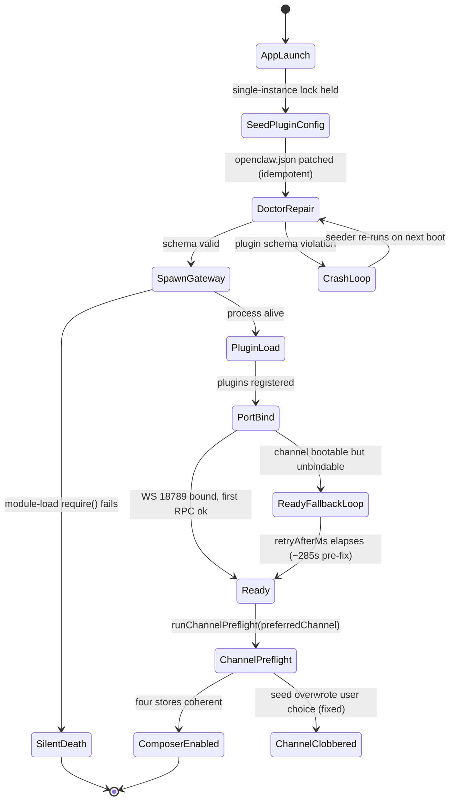
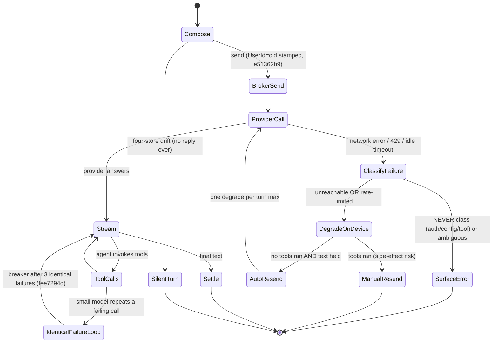
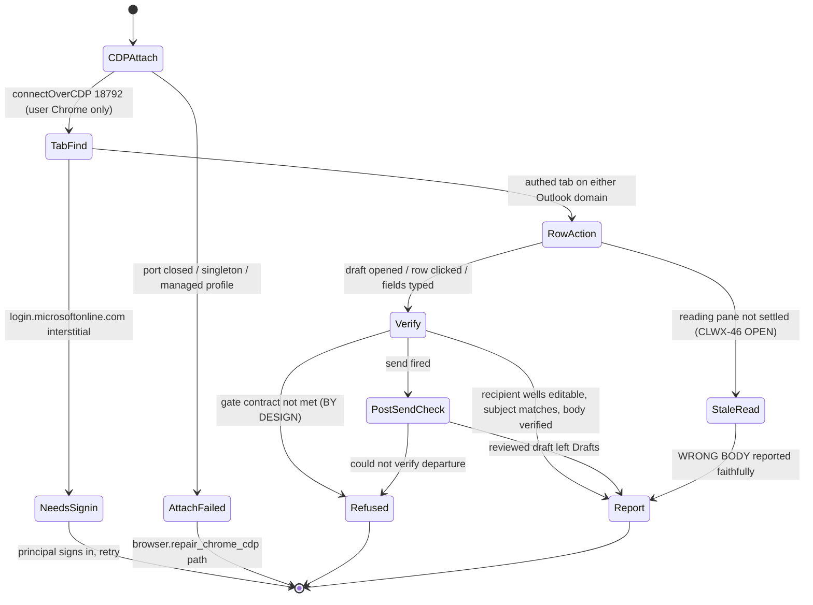
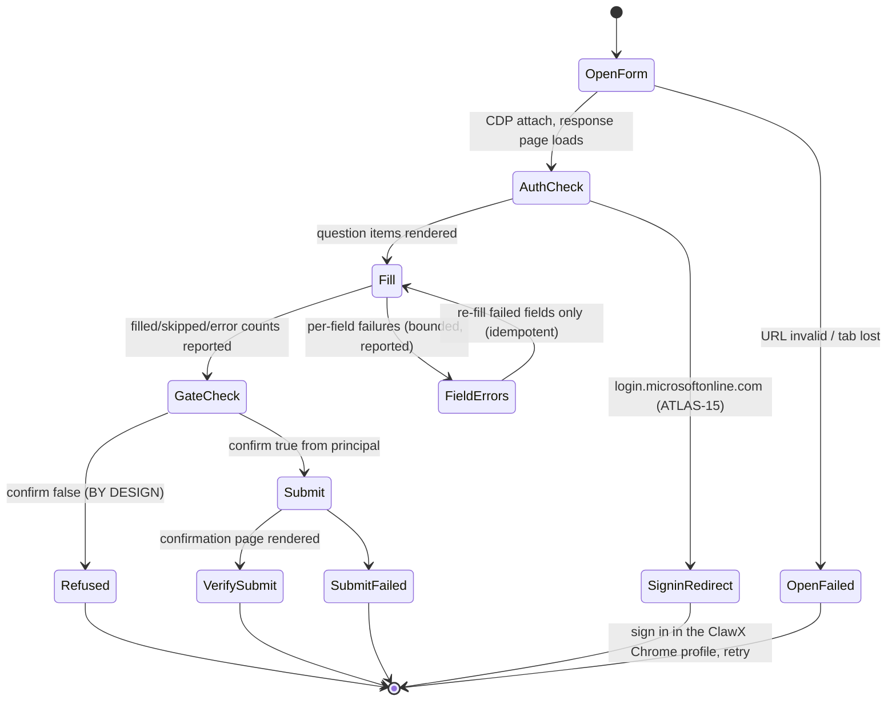
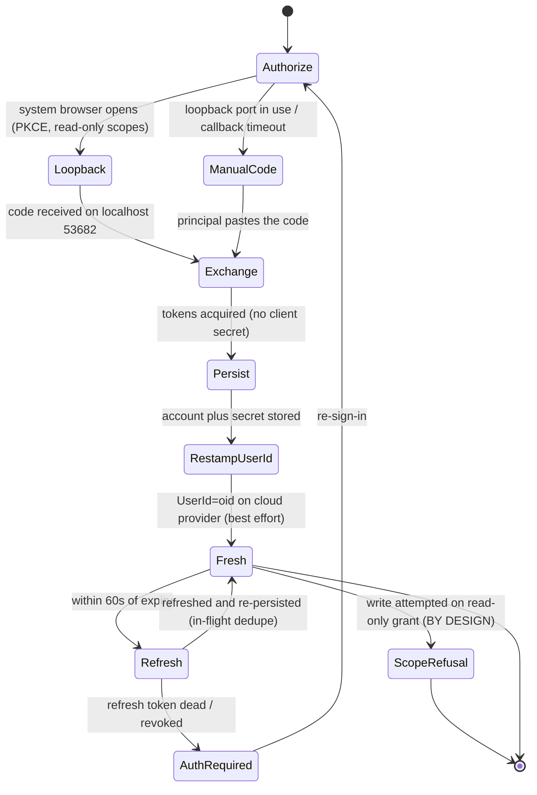
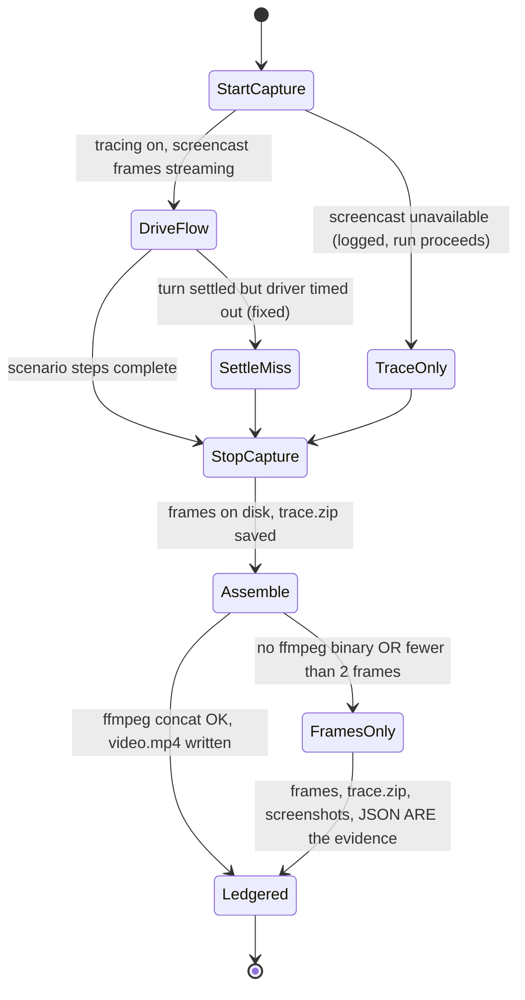

# Flow state diagrams — demo-critical flows, failure modes, and recovery

_Authored 2026-09-03. Resilience engineering pack for the Ministry of Education
app. Every failure mode below is grounded in a REAL incident: the Windows
problems atlas (`docs/WINDOWS_PROBLEMS_ATLAS.md` §1–§15), the GA sprint flight
checks (`docs/GA_SPRINT_STATE_VECTOR.md` §3 — every PF/IF/PT row has a scar),
and the defect register (`docs/DEFECT_REGISTER_2026-09-02.md`). Nothing here is
speculative. Companion operational skill:
`.claude/skills/demo-flow-recovery/SKILL.md` (symptom → state → command)._

## Retry doctrine (applies to every flow)

Three rules, consistent with the degrade classifier (`src/lib/channel-degrade.ts`)
and the hard-confirm contracts:

1. **Bounded retries only on idempotent steps.** Live examples in-tree: the
   atomic-rename EPERM retry (5 attempts, linear backoff,
   `electron/utils/channel-config.ts::writeOpenClawConfig`), the recipient-well
   recheck loop (8 attempts, `outlook-actions.ts`), the body-fill verify poll
   (24 attempts). A retry that can double a side effect is forbidden.
2. **Never retry through a confirm gate.** `outlook.send_email`,
   `download_attachment`, and `forms submit` refuse without `confirm:true`
   (plus subject-match for send). A refusal is a SUCCESS state of the gate,
   not a failure to retry around. Automation may re-verify and re-present;
   only the principal (or `DEMO=1` in the sandbox lane) re-fires the gate.
3. **Fail loud on the auth/config class — never mask with degrade.** The
   classifier's `NEVER_DEGRADE_PATTERNS` (401/403, invalid/missing key,
   permission denied, content filter, context overflow, tool errors) surface
   unchanged. Degrading over an auth fault turns "your key is wrong" into
   "the assistant is oddly always on-device" — indefinitely masked.

**Owner taxonomy** used in every transitions table:
- **code** — the shipped product recovers automatically.
- **agent** — a `.claude/agents/*` sub-agent or skill diagnoses/repairs
  (dev/ops loop, not in-product).
- **human** — principal, operator, or owner action required by design.

---

## Flow 1 — Gateway boot

Spawn → plugin load → port bind → ready → composer enabled. The single most
scarred flow in the tree (six named incidents).

### Transitions and failure modes

| State/transition | Failure mode (incident) | Detection signal | Recovery method | Retry owner |
|---|---|---|---|---|
| SpawnGateway → SilentDeath | `Cannot find module 'playwright-core'` — devDep stripped from asar (Atlas §1, moe.9) | PID alive, **0 bytes stdout/stderr**, no userData, no ports open | No runtime recovery possible — prevention only: dep moved to `dependencies` (`e26a702`) + `//runtime-deps-note` guard comment; `dependency-class-auditor` runs before every `package:*` (PF-5) | agent (pre-build) |
| DoctorRepair → CrashLoop | Plugin schema violation: `microsoft-graph` / `moe-principal-assistant` required keys missing or enum drift (`.claude/agents/gateway-recovery.md`) | Log: `Gateway process exited before becoming ready (code=1)`; composer shows `gateway error \| port 18789 \| pid` | In-process seeder (`electron/main/gateway-plugin-config-seed.ts`) is idempotent — restart the app; if bypassed or config corrupted, run the **`gateway-recovery`** agent (restores `openclaw.json.last-good`) | code (seeder), then agent |
| DoctorRepair → CrashLoop (variant) | `google-query-key` enum reseed loop — multiple writers raced past the normaliser (Atlas §2, moe.4→10) | Boot log: `Config validation failed: models.providers.google.api: Invalid option` | `normalizeRuntimeApi()` at ALL writer sites + one-shot boot migration (`21bce2b`, `ef9801c`); NEVER `chflags uchg`/`attrib +R` band-aids | code; `state-idempotency-auditor` detects regressions |
| PortBind → ReadyFallbackLoop | Slow-ready 285s: model-less `agents.defaults {}` skipped upgrade, channel bootable-but-unbindable (KR2, moe.11/12) | Composer disabled 4–5 min; log `retryAfterMs≈285000`; port 18789 IS bound — **IF-5: wait for composer enabled, never port bind** | Fixed `61be816e` (ships moe.13+): `ensureBootableAgentsConfig` upgrades when a modelRef resolves; verified 51s fresh-state ready on the KR2 run | code |
| ChannelPreflight write | EPERM rename race — Windows share violation while gateway/AV held `openclaw.json` open; on-device provider lost the write (moe.13 first boot) | First-boot log: rename EPERM; on-device provider missing from runtime config | Fixed `38085ba3`: bounded retry (5 attempts, 100ms linear backoff) on EPERM/EBUSY/EACCES inside the canonical atomic writer (`channel-config.ts`); all writers must delegate to it | code; `state-idempotency-auditor` |
| ChannelPreflight → ChannelClobbered | CH-CLOBBER: cloud-gateway seed forced `preferredChannel='online'` every boot — principal's "On this device" never survived relaunch (moe.13 run) | Toggle silently reverted after relaunch; store 4 disagrees with the user's last action | Fixed `38085ba3` (ships moe.14+): default online only when NO choice exists; regression test asserts respect-existing-choice | code; `config-coherence-auditor` |
| AppLaunch (Windows ops) | Hidden-launch trap: `Start-Process -WindowStyle Hidden` kills the Gateway via the `deferred start:finally` restart (memory; flight check IF-4; Atlas §16 pending) | Gateway dies moments after a scripted launch; no visible window | Operational rule, not code: launch visible via `Invoke-CimMethod Win32_Process Create`; see `.claude/skills/windows-runtime-recovery/SKILL.md` | human/agent (ops discipline) |
| PortBind (Windows) | Symlink restriction — `mklink /D` needs admin, gateway hung on first read (Atlas §5) | WS port open, every RPC times out | Fixed `8cf30ab`: fall back to NTFS junction | code |
| Ready timing (Windows) | AV cold-start (Defender + CrowdStrike) adds 3–4s per spawned exe (Atlas §6) | Handshake timeout at 5s on first launch only | Fixed `ffdd04e`: 30s ready timeout on win32 + first-RPC ready inference | code |
| AppLaunch (Windows) | `vcruntime140.dll` missing on fresh Win 11 images (Atlas §7) | Install exits 1 with the dll error in log | Settings Doctor check (`6581a9a`) + pre-flight `vc_redist.x64.exe` | human (one-time install) |

**Boot flow open gaps:** none blocking — but Atlas §16–§18 (hidden-launch,
extension path move, firewall silent-drop) are known-unwritten doc entries
(ATLAS-DOCGAP). The behaviors are codified as flight checks IF-4/PF-3.

---

## Flow 2 — Chat turn, cloud channel

Compose → broker → provider → stream → settle. The degrade classifier
(`src/lib/channel-degrade.ts`) and its consumer (`src/stores/chat.ts`) are the
recovery spine of this flow.

### Transitions and failure modes

| State/transition | Failure mode (incident) | Detection signal | Recovery method | Retry owner |
|---|---|---|---|---|
| Compose → SilentTurn | Four-store drift: `openclaw.json` (defaults + agents.list), `agents/*/models.json`, `clawx-providers.json`, localStorage `preferredChannel` disagree — hit 3+ times (Atlas §12) | Composer accepts a message, never streams; `trajectory.jsonl metadata.model` disagrees with renderer channel | `applyChannelChange` four-store transaction (`channel-router.ts`); app restart runs `runChannelPreflight`; **`clawx-config-doctor`** agent repairs, **`config-coherence-auditor`** detects (PF-4) | agent |
| ProviderCall → ClassifyFailure → Degrade | Cloud unreachable: school Wi-Fi drops before the 3:45pm daily report (`OFFLINE_ARCHITECTURE.md` §3.1); on-device path proven offline in eval lane G | Error matches `UNREACHABLE_PATTERNS` (ECONNREFUSED, ETIMEDOUT, `fetch failed`, …) | KR4 degrade (`bde78d94`): move the runtime on-device for the turn WITHOUT rewriting the stored preference; auto-resend only if no tools ran and the text is held | code |
| ProviderCall → ClassifyFailure → Degrade | Idle timeout: gateway's `LLM idle timeout (Ns): no response from model` rendered RAW to Raj (IDLE-TIMEOUT-RAW, 2026-05-08; confirmed still open by CLWX-44, fixed 09-03) | The idle-timeout string in the transcript/degrade log | Classifier now treats the idle-timeout class as unreachable (`f01bb43a`) → degrades instead of surfacing the raw string; mutation rows in channel-degrade tests | code (live regression proof rides the next shipped RC) |
| ProviderCall → ClassifyFailure → Degrade | Fleet 429 / budget exhaustion: Ministry APIM is one shared bucket, bare 429, no remaining-budget figure — every principal errors at once at ~20 schools (`SCALE_ANALYSIS_2026-08-20.md` §3) | Error matches `RATE_LIMIT_PATTERNS` (429, quota, throttl…) | Same degrade path — throttle and budget-death are indistinguishable from the principal's seat, treated identically | code (cause-side: KR6 trim `7add864b` owner-held; caps behind `CLAWX_PER_USER_CAPS`) |
| ClassifyFailure → SurfaceError | Auth/config class: 401/403 = wrong/missing APIM subscription key (Ministry handoff §4.2), content filter, context overflow | Matches `NEVER_DEGRADE_PATTERNS`, checked FIRST — a hard signal wins over network-looking substrings in the same message | **Fail loud by design.** No retry, no degrade. Unrecognised errors also surface (fail closed on ambiguity) | human (fix key/config); code refuses to mask |
| DegradeOnDevice → AutoResend guard | Ping-pong risk: persistently failing local + cloud runtimes | `alreadyDegraded` / `degradedThisTurn` flag | One degrade per turn, flag claimed before any await; a second failure (now on-device) surfaces | code |
| ToolCalls → IdenticalFailureLoop | ONDEVICE-RETRY-LOOP: 3B model called `principal.summarise_circular` with empty args identically for 13+ min — small models ignore error text (moe.14 KR2 run) | Endless "Working" state; `trajectory.jsonl` shows identical tool calls with identical failing args | Breaker `fee7294d` (CLWX-38, 12/12 tests): after 3 consecutive identical failures, return a SUCCESS-shaped stop instruction ("answer directly") — success results break the fixation loop | code |
| Stream/Settle latency | LATENCY-UX: median successful cloud turn ~103s on the VM lane, ~7x the proposed p50 <=15s; cost a Minister demo slot (`evidence/LATENCY_BASELINE_2026-09-02.md`) | Turn stopwatch vs budget; driver JSON `duration` fields | **TO-BUILD (see ledger):** slow-turn watchdog — in-chat "still working" affordance at 30s + duration logged per turn for fleet baselining. Cause-side movers: trim unhold (owner), prompt-caching ask #7, routing | code (TO-BUILD); owner signs the budget |
| Settle detection (test lane) | DRIVER-SETTLE: driver reported TIMED_OUT_MID_TURN on a settled turn with threaded "N tool calls" blocks (IF-8) | Driver timeout while the transcript shows a final answer | Fixed `ecf31c4b`: placeholder rejection + 9s stable window; one green Lane-2 run under the fixed driver still owed | code (test tooling) |

---

## Flow 3 — Outlook browser action

CDP attach → tab find → row action → verify → report. The verify stage is
load-bearing: two of Raj's four defects were VERIFIER bugs, not action bugs.

### Transitions and failure modes

| State/transition | Failure mode (incident) | Detection signal | Recovery method | Retry owner |
|---|---|---|---|---|
| CDPAttach → AttachFailed | AADSTS53003: Conditional Access blocks managed/bundled Chromium on both tenants (Atlas §8) | Redirect hangs at the AADSTS53003 error page | HARD RULE: `profile=user` always — `connectOverCDP`, never `chromium.launch()`; if Chrome is open without the endpoint, return `profile_locked_close_chrome` and ask ONE action (close Chrome, retry from ClawX); `browser.diagnose` + `browser.repair_chrome_cdp` first per persona steering | code (repair path), human (one action) |
| CDPAttach → AttachFailed | Chrome singleton silently ignores `--remote-debugging-port` when an instance is alive, or the default profile refuses the port (`outlook-lane-debug` skill) | Port 18792 never opens | Full quit → verify dead → relaunch with the dedicated profile (exact command in `.claude/skills/outlook-lane-debug/SKILL.md`) | agent/operator |
| TabFind → NeedsSignin | Session signed out; CAE revokes cookies in minutes | Every action returns `status:'needs_signin'` — checked at the top of ALL 11 actions (`outlook-actions.ts`) | Ask the principal to complete sign-in in the Chrome window, then retry; sandbox lane: `outlook-login-helper.ts` with `PILOT_TEST_PASSWORD` (test.fac ONLY) | human (principal), agent (sandbox) |
| TabFind navigation | Domain migration: tenant flipped `outlook.office.com` → `outlook.cloud.microsoft` mid-session (2026-09-02); hardcoded gotos died with net::ERR_ABORTED | Navigation aborts; tab lives on the other domain | Fixed `a8322ad9`: origin-derived URLs + SPA sidebar-click navigation; both domains accepted everywhere | code |
| RowAction → StaleRead | **STALE-READ (CLWX-46, OPEN, MED-HIGH):** `readEmail` returned the WRONG body for the same row across back-to-back runs (2683-char real body, then 1090-char adjacent mail) — the agent then faithfully summarises the wrong email; plausible root cause of RAJ-2 | Back-to-back `readEmail` on the same row yields different bodies; subject/sender of extracted content does not match the clicked row | **TO-BUILD: settle-on-expected-item guard** — after clicking a row, poll until the reading-pane subject AND sender match the clicked row before extraction; refuse with a structured error if they never settle (bounded poll, idempotent read). Recommended before GA | code (TO-BUILD); `ga-e2e-regression-verifier` owns detection |
| RowAction subject extraction | CLWX-46 secondary: `readEmail.subject` returns the UI heading "Navigation pane" (selector defect, `outlook-actions.ts`) | Subject field literally reads "Navigation pane" | **TO-BUILD:** re-anchor the subject selector under the 3-fallback rule for vendor-rotated UIs | code (TO-BUILD); `dom-selector-regression-tester` owns detection |
| Verify (recipients) | RAJ-4 verifier FALSE POSITIVE: inbox LIST ROWS classified as recipient wells via loose `[aria-label*="To"]` substring — any row previewing the draft text tripped it | "message text appears in a recipient field" on a visibly correct draft | Fixed `a8322ad9`: recipient wells must be EDITABLE fields; bounded recheck loop (8 attempts); 15/15 live eval | code |
| Verify (subject gate) | Subject-gate FALSE NEGATIVE: changed-after-review branch let a subject-drifted draft go out (self-addressed sandbox, 2026-09-02) | A drifted draft dispatched | Fixed `a8322ad9`: subject drift now REFUSES (only body drift is sendable); contract tests inverted; 4-step gate proof PASS on the new domain. **Never retry through this gate** — refusal returns to the principal | code (gate), human (re-confirm) |
| Verify → Refused | RAJ-1: "draft subject has been changed before it can be sent" — post-dispatch verification failure produced an accidental-refusal error text | Send blocked with the drift message | Fixed-verified `a8322ad9` (73/73 contract units). Persona steering: on draft-class refusals do NOT redraft — verify exactly one reviewed visible draft, then retry send with `confirm:true` | code + human confirm |
| PostSendCheck | Send fired but departure unverifiable | `verifyPostSendState` cannot confirm the reviewed draft left Drafts | Refuse loudly with the block reason; operator triages screenshot-first via `outlook-lane-debug` (two wrong "focus steal" fixes were burned before one screenshot showed the verifier was lying) | agent |

---

## Flow 4 — Forms fill/submit

Open → auth interstitial check → fill → hard-confirm gate → submit → verify.
Driver: `electron/services/forms-browser-v2/`; smoke:
`scripts/forms-fill-suspensions.ts`.

### Transitions and failure modes

| State/transition | Failure mode (incident) | Detection signal | Recovery method | Retry owner |
|---|---|---|---|---|
| OpenForm (surface choice) | Forms EDITOR DOM rotation: `DesignPageV2.aspx` iframe with rotating CSS classes and vanishing `data-automation-id` — clone script died in under a week (Atlas §9, moe.5) | Working script breaks with no code change | Structural pivot (shipped): automate the RESPONSE page (`ResponsePage.aspx`), use the internal `/formapi/.../questions` endpoint for CREATE; rotated selectors require 3+ fallbacks | code; `dom-selector-regression-tester` |
| AuthCheck → SigninRedirect | ATLAS-15: forms list shows the forms, but the response page redirects to `login.microsoftonline.com/.../authorize` — the automation Chrome profile is not signed in to the tenant; all other probes can still be green | Driver's interstitial classifier (`forms-driver.ts`): URL host is Microsoft login OR visible "Sign in to your account" text, question count 0 | Detection shipped: structured "sign-in required" error instead of the generic 30s question-render timeout. Recovery is AUTHENTICATION, never selector-broadening: sign in to Microsoft in the Chrome profile ClawX opened, rerun the preview. GA path (first-run "Connect Microsoft" / Graph) is KR7/KR8-gated | human (sign-in); code (detection) |
| Fill → FieldErrors | Per-field fill failures (32-field Suspensions payload) | `fill()` returns `filledCount/skippedCount/errors[]` with per-field reasons | Re-fill only the failed fields — field fill is idempotent (typing over a field's own value); never advance to the gate with unreviewed errors; smoke asserts the counts | code |
| GateCheck → Refused | Gate refusals AS DESIGNED: `submit({confirm:false})` must refuse — the smoke exits non-zero if it does NOT refuse | `status:'refused'` | Not a failure. **Never retry through the gate.** Principal reviews on screen and confirms; sandbox uses `DEMO=1` explicitly | human |
| Submit → SubmitFailed | Submit clicked but no confirmation surface | Missing thank-you/confirmation state | Screenshot-first triage (same doctrine as the Outlook lane); check for a late interstitial before suspecting selectors (Atlas §15 "Never" rule) | agent |

---

## Flow 5 — Graph sign-in and token lifecycle

Authorize → loopback → exchange → persist → refresh → re-stamp UserId.
Modules: `electron/utils/microsoft-graph-oauth.ts`,
`electron/services/microsoft-graph/manager.ts`.

### Transitions and failure modes

| State/transition | Failure mode (incident) | Detection signal | Recovery method | Retry owner |
|---|---|---|---|---|
| Exchange → Persist | Memory-only token loss: the first sign-in smoke held tokens in memory only — a working session evaporated with the process | Next run demands a fresh interactive sign-in despite a recent success | Fixed: `graph-signin-smoke.ts --persist [path]` writes the session into the app's electron-store shape (atomic + idempotent, per `v2-eval-graph.ts` prereq); in-app path persists via `persistCredentials` (account + secret) as designed | code |
| Authorize → ManualCode | Loopback port 53682 in use, or callback timeout (`microsoft-graph-oauth.ts`) | `onManualCodeRequired` fires with reason `port_in_use` or `callback_timeout` | Built-in fallback: renderer shows the authorization URL, principal pastes the code (`onManualCodeInput`) — sign-in completes without the loopback | code + human (paste) |
| Exchange scopes | Consent-scope mismatch — fixed to the READ-ONLY baseline (profile + inbox read + offline_access), admin-consented on the real tenant (L1–L3 PASS 2026-09-02) | `getStatus().grantedScopes` vs expected baseline | Scope-aware compose refusal (URL-form grants recognised); Graph 403 → structured refusal; stub force-parked. **Auth class never degrades** (classifier rule) | code |
| Refresh | Token refresh stampede risk under concurrent Graph calls | Multiple callers hit an expiring token simultaneously | `inFlightRefresh` promise dedupe: one refresh flight, everyone awaits it; 60s expiry leeway (`REFRESH_LEEWAY_MS`); refresh persists via the same atomic path | code |
| Refresh → AuthRequired | Refresh token revoked/expired (CAE revokes in minutes on policy change) | `MicrosoftGraphAuthRequired` thrown | Re-run sign-in; the mock-mailbox fallback keeps demos alive when not signed in (`shouldUseMockMailbox`) — but eval greens against mock are worthless, `v2-eval-graph.ts` anti-mock guard refuses | code (detect), human (re-sign-in) |
| RestampUserId | Stamp failure is swallowed BY DESIGN (`refreshCloudGatewayUserIdStamp` is best-effort, warn-only) — a persistent failure silently drops KR7 attribution while everything else works | `[msgraph] cloud gateway UserId header refresh failed` in the log; provider account missing the `UserId` header while signed in | **TO-BUILD:** coherence rule — when Graph is signed in, the moe-cloud-gateway provider account MUST carry `UserId=<oid>`; drift is a repairable finding (re-run the stamp), not a sign-in failure | code (TO-BUILD); `config-coherence-auditor` owns detection |

---

## Flow 6 — Recorded evidence capture

Trace/screencast start → flow → stop → assemble. This week's machinery:
`scripts/forms-submit-recorded.ts` — Playwright tracing (`trace.zip`) plus
CDP `Page.startScreencast` frames (~2–4 fps, throttled and capped), assembled
to MP4 afterwards via ffmpeg (concat demuxer with real frame durations;
resolver tries the bundled `resources/bin/<platform>/ffmpeg` first, then
system paths). Evidence lands as `run-summary.json`, before/after screenshots,
`frames/`, `trace.zip`, and `video.mp4` when assembly succeeds. Adjacent
machinery: `windows-pilot/scripts/pilot-chat-turn-driver.js` (per-step JSON +
full-page screenshots). The KR2 acceptance recording (assisted GUI
fresh-install) remains human-at-screen by definition.

### Transitions and failure modes

| State/transition | Failure mode (incident) | Detection signal | Recovery method | Retry owner |
|---|---|---|---|---|
| Assemble → FramesOnly | ffmpeg missing on the target box (Atlas §14 class: packaged binary absent or PATH-only) | `assembleMp4` returns `{ok:false, detail:'no ffmpeg binary found (bundled or system)'}`; on Windows `where.exe ffmpeg` empty and `Test-Path "<install>\resources\bin\ffmpeg.exe"` false | **Frames-only fallback (designed, loud):** the frame sequence + `trace.zip` + screenshots + `run-summary.json` are complete evidence on their own — ledger them as-is; assemble the MP4 later on a box that has ffmpeg. Resolver checks bundled paths then system (`where.exe` counts PATH installs, Atlas §14) | code (fallback), agent (later assembly) |
| Assemble → FramesOnly | Fewer than 2 frames captured (screencast never attached, or the flow was too fast for the throttle) | `assembleMp4` returns `{ok:false, detail:'only N frame(s) captured'}` | Same frames-only ledger; if screencast was unavailable the recorder logged it at start — re-run with the CDP session healthy if video is mandatory | code (report), agent (re-run) |
| Assemble (transcode) | ffmpeg cannot edit a file in place — same input/output path yields `Invalid argument` or unreadable output (Atlas §14, WAV lesson, same class for video) | ffmpeg exits non-zero on an in-place invocation | Two-file rule: always distinct input and output paths (the concat script writes `concat.txt` + a separate `outPath`) | code |
| StartCapture → TraceOnly | `Page.startScreencast` unavailable on the attached target | Recorder logs `screencast unavailable (…)` and continues | Run proceeds trace-first; Playwright `trace.zip` still captures the flow; screenshots bracket the confirm step | code |
| StopCapture | Trace save failure | Recorder logs `trace save failed (…)` | Frames + screenshots + JSON remain; treat a run with BOTH trace and frames missing as no-evidence and re-run | code (report), agent |
| DriveFlow → SettleMiss | DRIVER-SETTLE: TIMED_OUT_MID_TURN on a turn that actually settled — threaded "N tool calls" blocks defeated settle detection (IF-8) | Driver timeout while the final answer is visible in the transcript | Fixed `ecf31c4b`: placeholder rejection + 9s stable window; one green Lane-2 run under the fixed driver still owed as the regression proof | code |
| DriveFlow (chat-turn driver) | Screenshot failures swallowed (`.catch(() => {})` in `pilot-chat-turn-driver.js`) — a run can silently produce zero screenshots and still report success | Evidence dir has the JSON but no PNGs | **TO-BUILD:** record capture failures loudly in that driver — `frameCaptureFailed` counter in the JSON + non-zero exit on zero-frame runs, matching the loud `{ok,detail}` contract the forms recorder already has | code (TO-BUILD); `windows-smoke` agent owns detection |
| Ledgered | Judging a run by the command's tail instead of the artifact (IF-1/PT-1 — burned twice) | Tail shows success; the log/JSON shows failure | Doctrine: `cmd > log 2>&1; echo "EXIT=$?"` then READ the log; every Ready transition carries the evidence paths (PT-3) | agent (discipline) |
| Whole flow (KR2 acceptance) | Assisted-GUI install recording cannot be automated — silent installs leave no console session (`quser` empty on the VM) | KR2 acceptance item open on the card | Human-at-screen or RDP session; everything else pre-staged (owner decision: accept silent+timed evidence OR schedule the recording) | human |

---

## TO-BUILD ledger (open gaps with no automated recovery — feeds board cards)

Every row: smallest viable mechanism + the existing auditor/agent that owns
detection. These are the ONLY transitions above without a shipped recovery.

| # | Gap | Flow | Smallest viable mechanism | Detection owner |
|---|---|---|---|---|
| TB-1 | **STALE-READ settle-on-expected-item guard** (CLWX-46, OPEN, MED-HIGH — recommended before GA) | 3 Outlook | After clicking an inbox row, poll (bounded, idempotent) until reading-pane subject AND sender match the clicked row before extracting; structured refusal if never settled | `ga-e2e-regression-verifier` (regression matrix row); filed via report-bug 2026-09-03 |
| TB-2 | **Navigation-pane subject selector** (CLWX-46 secondary) | 3 Outlook | Re-anchor `readEmail` subject extraction with 3+ fallback strategies (role/aria first) per the rotated-selector rule | `dom-selector-regression-tester` |
| TB-3 | **Slow-turn watchdog** (LATENCY-UX, OPEN — ~103s median vs proposed p50 <=15s) | 2 Chat | Per-turn stopwatch in the chat store: "still working" notice at 30s, turn duration logged backend-side (no cost/model identity in UI per hard rules); budget number is owner-gated | `ga-e2e-regression-verifier` (latency baseline re-runs); owner signs p50/p90 |
| TB-4 | **UserId-stamp coherence rule** (best-effort stamp can silently drop KR7 attribution) | 5 Graph | Coherence check: Graph signed-in ⇒ moe-cloud-gateway provider carries `UserId=<oid>`; drift = re-run `refreshCloudGatewayUserIdStamp`, report if still absent | `config-coherence-auditor` (add as a fifth store-pair rule) |
| TB-5 | **Loud frame-capture failure in `pilot-chat-turn-driver.js`** (silent `.catch(() => {})`; the newer forms recorder already reports `{ok,detail}` loudly) | 6 Evidence | `frameCaptureFailed` count in driver JSON + non-zero exit on zero-frame runs, distinguishing frames-only (ffmpeg absent) from frames-lost (capture broken) | `windows-smoke` |
| TB-6 | **Atlas §16–§18 doc entries** (ATLAS-DOCGAP: hidden-launch trap, extension path move, firewall silent-drop) — behaviors codified as flight checks but unwritten | 1 Boot | Write the three §-entries per the atlas extension protocol (symptom/root cause/fix/detection) | doc task; behaviors already guarded by IF-4/PF-3 |

Ministry-gated (post-GA by design, listed for completeness, NOT agent
buildable): Forms GA auth path (ATLAS-15 full fix = first-run Connect
Microsoft / Graph transport, gated on KR7/KR8); fleet-side KR6 verification.

---

*Cross-references: `.claude/skills/demo-flow-recovery/SKILL.md` (live-demo
symptom → command), `.claude/skills/windows-runtime-recovery/SKILL.md`
(Windows runtime repair), `.claude/skills/outlook-lane-debug/SKILL.md`
(screenshot-first browser-lane debugging), `.claude/agents/gateway-recovery.md`,
`.claude/agents/clawx-config-doctor.md`.*
