# Use-case video capture — state diagram, OKR, acceptance criteria

**Owner ask (2026-09-03):** "We want to show the agent system actually doing all
the functions we require… the key use cases that Raj and others have tested for.
We need videos for all of them." And: "capture the actual agent interaction,
clicking it, sending the message, the message being meaningful, the agent then
operating and doing the tasks of completion and acceptance… contextual like a
user's experience."

This doc is the analysis + plan. It supersedes the ad-hoc recording attempts of
2026-09-03 (which failed frame verification — see §6).

---

## 1. Recursive analysis of the feedback (why the current videos fail)

Each piece of owner feedback, traced to a root cause and a requirement it creates.

| Feedback | What it exposed (frame evidence) | Root cause | Requirement it creates |
|---|---|---|---|
| "resolution… could be bigger, it didn't display everything" | Windows `usecase.mp4` is **640×480 @ 5fps**; composer right edge clipped ("moe-demo-p" cut off) | ffmpeg captured a fixed 640×480 region, smaller than the app window | **R1** capture the *whole app window*, unclipped, ≥1280px wide |
| "did we really analyze the video by breaking down the frames?" | No — the "verified" verdict came from the driver's JSON (`settled=true`), not the pixels. Frame 1s = the **ffmpeg console**; 13–26s = a **stale prior reply**; 51s = the parent-letter prompt only *being typed*, never sent/answered; "Disconnected" throughout | Verdict trusted a side-channel, not the artifact; capture opened on the wrong window | **R2** a video is proof only after **frame-by-frame verification**; **R3** capture the *named app window*, never a screen region (kills wrong-window + occlusion) |
| "show the agent actually doing all the functions" | W3 forms video is real but shows the **browser form**, not the agent app driving it; no video shows the app UX end to end | We recorded outcomes, not the experience | **R4** every video shows the **agent app** from the principal's seat |
| "clicking it, sending the message, the message being meaningful, the agent operating and doing the tasks of completion and acceptance… like a user's experience" | — | We captured static end-states, not the interaction arc | **R5** each video is a continuous take of: click → type a *realistic* message → send → visible agent work → completed artifact → acceptance |

**Net:** we had 0 videos that meet R1–R5. This program produces them.

---

## 2. Purpose of the agent (what the videos must convince a viewer of)

The Ministry assistant lets a **primary-school principal** do school-admin work in
plain language on their own laptop: triage and answer email, turn a document into a
submitted MoE form, draft letters/memos, build simple spreadsheets, transcribe
meetings, answer routine questions on-device, and stay usable offline. The videos
exist to prove to **Raj / Ministry ICT and principals** that the system *does the
job*, hands-free, the way a principal would actually use it — not that a test
harness returned `settled=true`.

---

## 3. OKR

**Objective:** A trustworthy demo reel proving the Ministry agent performs every
key principal function, captured as a real user experience, each clip
frame-verified.

| Key result | Target | Measure |
|---|---|---|
| **KR1 — Coverage** | 10/10 key use cases (UC1–UC10, §5) have a video | count of accepted clips |
| **KR2 — Fidelity** | 100% of accepted clips pass all 7 acceptance criteria (§4) | frame-verification report per clip |
| **KR3 — Legibility** | 0 clips clipped or <1280px wide; app window fully in frame | ffprobe width + frame check |
| **KR4 — Integrity** | 0 clips contaminated (only the app window in frame) | frame check across full timeline |
| **KR5 — Reality** | 100% of clips show a completed, correct artifact + acceptance, no error/Disconnected banner | frame check of end-state |
| **KR6 — Provenance** | every accepted clip has a RESULT.md: prompt, model/channel, duration, verification frames, SHA | file audit |

"Accepted" is defined by §4; nothing counts toward KR1 until it passes §4.

---

## 4. Acceptance criteria — definition of a valid use-case video

A clip is **ACCEPTED** only if ALL hold (verified by extracting ≥8 evenly-spaced
frames + first + last and inspecting each):

1. **App-only frame** — every frame shows the "Ministry of Education" app window
   and nothing else (no terminal, no recorder console, no other app).
2. **Unclipped + legible** — the full app window is in frame; width ≥1280px; text
   readable; composer and its controls fully visible.
3. **Connected** — status reads connected/Online; never "Disconnected"; no error
   banner at any point.
4. **Real interaction** — the composer is clicked/focused and a **meaningful,
   realistic principal message** is typed (not a probe string) and **sent** (send
   action visible in-frame).
5. **Visible agent work** — after send, the agent visibly works (thinking / tool
   activity) — the operation is shown, not implied.
6. **Completion + acceptance** — a correct, on-topic result is rendered *and* the
   task's artifact is shown reaching its end-state (letter text drafted, form
   submit confirmation, file saved to Desktop, transcript produced, etc.).
7. **Continuous & contextual** — one continuous take that reads like a principal's
   session; if trimmed, labeled as such in RESULT.md.

Any failure → **REJECTED**, diagnose the failure mode (§7 state machine), re-record.

---

## 5. Use-case set (the functions Raj and stakeholders tested)

Anchored to `APP_WORKFLOWS_TEST_MATRIX.md` (W1–W10) and the principal demo plan.

| UC | Function | Realistic message to type | Completion artifact to capture | Needs account? |
|---|---|---|---|---|
| UC1 | Summarise recent email (W1) | "Summarise my last 5 emails." | rendered 5-point summary | yes (Outlook tab) |
| UC2 | Draft + 2-gate send reply (W2) | "Draft a reply saying I'll attend the parent meeting." | compose pane + hard-confirm gate firing | yes |
| UC3 | Document → form prefill → submit (W3) | drop suspension doc: "Fill the suspensions form from this." | form filled + submit confirmation | test.fac only |
| UC4 | Daily report form (W4) | "Prepare today's daily report for submission." | filled preview + confirm gate | test.fac only |
| UC5 | Draft letter/memo → .docx (W6) | "Draft a short letter to parents about the Term 1 parent-teacher meeting on Friday, save to Desktop." | drafted letter + saved .docx | no |
| UC6 | Build/read spreadsheet (W7) | "Make a spreadsheet of 5 morning checks and save it." | .xlsx created + reread | no |
| UC7 | Routine query, on-device + cloud (W9) | "What are three things you can help a principal with?" | rendered answer (once Online, once On-device) | no |
| UC8 | Transcribe meeting (W8) | attach audio: "Transcribe this and give me the minutes." | transcript + minutes | no |
| UC9 | Cron reminder + reply (W5) | (scheduled) "3:45pm — submit today's daily report" fires; principal replies | reminder fires in-chat + reply handled | no |
| UC10 | Cloud→on-device failover (W10) | force cloud unavailable mid-turn | turn continues on-device, graceful notice | no |

**Sequencing:** UC5, UC6, UC7 (offline, no tenant) are the fast wins — record
first. UC1–UC4 need a signed-in Outlook/test.fac tab. UC8–UC10 need a scripted
setup (audio fixture, cron schedule, forced failover).

---

## 6. Status of prior attempts (invalidated)

| Artifact | Verdict | Frame evidence |
|---|---|---|
| `2026-09-03-win-recorded-usecase/usecase.mp4` | **REJECTED** | 640×480; 1s=ffmpeg console; 13–26s=stale reply; 51s=prompt only being typed; "Disconnected" throughout; no completion |
| `2026-09-03-app-usecase-recorded/` (Mac crop) | **REJECTED** earlier | occluding terminal over crop region (avfoundation can't target a window) |
| `2026-09-03-forms-submit-recorded/video.mp4` | **PARTIAL** | real, legible 1280×932 form fill+submit, but browser surface only — not the agent app UX (fails R4/AC-1) |

---

## 7. State machine — record → verify → accept (follow this)

```mermaid
stateDiagram-v2
    [*] --> S0_PREP
    S0_PREP: S0 PREP\nVM up, tunnel open, display >=1920x1080,\napp maximized + Connected, model = cloud
    S1_ARRANGE: S1 ARRANGE\nfocus app window; assert 'Connected' not 'Disconnected'
    S2_REC_START: S2 RECORD START\nffmpeg -f gdigrab -i title="Ministry of Education"\n(captures the WINDOW, full size, any z-order)
    S3_INTERACT: S3 INTERACT\nclick composer -> type realistic message -> SEND
    S4_WORK: S4 AGENT WORK\nobserve thinking / tool activity
    S5_COMPLETE: S5 COMPLETION\ncorrect answer rendered + artifact end-state shown
    S6_REC_STOP: S6 RECORD STOP
    S7_VERIFY: S7 VERIFY FRAMES\nextract >=8+first+last; check AC1..AC7
    S8_ACCEPT: S8 ACCEPT\nwrite RESULT.md (prompt, model, dur, frames, SHA)
    S9_REJECT: S9 REJECT\nclassify failure mode, fix, retry

    S0_PREP --> S1_ARRANGE
    S1_ARRANGE --> S2_REC_START
    S1_ARRANGE --> S9_REJECT: Disconnected / not connected
    S2_REC_START --> S3_INTERACT
    S3_INTERACT --> S4_WORK: send confirmed
    S3_INTERACT --> S9_REJECT: send never fired
    S4_WORK --> S5_COMPLETE: answer rendered
    S4_WORK --> S9_REJECT: error banner / stall / degrade-with-no-notice
    S5_COMPLETE --> S6_REC_STOP
    S6_REC_STOP --> S7_VERIFY
    S7_VERIFY --> S8_ACCEPT: AC1..AC7 all pass
    S7_VERIFY --> S9_REJECT: any AC fails
    S9_REJECT --> S0_PREP: wrong-window / clipped / occluded (harness)
    S9_REJECT --> S1_ARRANGE: disconnected (runtime)
    S9_REJECT --> S3_INTERACT: no-completion (content/model)
    S8_ACCEPT --> [*]
```

**Failure-mode → recovery map** (the transitions the prior attempts hit):

| Failure mode | Detected at | Recovery |
|---|---|---|
| WRONG-WINDOW (recorder console / other app) | S7 AC1 | S0: switch to `gdigrab -i title=` window capture |
| CLIPPED / too small | S7 AC2 | S0: raise VM display res, maximize app, window-capture |
| DISCONNECTED / gateway | S1 or S7 AC3 | S1: recover gateway (gateway-recovery), re-assert Connected |
| SEND-NEVER-FIRED | S3 | S3: driver waits for send affordance + posted bubble |
| NO-COMPLETION (typed, never answered) | S4/S7 AC6 | S3/S4: wait for settled + rendered artifact before stop |
| OCCLUDED (Mac) | S7 AC1 | S0: Windows window-capture is canonical; Mac still only |

---

## 8. Recorder v2 spec (the harness fix)

- **Capture by window title, not region:** `ffmpeg -f gdigrab -framerate 15 -i
  title=Ministry of Education -c:v libx264 -crf 20 out.mkv`. Grabs exactly that
  window at its true pixel size, on top of anything, no clipping.
- **Full resolution:** set the VM display to ≥1920×1080 before launch; maximize
  the app so the window is large and text legible.
- **Never `-WindowStyle Hidden`** (kills the gateway — known trap).
- **Frame-verification gate is mandatory** and lives *in the harness*: after stop,
  auto-extract frames and fail the run if AC1–AC7 aren't demonstrably met; only a
  passing run writes RESULT.md + registers the clip as proof.
- **Provenance:** RESULT.md per clip with prompt, resolved model/channel, duration,
  the verification frames, and SHA-256 of the mp4.

---

## 9. Rollout plan (board-tracked)

1. **Recorder v2** — implement §8 window-title capture + in-harness frame gate.
2. **Re-establish VM path** — bring IAP tunnel up (`:12222`), display ≥1920×1080,
   app maximized + Connected (S0).
3. **Record offline wins first** — UC5, UC6, UC7 (no tenant); verify each to
   ACCEPT before moving on.
4. **Record tenant lane** — UC1–UC4 once a signed-in Outlook/test.fac tab is set.
5. **Record scripted lane** — UC8 (audio fixture), UC9 (cron schedule), UC10
   (forced failover).
6. **Assemble the reel** — index all accepted clips in `USE_CASE_COVERAGE`, each
   with its RESULT.md; mark KR1–KR6.

Board: parent card "Use-case demo reel (UC1–UC10)" + "Recorder v2" + the
invalidation bug; per-UC acceptance tracked as the checklist in this doc.
