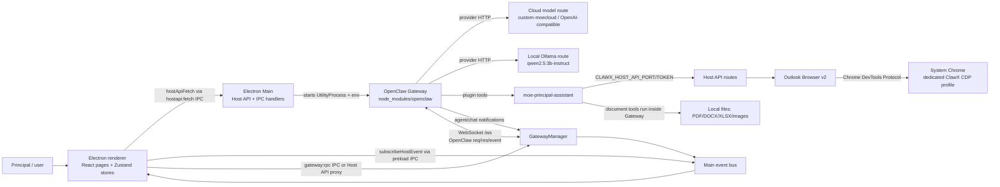
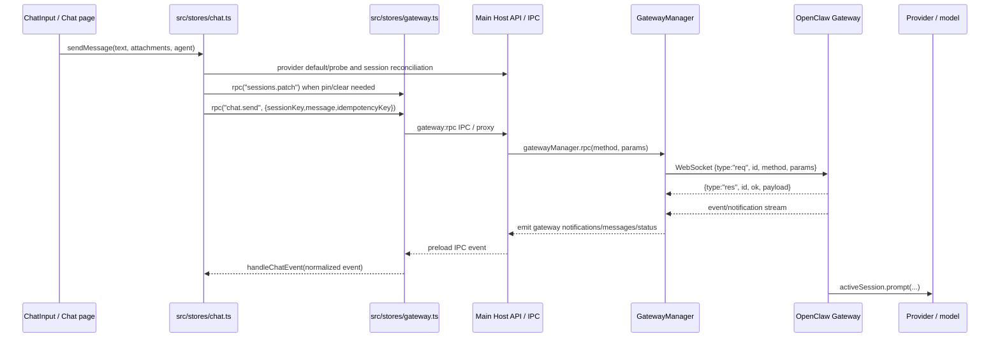
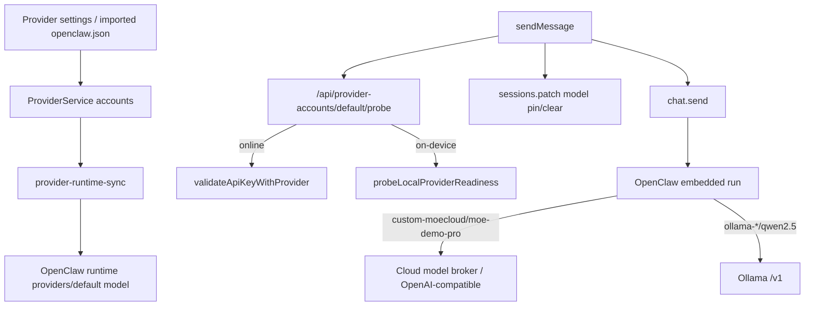

# OpenClaw / Windows communication map

Source scope: ClawX `8058e9b5` (`0.4.3-moe.25`) in `/private/tmp/clawx-moe25-first-response-20260908`, with bundled `openclaw` package `2026.4.23`. Revision-bound snapshot; later checkouts may have different line numbers. The September 8 owner pause limits current work to study and planning. See [the improvement study](../research/OPENCLAW_WINDOWS_IMPROVEMENT_STUDY_2026-09-08.md). This document maps the product path from the Electron renderer through ClawX Main, the OpenClaw Gateway, model providers, document tools, and Windows Outlook/Chrome automation. It is a source map, not installed-build acceptance evidence.

## Top-level process map



Renderer code does not call OpenClaw directly for normal app traffic. `hostApiFetch()` sends Host API requests through the Main-owned `hostapi:fetch` IPC proxy first, with localhost fallback blocked unless the renderer explicitly enables it in local storage. That keeps CORS, token handling, and backend routing in Main (`src/lib/host-api.ts:153`, `src/lib/host-api.ts:181`, `src/lib/host-api.ts:197`). Host events follow the same Main-owned rule: `subscribeHostEvent()` maps logical events such as `gateway:notification`, `gateway:chat-message`, `gateway:status`, `gateway:health`, and `gateway:channel-status` to preload IPC channels before considering SSE fallback (`src/lib/host-events.ts:5`, `src/lib/host-events.ts:40`, `src/lib/host-events.ts:65`).

## Renderer to Gateway request path



`src/stores/chat.ts` owns the app turn state: `sendMessage()` prepares the outbound request, reconciles model pins, calls `chat.send`, starts history polling, and enforces a terminal watchdog (`src/stores/chat.ts:3330`, `src/stores/chat.ts:3403`, `src/stores/chat.ts:3513`, `src/stores/chat.ts:3532`, `src/stores/chat.ts:3455`). It also probes the configured provider/default route through `/api/provider-accounts/default/probe` before allowing some automatic channel choices (`src/stores/chat.ts:2077`). Gateway RPC from the renderer goes through `useGatewayStore.rpc()`, which currently invokes Main IPC `gateway:rpc`; the store separately initializes status and event subscriptions through Host API and `subscribeHostEvent()` (`src/stores/gateway.ts:261`, `src/stores/gateway.ts:283`, `src/stores/gateway.ts:388`, `src/stores/gateway.ts:418`).

Main registers both the local Host API server and the Gateway manager. On app startup, it registers IPC handlers, starts the authenticated Host API server, wires Gateway events into the Host event bus, performs provider/channel startup preflight, creates `GatewayManager`, registers bundled extensions, and starts the Gateway (`electron/main/index.ts:355`, `electron/main/index.ts:357`, `electron/main/index.ts:431`, `electron/main/index.ts:446`, `electron/main/index.ts:582`, `electron/main/index.ts:684`, `electron/main/index.ts:689`). IPC registration includes the unified request handler, Host API proxy, Gateway handlers, OpenClaw handlers, provider handlers, settings, files, Microsoft Graph, Forms, Outlook Browser, Azure/ASR, and MoE seed handlers (`electron/main/ipc-handlers.ts:100`, `electron/main/ipc-handlers.ts:106`, `electron/main/ipc-handlers.ts:109`, `electron/main/ipc-handlers.ts:112`, `electron/main/ipc-handlers.ts:121`, `electron/main/ipc-handlers.ts:163`, `electron/main/ipc-handlers.ts:170`, `electron/main/ipc-handlers.ts:174`, `electron/main/ipc-handlers.ts:179`).

## Host API boundary

The Host API is a token-gated loopback HTTP server. It builds a route list that includes gateway, providers, app, settings, browser, Outlook, Forms, skills, files, sessions, diagnostics, logs, and usage routes. Every non-preflight request must carry the generated bearer token or `?token=` value, and JSON content type is required for mutations (`electron/api/server.ts:40`, `electron/api/server.ts:70`, `electron/api/server.ts:90`, `electron/api/server.ts:103`, `electron/api/server.ts:111`).

Concrete Host API surfaces in this path:

| Surface | Route / method | Owner | Purpose |
|---|---|---|---|
| Gateway metadata | `GET /api/app/gateway-info` | `electron/api/routes/gateway.ts` | Returns `ws://127.0.0.1:<port>/ws`, gateway token, port, optional device token (`electron/api/routes/gateway.ts:14`). |
| Gateway status/health | `GET /api/gateway/status`, `GET /api/gateway/health` | `electron/api/routes/gateway.ts` | Reads `GatewayManager` state and optional health probe (`electron/api/routes/gateway.ts:38`, `electron/api/routes/gateway.ts:43`). |
| Gateway lifecycle | `POST /api/gateway/start|stop|restart` | `electron/api/routes/gateway.ts` | Delegates to `GatewayManager.start/stop/restart` (`electron/api/routes/gateway.ts:51`, `electron/api/routes/gateway.ts:61`, `electron/api/routes/gateway.ts:71`). |
| Media send | `POST /api/chat/send-with-media` | `electron/api/routes/gateway.ts` | Converts attached image files to base64 `attachments` and passes non-image files as textual path references into `chat.send` (`electron/api/routes/gateway.ts:95`, `electron/api/routes/gateway.ts:124`, `electron/api/routes/gateway.ts:136`). |
| Provider accounts | `GET/POST/PUT/DELETE /api/provider-accounts...` | `electron/api/routes/providers.ts` | Stores accounts, keys, defaults, validates keys, syncs providers to OpenClaw runtime (`electron/api/routes/providers.ts:201`, `electron/api/routes/providers.ts:206`, `electron/api/routes/providers.ts:223`, `electron/api/routes/providers.ts:374`). |
| Provider readiness | `GET /api/provider-accounts/default/probe`, `GET /api/provider-accounts/:id/probe` | `electron/api/routes/providers.ts` | Classifies online vs local, checks stored key, validates online key through provider validation, or probes Ollama readiness (`electron/api/routes/providers.ts:66`, `electron/api/routes/providers.ts:95`, `electron/api/routes/providers.ts:142`, `electron/api/routes/providers.ts:154`, `electron/api/routes/providers.ts:252`). |
| Sessions | Host route + Gateway RPC | `electron/api/routes/sessions.ts`, OpenClaw `sessions.*` | Host route reads transcript files for summaries; OpenClaw owns live `sessions.list` and `sessions.patch` (`electron/api/routes/sessions.ts:119`, `node_modules/openclaw/dist/server-plugin-bootstrap-CxnqPNN-.js:7410`, `node_modules/openclaw/dist/server-plugin-bootstrap-CxnqPNN-.js:7906`). |
| Outlook | `POST /api/outlook/*` | `electron/api/routes/outlook.ts` | Host-side Outlook Browser v2 / optional Graph route used by plugin tools (`electron/api/routes/outlook.ts:208`). |

## GatewayManager and OpenClaw transport

`GatewayManager.rpc()` sends OpenClaw protocol requests over the Gateway WebSocket as `{ type: "req", id, method, params }` and tracks pending requests with a per-call timeout (`electron/gateway/manager.ts:871`, `electron/gateway/manager.ts:879`, `electron/gateway/manager.ts:893`). Incoming `{ type:"res" }` messages resolve or reject the pending request; `{ type:"event", event, payload }` is dispatched through `dispatchProtocolEvent()`, and JSON-RPC notifications fall back through `dispatchJsonRpcNotification()` (`electron/gateway/manager.ts:1179`, `electron/gateway/manager.ts:1192`, `electron/gateway/manager.ts:1211`).

Gateway readiness is not just “WebSocket connected.” After the WS handshake, Main marks the Gateway `running`, starts pings, and schedules a ready fallback; the fallback calls OpenClaw `system-presence` before setting `gatewayReady:true` when no `gateway.ready` event has arrived (`electron/gateway/manager.ts:1107`, `electron/gateway/manager.ts:1124`, `electron/gateway/manager.ts:1131`, `electron/gateway/manager.ts:1137`, `electron/gateway/manager.ts:836`, `electron/gateway/manager.ts:839`, `electron/gateway/manager.ts:848`). OpenClaw itself exposes base methods including `models.list`, `sessions.list`, `sessions.patch`, `chat.history`, `chat.abort`, and `chat.send`; it considers `chat.history` and `models.list` unavailable during startup (`node_modules/openclaw/dist/server.impl-DhtU4okW.js:5405`, `node_modules/openclaw/dist/server.impl-DhtU4okW.js:5427`, `node_modules/openclaw/dist/server.impl-DhtU4okW.js:5440`, `node_modules/openclaw/dist/server.impl-DhtU4okW.js:5484`, `node_modules/openclaw/dist/server.impl-DhtU4okW.js:9490`).

## Model route and provider configuration



Provider account import/sync bridges ClawX account storage into OpenClaw runtime config. Missing ClawX accounts can be seeded from OpenClaw provider entries; the import now infers a model from either the default model or the provider entry’s advertised `models` list (`electron/services/providers/provider-service.ts:175`, `electron/services/providers/provider-service.ts:202`, `electron/services/providers/provider-service.ts:232`). Runtime sync maps ClawX provider types into OpenClaw provider keys, with managed cloud aliases using `custom-moecloud`; generic custom and Ollama providers are treated as unregistered provider types with OpenAI-compatible defaults (`electron/services/providers/provider-runtime-sync.ts:30`, `electron/services/providers/provider-runtime-sync.ts:39`, `electron/services/providers/provider-runtime-sync.ts:64`, `electron/services/providers/provider-runtime-sync.ts:438`). Setting the default provider writes OpenClaw default model/provider metadata and can include managed model entries for `custom-moecloud` (`electron/services/providers/provider-runtime-sync.ts:752`, `electron/services/providers/provider-runtime-sync.ts:775`, `electron/services/providers/provider-runtime-sync.ts:787`, `electron/services/providers/provider-runtime-sync.ts:792`).

`channel-router.ts` is the single source of truth for the Online / On-this-device toggle. It refuses unready local accounts during boot preflight, refuses transient on-device switching when the local model is not ready, and applies channel preflight before startup so persisted preferences cannot silently route a turn into a stale provider (`electron/services/providers/channel-router.ts:169`, `electron/services/providers/channel-router.ts:221`, `electron/services/providers/channel-router.ts:367`, `electron/services/providers/channel-router.ts:404`, `electron/services/providers/channel-router.ts:429`). The default provider probe can still make a network validation request for online providers: `validateApiKeyWithProvider()` chooses OpenAI-compatible, Google, Anthropic, OpenRouter, or local/no-auth validation profiles, then performs the actual HTTP probe (`electron/services/providers/provider-validation.ts:93`, `electron/services/providers/provider-validation.ts:122`, `electron/services/providers/provider-validation.ts:390`).

## OpenClaw chat execution and events

OpenClaw owns live chat execution. `chat.history` loads the session entry, reads the transcript file, sanitizes and budgets messages, and may load the model catalog to resolve thinking defaults (`node_modules/openclaw/dist/chat-DM9hSaNV.js:1979`, `node_modules/openclaw/dist/chat-DM9hSaNV.js:1984`, `node_modules/openclaw/dist/chat-DM9hSaNV.js:1991`, `node_modules/openclaw/dist/chat-DM9hSaNV.js:1999`, `node_modules/openclaw/dist/chat-DM9hSaNV.js:2029`). `chat.abort` aborts by session or run id and persists aborted partials when it owns a matching active run (`node_modules/openclaw/dist/chat-DM9hSaNV.js:2047`, `node_modules/openclaw/dist/chat-DM9hSaNV.js:2075`, `node_modules/openclaw/dist/chat-DM9hSaNV.js:2092`). `chat.send` validates input, resolves the session/agent, normalizes attachments, sets a chat abort controller, immediately responds with a run id, then dispatches inbound execution with the run’s abort signal, images, and model-selection callback (`node_modules/openclaw/dist/chat-DM9hSaNV.js:2114`, `node_modules/openclaw/dist/chat-DM9hSaNV.js:2153`, `node_modules/openclaw/dist/chat-DM9hSaNV.js:2168`, `node_modules/openclaw/dist/chat-DM9hSaNV.js:2219`, `node_modules/openclaw/dist/chat-DM9hSaNV.js:2242`, `node_modules/openclaw/dist/chat-DM9hSaNV.js:2444`).

The embedded run builds workspace/sandbox context, resolves skills, loads tool definitions, and passes model/provider/tool metadata into the model attempt (`node_modules/openclaw/dist/selection-D8_ELZa7.js:5891`, `node_modules/openclaw/dist/selection-D8_ELZa7.js:5912`, `node_modules/openclaw/dist/selection-D8_ELZa7.js:5925`, `node_modules/openclaw/dist/selection-D8_ELZa7.js:5942`, `node_modules/openclaw/dist/selection-D8_ELZa7.js:5976`). The model boundary is `activeSession.prompt(...)`, immediately after the `prompt.submitted` trajectory event (`node_modules/openclaw/dist/selection-D8_ELZa7.js:7220`, `node_modules/openclaw/dist/selection-D8_ELZa7.js:7232`). OpenClaw emits lifecycle start on its `agent_start` event as `stream:"lifecycle"`, `data.phase:"start"`; Gateway maps the OpenClaw run/session into client-visible `runId` and `sessionKey`, then broadcasts the agent event (`node_modules/openclaw/dist/selection-D8_ELZa7.js:2022`, `node_modules/openclaw/dist/selection-D8_ELZa7.js:3015`, `node_modules/openclaw/dist/server.impl-DhtU4okW.js:6276`, `node_modules/openclaw/dist/server.impl-DhtU4okW.js:6281`, `node_modules/openclaw/dist/server.impl-DhtU4okW.js:6289`, `node_modules/openclaw/dist/server.impl-DhtU4okW.js:6338`).

ClawX renderer event handling has two layers. `src/stores/gateway.ts` normalizes OpenClaw agent notifications and forwards chat-shaped events to the chat store. It treats `stream:"lifecycle"` + `phase:"start"` as a started event while preserving legacy `phase:"started"`, and it refreshes sessions/history on completion-like lifecycle phases (`src/stores/gateway.ts:113`, `src/stores/gateway.ts:125`, `src/stores/gateway.ts:146`, `src/stores/gateway.ts:160`, `src/stores/gateway.ts:171`). `src/stores/chat.ts` counts meaningful `delta/final/error/aborted` events as liveness, and in moe25 also counts one owned lifecycle-start event only when run id, session key, active send state, and send generation match (`src/stores/chat.ts:2417`, `src/stores/chat.ts:2424`, `src/stores/chat.ts:3653`, `src/stores/chat.ts:3667`, `src/stores/chat.ts:3681`).

## Skills and the MoE plugin boundary

```mermaid
flowchart LR
  OpenClaw[OpenClaw plugin loader] -->|register(api)| MoE[moe-principal-assistant]
  MoE -->|document.*| DocTools[doc-tools.mjs\nlocal file parser/writer]
  MoE -->|browser.*| BrowserFacade[Host API /api/browser]
  MoE -->|outlook.*| OutlookFacade[Host API /api/outlook]
  MoE -->|forms.*| FormsFacade[Host API /api/forms]
  BrowserFacade --> ChromeCDP[Chrome CDP helper]
  OutlookFacade --> BrowserV2[Outlook Browser v2 manager]
  FormsFacade --> FormsV2[Forms browser routes]
```

OpenClaw’s plugin loader records tool registrations by plugin id/name/root and passes the `registerTool` hook to each plugin during full registration (`node_modules/openclaw/dist/loader-DeOtDUYt.js:582`, `node_modules/openclaw/dist/loader-DeOtDUYt.js:1358`, `node_modules/openclaw/dist/loader-DeOtDUYt.js:1366`). The MoE plugin is a Gateway plugin, not a renderer module. Its scoped contract requires every tool to expose `execute(toolCallId, params)`, to include JSON-schema `parameters`, and to call Electron Host API through `CLAWX_HOST_API_PORT` and `CLAWX_HOST_API_TOKEN` for Outlook and Forms instead of duplicating browser automation (`extensions/moe-principal-assistant/AGENTS.md:1`, `extensions/moe-principal-assistant/AGENTS.md:6`, `extensions/moe-principal-assistant/AGENTS.md:10`).

The plugin registers local document tools before principal config gating so Windows document reads work even if school/persona settings are incomplete. Registered document tools include `document.find`, `document.read_pdf`, `document.read_docx`, `document.write_docx`, `document.read_xlsx`, `document.write_xlsx`, and `document.read_image` (`extensions/moe-principal-assistant/index.mjs:558`, `extensions/moe-principal-assistant/index.mjs:632`, `extensions/moe-principal-assistant/index.mjs:652`, `extensions/moe-principal-assistant/index.mjs:692`, `extensions/moe-principal-assistant/index.mjs:707`, `extensions/moe-principal-assistant/index.mjs:735`, `extensions/moe-principal-assistant/index.mjs:746`). These are bundled plugin tools, distinct from any user-installed OpenClaw skills.

The plugin’s document helpers are local Node code: `findDocuments()` scans bounded roots and returns safe/ambiguous/incomplete statuses (`extensions/moe-principal-assistant/doc-tools.mjs:817`, `extensions/moe-principal-assistant/doc-tools.mjs:856`, `extensions/moe-principal-assistant/doc-tools.mjs:861`). `readPdf()` uses bundled `pdf-parse` and configures the matching pdf worker for Electron UtilityProcess (`extensions/moe-principal-assistant/doc-tools.mjs:894`, `extensions/moe-principal-assistant/doc-tools.mjs:975`, `extensions/moe-principal-assistant/doc-tools.mjs:1006`). `readDocx()` uses `mammoth`; `readXlsx()` and `writeXlsx()` use `xlsx`; `readImage()` returns both JSON metadata and an image content block, downscaling/normalizing through `sharp` when available (`extensions/moe-principal-assistant/doc-tools.mjs:1130`, `extensions/moe-principal-assistant/doc-tools.mjs:1207`, `extensions/moe-principal-assistant/doc-tools.mjs:1242`, `extensions/moe-principal-assistant/doc-tools.mjs:1266`, `extensions/moe-principal-assistant/doc-tools.mjs:1298`, `extensions/moe-principal-assistant/doc-tools.mjs:1328`).

## Windows Outlook interface

Outlook tools are agent-callable wrappers, but the browser work lives in Electron Main. The plugin builds an Outlook facade from `CLAWX_HOST_API_PORT` and `CLAWX_HOST_API_TOKEN`, posts JSON to `http://127.0.0.1:<port>/api/outlook/*`, times out at 60 seconds, and returns structured `unknown` results for send/download paths when side effects cannot be confirmed (`extensions/moe-principal-assistant/index.mjs:2029`, `extensions/moe-principal-assistant/index.mjs:2046`, `extensions/moe-principal-assistant/index.mjs:2068`, `extensions/moe-principal-assistant/index.mjs:2077`, `extensions/moe-principal-assistant/index.mjs:2050`). The tool descriptions direct the agent to call `browser.diagnose` / `browser.repair_chrome_cdp` for CDP attach failures and prohibit generic browser/Chrome MCP tools for Outlook (`extensions/moe-principal-assistant/index.mjs:1512`, `extensions/moe-principal-assistant/index.mjs:1520`, `extensions/moe-principal-assistant/index.mjs:1562`, `extensions/moe-principal-assistant/index.mjs:1573`, `extensions/moe-principal-assistant/index.mjs:1614`).

Host Outlook routes feature-gate the entire family through `PRINCIPAL_SKILL_ALLOWLIST`, choose Browser v2 by default, and optionally route read/compose through Microsoft Graph only when configured and available. Graph compose additionally refuses when `Mail.Send` is not granted; browser-lane operations refuse Graph ids because the identifiers are not interchangeable (`electron/api/routes/outlook.ts:55`, `electron/api/routes/outlook.ts:89`, `electron/api/routes/outlook.ts:121`, `electron/api/routes/outlook.ts:131`, `electron/api/routes/outlook.ts:162`, `electron/api/routes/outlook.ts:197`, `electron/api/routes/outlook.ts:208`). Browser-backed endpoints include open, read inbox, draft, send, search, read email, reply, forward, mark read, list attachments, and download attachment (`electron/api/routes/outlook.ts:231`, `electron/api/routes/outlook.ts:238`, `electron/api/routes/outlook.ts:255`, `electron/api/routes/outlook.ts:274`, `electron/api/routes/outlook.ts:306`, `electron/api/routes/outlook.ts:319`, `electron/api/routes/outlook.ts:332`, `electron/api/routes/outlook.ts:346`, `electron/api/routes/outlook.ts:360`, `electron/api/routes/outlook.ts:373`, `electron/api/routes/outlook.ts:388`).

Outlook Browser v2 uses Playwright over Chrome DevTools Protocol, backed by `chrome-cdp.ts`. The Windows CDP helper intentionally launches the user’s system Chrome with a dedicated non-default user-data-dir because Chrome M136+ refuses remote debugging on the OS default profile. A running default-profile Chrome is not treated as a blocker; only a process holding the ClawX CDP profile or debug port blocks launch. On port-bind timeout, the helper kills only the Chrome process it spawned (`electron/services/chrome-cdp.ts:134`, `electron/services/chrome-cdp.ts:149`, `electron/services/chrome-cdp.ts:417`, `electron/services/chrome-cdp.ts:424`, `electron/services/chrome-cdp.ts:470`, `electron/services/chrome-cdp.ts:479`, `electron/services/chrome-cdp.ts:526`, `electron/services/chrome-cdp.ts:549`). The Playwright driver prefers an existing Outlook tab, reuses only tabs it created or safely claimed, and avoids navigating arbitrary principal tabs away from their work (`electron/services/outlook-browser-v2/playwright-driver.ts:242`, `electron/services/outlook-browser-v2/playwright-driver.ts:258`, `electron/services/outlook-browser-v2/playwright-driver.ts:274`, `electron/services/outlook-browser-v2/playwright-driver.ts:297`, `electron/services/outlook-browser-v2/playwright-driver.ts:331`).

## Forms interface

Forms uses the same Gateway-plugin-to-Host-API pattern. The plugin builds a `forms` facade on `/api/forms`, uses a 90 second timeout, exposes `forms.list`, `forms.preview_suspension`, `forms.preview_daily_report`, `forms.submit_suspension`, and `forms.submit_daily_report`, and requires explicit `confirm:true` for submission (`extensions/moe-principal-assistant/index.mjs:1970`, `extensions/moe-principal-assistant/index.mjs:1972`, `extensions/moe-principal-assistant/index.mjs:1813`, `extensions/moe-principal-assistant/index.mjs:1821`, `extensions/moe-principal-assistant/index.mjs:1859`, `extensions/moe-principal-assistant/index.mjs:1877`, `extensions/moe-principal-assistant/index.mjs:1890`). The plugin’s form-payload tools and browser-preview tools are intentionally separate: `principal.*_payload` tools build structured payloads, while `forms.preview_*` opens/fills a browser form and `forms.submit_*` is gated.

## Custom interfaces vs bundled OpenClaw

| Layer | Bundled OpenClaw responsibility | ClawX / MoE custom responsibility |
|---|---|---|
| Gateway protocol | WebSocket req/res/event protocol, method registry, `chat.send`, `chat.history`, `sessions.*`, `models.list` (`node_modules/openclaw/dist/server.impl-DhtU4okW.js:5405`). | `GatewayManager`, startup supervision, Host API proxy, readiness fallback, status/event bridge (`electron/gateway/manager.ts:871`, `electron/main/index.ts:431`). |
| Model execution | Embedded run, tool loop, provider-compatible request execution, lifecycle/tool/assistant events (`node_modules/openclaw/dist/selection-D8_ELZa7.js:5891`). | Provider account store/import/sync, Online/On-device policy, `custom-moecloud` alias metadata, local-readiness probes (`electron/services/providers/provider-runtime-sync.ts:752`, `electron/services/providers/channel-router.ts:367`). |
| Skills/tools | Plugin loading and `registerTool` registry (`node_modules/openclaw/dist/loader-DeOtDUYt.js:582`). | MoE plugin tools, principal safety wording, document parser/writer helpers, Outlook/Forms facades (`extensions/moe-principal-assistant/index.mjs:750`). |
| Local files | Generic OpenClaw coding tools can exist, depending on model/tool policy. | Release-critical MoE `document.*` tools for PDF/DOCX/XLSX/image on Windows (`extensions/moe-principal-assistant/index.mjs:558`). |
| Outlook / Forms | OpenClaw only sees tool calls and results. | Electron Main browser automation, Chrome CDP profile management, Outlook/Forms Host API routes, send/submit confirmation gates (`electron/api/routes/outlook.ts:208`, `electron/services/chrome-cdp.ts:549`). |
| UI lifecycle | None. | Renderer maps Host API and Gateway notifications into visible state, composer enablement, channel pills, errors, and history (`src/stores/gateway.ts:113`, `src/stores/chat.ts:3611`). |

## Known failure points and evidence-backed checks

1. **Gateway connected but not ready.** A WebSocket handshake sets `state:"running"`, but `gatewayReady` waits for `gateway.ready` or successful `system-presence`. UI must distinguish connected transport from a ready RPC router (`electron/gateway/manager.ts:1124`, `electron/gateway/manager.ts:1137`, `electron/gateway/manager.ts:836`).

2. **`chat.history` and `models.list` can be unavailable during startup.** OpenClaw explicitly marks those methods startup-unavailable, and `chat.history` may also load the model catalog while constructing the response (`node_modules/openclaw/dist/server.impl-DhtU4okW.js:9490`, `node_modules/openclaw/dist/chat-DM9hSaNV.js:2029`). Renderer startup retry and history polling must not interpret every startup timeout as a completed turn.

3. **Provider/default drift.** ClawX stores provider accounts separately from OpenClaw runtime config. The route `/api/provider-accounts/default/probe` is the app’s bounded truth check for the currently selected account and can return `missing-default`, `missing-account`, `missing-key`, `changed-default`, `unavailable`, `unsupported`, `probe-error`, or `ok` (`electron/api/routes/providers.ts:52`, `electron/api/routes/providers.ts:66`, `electron/api/routes/providers.ts:154`). A `GET /v1/models` success against the cloud provider proves key/model-list reachability, not that the active session pin was cleared or that `chat.send` used that route.

4. **Session pin/clear mismatch.** Current selection is a combination of provider default, session entry, and runtime `sessions.patch`. OpenClaw applies `sessions.patch` through `applySessionsPatchToStore()` after resolving the canonical session target (`node_modules/openclaw/dist/server-plugin-bootstrap-CxnqPNN-.js:7906`, `node_modules/openclaw/dist/server-plugin-bootstrap-CxnqPNN-.js:7917`, `node_modules/openclaw/dist/server-plugin-bootstrap-CxnqPNN-.js:7924`). The UI must treat a saved preference and an acknowledged runtime patch as separate facts.

5. **Cold first turn before model execution.** `chat.send` can acknowledge and dispatch the inbound message before OpenClaw reaches `prompt.submitted` / `activeSession.prompt`. The renderer watchdog must count the real lifecycle start, not just assistant text, but it must ignore wrong-run, wrong-session, duplicate, cancelled, or old-generation events (`node_modules/openclaw/dist/chat-DM9hSaNV.js:2255`, `node_modules/openclaw/dist/selection-D8_ELZa7.js:7220`, `src/stores/chat.ts:2424`).

6. **Document/image capability depends on model metadata.** `document.read_image` returns an image block, but OpenClaw only treats a model as vision-capable when `model.input` includes `image` (`extensions/moe-principal-assistant/doc-tools.mjs:1328`, `node_modules/openclaw/dist/selection-D8_ELZa7.js:5987`). Managed cloud model metadata must therefore advertise image input before image-document answers can be promised.

7. **Outlook Browser v2 attach is CDP state plus Microsoft auth state.** `cdp_ready` means Chrome automation endpoint is reachable. It does not mean the principal is signed in to Outlook. `profile_locked_close_chrome`, `cdp_down_chrome_closed`, `chrome_not_found`, and `port_bind_timeout` are Chrome/CDP states; `needs_signin` is surfaced later by Outlook browser automation (`electron/services/chrome-cdp.ts:392`, `electron/services/chrome-cdp.ts:417`, `electron/services/chrome-cdp.ts:541`, `extensions/moe-principal-assistant/index.mjs:1562`).

8. **Graph and browser Outlook ids are not interchangeable.** Graph-read messages can produce `graph:` ids, but reply/forward/mark-read/attachment operations are browser-lane actions and refuse those ids instead of scrolling the DOM for an impossible match (`electron/api/routes/outlook.ts:188`, `electron/api/routes/outlook.ts:197`).

## Integration options for future changes

- **Renderer changes** should use `src/lib/host-api.ts`, `src/lib/api-client.ts`, and `src/lib/host-events.ts`; pages/components should not add direct Gateway HTTP calls or raw Electron IPC for backend work.
- **Gateway/backend communication changes** should start with a `harness/specs/tasks/` spec referencing `gateway-backend-communication`, because Main owns transport and run lifecycle while renderer owns intent/UI state.
- **Provider/channel changes** should go through `ProviderService`, `provider-runtime-sync.ts`, `provider-validation.ts`, and `channel-router.ts`; do not patch OpenClaw config files directly from renderer code.
- **MoE tool changes** belong in `extensions/moe-principal-assistant/` and must preserve the plugin contract: `execute(toolCallId, params)`, JSON-schema `parameters`, document tools available before principal config, and Host API facades for browser automation.
- **Outlook/Forms automation changes** belong in Host API routes and the Main-side browser managers. Tool descriptions may steer the model, but dispatch safety lives in the manager/routes, not in prompt wording alone.
