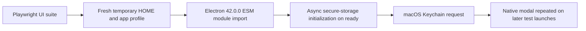

# CLWX-102 — Local Electron UI tests repeatedly open macOS Keychain dialogs

**REOPENED — September 8, 17:27–17:28 Dubai / 13:27–13:28 UTC.** The owner reported the same modal during the resumed suite, with Ministry windows repeatedly opening and closing. The earlier two-launch synthetic pass and independent source approval did not establish resolution of the full test path. Desktop UI testing on the owner Mac is now held.

## Identity and impact

Owner screenshot reported September 8, 2026 at 17:05:27 Asia/Dubai / 13:05:27 UTC: **Keychain Not Found**, unable to store **Electron Key**, with Cancel and Reset To Defaults. The repeated native modal interrupted the owner's Mac while the GA UI acceptance suite was running. This is an additional test-environment blocker under CLWX-102, related to the active CLWX-122 UI lane. Exact popup count is UNKNOWN.

Source baseline: candidate `488ebe29`, worktree `/private/tmp/clawx-ui-release-acceptance-20260908`, with uncommitted CLWX-122 component/test edits. Runtime: isolated official Electron **42.0.0**, darwin-arm64, `/private/tmp/clawx-graph-e2e-electron42/dist/Electron.app`. This is a local Mac test run, not the installed Windows app. A prior single Graph Settings test passed with this binary; that did not establish absence of intermittent Keychain dialogs across repeated launches.

## Reproduction and expected result

The existing `tests/e2e/fixtures/electron.ts` launches Electron with a fresh temporary HOME and user-data directory per test, but no macOS Keychain isolation. The UI lane started its selected Playwright baseline suite with `ELECTRON_OVERRIDE_DIST_PATH` pointing to the official 42.0.0 binary. Repeated Electron startups coincided with the reported native prompt. Do not rerun the unguarded suite merely to reproduce another interruption.

Expected: synthetic UI tests start, interact, close and relaunch using their temporary profile without reading, writing, resetting or prompting for the operator's Keychain. Production credential storage must not inherit test bypasses.

## Evidence and execution path

| Evidence | Observation | Limit |
|---|---|---|
| Private `artifacts/ga-fable-20260908/keychain-popup/owner-keychain-popup.png` | Owner-provided native modal, SHA256 `7a6028bd1e72b88fa9fd7f9eb7d00919a983f8d824911169095dc6cca68b55b1` | Does not establish a damaged operator Keychain |
| `keychain-popup/containment.json` | UI author PID48782 and its five test descendants were identified through process ancestry and stopped | Other applications and system Keychain configuration were untouched |
| `ui-release-acceptance/status.json` / `result.json` | Operator interruption is recorded as CLI_FAILED/error_during_execution; changes remain in the worktree | Not a test pass, timeout diagnosis or lost implementation |
| Tagged upstream Electron 42.0.0 source and binary switch scan | Eager async safeStorage initialization and separate key-provider switch exist | Need controlled launch/relaunch proof for the local workaround |

## Cause and confidence

Confirmed source mechanism: Electron 42.0.0 initializes async secure storage when its module is constructed; ESM imports can construct that module even when application code never calls safeStorage. Electron documents this as a macOS CI prompt/hang defect, later corrected in 42.4.1. Its macOS async `KeychainKeyProvider` is controlled separately from Chromium's synchronous mock Keychain. The temporary test HOME has no normal login Keychain; this matches the reported missing-storage dialog. Attribution to this local test run is strongly supported by its timing, process identity and code path; the precise OS Keychain request stack was not sampled before containment.

Primary sources:

- [Electron upstream defect and 42.4.1 backport](https://releases.electronjs.org/pr/50419).
- [Electron 42.0.0 safeStorage constructor](https://github.com/electron/electron/blob/v42.0.0/shell/browser/api/electron_api_safe_storage.cc).
- [Electron 42.0.0 async Keychain provider construction](https://github.com/electron/electron/blob/v42.0.0/shell/browser/browser_process_impl.cc).
- [Chromium macOS developer test flags](https://chromium.googlesource.com/chromium/src/+/main/docs/mac_build_instructions.md).

## Attempts and verified fix

1. Root paused the responsible Claude author to prevent new launches, terminated only its identified test descendants and interrupted that author. A subsequent process scan found no remaining Electron processes from the isolated test binary. No Keychain reset, unlock, deletion or credential operation was executed.
2. A separate repair worktree at `64ae2dc6`, branch `fix/e2e-macos-keychain-20260908`, owns only the shared test fixture and focused Keychain-isolation E2E spec. The interrupted UI author's three edited files are preserved.
3. Verified fixture-only macOS arguments: `--use-mock-keychain` for the synchronous path and `--disable-features=UseKeychainKeyProvider` for the independently initialized async provider. Other platforms retain the original launch arguments. No production Main-process switch or weakened installed-app storage is introduced.
4. The focused test checks isolated userData, synthetic encryption, a visible setup window, clean close and decrypting the same synthetic value after relaunch. It does not use real credentials or prove production Keychain integration.
5. Dependency upgrade to an upstream corrected release is a separate reviewed dependency decision; it is not substituted silently for the declared 42.0.0 test/runtime version. Shared dependencies remain unchanged.

## Verification and acceptance

Containment: PASS for stopping the identified test processes; visual disappearance of any already queued OS dialog is not asserted from process absence alone. Controlled focused E2E PASS: one spec completes two isolated Electron 42.0.0 launches, encryption and cross-relaunch decryption in 10.73 seconds. Ten native window samples observed zero SecurityAgent windows, including the final sample. Typecheck, fresh Vite build and focused ESLint pass. Initial clean-worktree build failed because the generated extension bridge was missing; the standard typecheck generated that prerequisite and the subsequent build passed. This was a setup prerequisite, not a product-code repair. Independent source review APPROVE, `artifacts/ga-fable-20260908/keychain-isolation-review/result.json`; final usage confirms Fable 5 on Bedrock. Source fix `7e1f9417ae3f57096a7799d9a433ea9745604e5f` is integrated in the candidate unchanged, into root as `b943fd2d`, and into the interrupted UI worktree as `cedca13d`. All three original UI edits were hash-verified preserved. `ui-release-resume` intentionally resumes that inspected session; the broader UI-suite verdict remains pending.

Exact checks: `pnpm typecheck`; `pnpm run build:vite`; `pnpm exec eslint tests/e2e/fixtures/electron.ts tests/e2e/keychain-isolation.spec.ts`; `ELECTRON_OVERRIDE_DIST_PATH=/private/tmp/clawx-graph-e2e-electron42/dist pnpm exec playwright test tests/e2e/keychain-isolation.spec.ts --reporter=line`. Last check ran inside a bounded private observer that would terminate only the test's own process tree if a native security dialog appeared. Playwright reported **1 passed (9.4s)**; whole-process observation was 10.73s. Receipt: `artifacts/ga-fable-20260908/keychain-popup/focused-e2e-verification.json`.

Review limits: the in-test switch assertion is a regression tripwire after startup, not the isolation mechanism; launch arguments provide protection before initialization. The macOS-specific skip currently occurs after fixture initialization on other platforms (minor test overhead). This synthetic test does not prove production Keychain behavior. No extra source changes were required by review.

## Resume here

Root owns fixture correction/integration, bug/Plane updates and the controlled Mac retest. The existing UI author is resumed with the corrected fixture applied; preserve that fixture in any further test worktree. Never solve the test issue by resetting the owner's Keychain, using a global mock Keychain switch, changing shared node_modules, or killing all Electron applications. Windows and other independent source/audit lanes can continue.

## Recurrence and corrected disposition

New owner screenshots at 17:27:58, 17:28:12 and 17:28:20 Dubai supersede the earlier resolution claim. Private copies and SHA256 receipts are in `artifacts/ga-fable-20260908/keychain-popup/recurrence/`. The app is visibly on Models when the native modal appears. This is observed behavior; the exact requesting call is still UNKNOWN.

`ui-release-resume` was running the selected app-smoke, channels, provider-lifecycle, skill/language, gateway and unconfigured-startup specs. The UI worktree is `cedca13d`, containing both fixture flags; a source scan finds only one `electron.launch`, inside that shared fixture. An unguarded second launch is therefore not an established cause. The three original UI edits remain uncommitted and preserved.

At 13:28:47 UTC root verified Claude PID23087, froze it, terminated its eight identified test descendants, then interrupted the author. Subsequent process verification found no descendants or Electron processes from the isolated test binary; the observer reported zero SecurityAgent windows. Receipts: `recurrence/containment.json` and `recurrence/windows-after-containment.json`. No system Keychain or installed-app credential setting changed. Zero observer samples alone do not prove absence of every native dialog; detector coverage is under review.

New owner: `keychain-recurrence-analysis`, Claude Fable 5 on Bedrock, read-only in `/private/tmp/clawx-e2e-macos-keychain-20260908` at `7e1f9417`. Its scope is launch argument/environment precedence, explicit secure-storage calls, Electron behavior, test-path differences and observer limitations. No GUI launches are allowed. Source/log findings must distinguish confirmed causes from hypotheses; a further correction needs independent review and controlled validation away from the owner's active desktop. The prior fix remains in source but its full-suite outcome is FAIL/UNRESOLVED; CLWX-102 and related CLWX-122 acceptance stay open. Do not restart the interrupted UI suite automatically.
