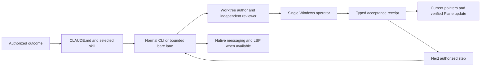

# CLWX-128 — Claude configuration and continuation gaps

## Identity and impact

- Observed September 9, 2026, from 02:59 UTC through the dated validation receipt; operator timezone Asia/Dubai.
- Owner: CLWX-128 (Claude CLI supervision); related CLWX-133 (release execution). Configuration author/reviewer lanes are separate from the active Windows operator.
- Environment: macOS development host; live Claude 2.1.265, newly launched CLI 2.1.266, Bedrock. Source audit began at `238d177d` on `fix/doc-tooling-steering`; instruction author worktree `/private/tmp/clawx-claude-config-20260909`.
- Status: configuration fixes and CLI probes verified; independent Claude review APPROVE with no blocking findings. This work does not prove an installed Windows candidate or GA.
- Known working baseline: ordinary CLI/review work was running. No prior receipt established native messaging or TypeScript LSP for this session.

## Reproduction and expected result

1. Read the original `ga-sprint-driver` ending, then inspect the lead's staged-candidate checkpoint. The lead deferred an already-authorized long install preparation to a later scheduler tick. Expected: preserve the checkpoint and continue the authorized outcome with an appropriate operation timeout.
2. Run `claude plugin list --json` and resolve `typescript-language-server` on PATH. The official TypeScript plugin was disabled and the executable absent. Expected: the selected tool starts and returns actual source symbols.
3. Run the bounded runner with only `ListAgents,SendMessage`. Its bare session exposes neither tool. Run a normal project-scoped CLI with those tools: both are exposed and delivery succeeds. Expected: select a capable lane; never mistake an allowlist for actual availability.
4. Inspect scoped instructions: Windows and principal-extension directories had `AGENTS.md` but no `CLAUDE.md` bridge. Expected: Claude gets the existing contract when entering those source areas.
5. Parse `.claude/agents/moe-product-manager.md` using YAML: its unquoted description contains `Read-only:` and fails strict parsing. Claude's runtime still listed the agent, so total runtime non-discovery is **not** claimed. Expected: portable valid frontmatter.
6. Read the legacy `windows-smoke` agent: it hard-coded a historical Ollama/Qwen setup, ports, seeding assumptions and an email-send canary. Expected: use the current candidate/skill/acceptance contract and explicit outbound gates.

No reproduction sends email, submits a form or mutates the Windows VM.

## Execution path and cause

- **High confidence:** missing executable/plugin enablement explains unavailable TypeScript code intelligence. A normal CLI returned symbols after installation.
- **High confidence:** bare versus normal session mode explains the observed native messaging tool difference. Same provider/model family, different actual tool lists; normal `SendMessage` returned success.
- **Medium confidence:** stop-oriented checkpoint wording contributed to the observed idle gap. The lead's own explanation referenced its bounded checkpoint. This does not establish the cause of every prior delay.
- **High confidence:** scoped `AGENTS.md` alone is not Claude's automatic instruction format. Bridges now share those contracts without duplicating the Codex orchestration brain.
- **High confidence:** old smoke-role assumptions diverged from current release instructions. The role now delegates procedure to the maintained smoke skill.
- The installed 2.1.266 update and the live lead's observed Opus model are separate facts. Session evidence records an automatic refusal-triggered Fable-to-Opus fallback. Do not treat it as an accidental preference edit or bypass it.

## Attempts and decisions

| Attempt | Result | Decision |
|---|---|---|
| Initial read-only bare research lane | Completed but web tools were unavailable | Parent verified primary documentation; no claim the research lane browsed |
| Bare native-messaging probe | No tools, nothing delivered | Preserve failed receipt; use normal CLI for this capability |
| Reply to completed one-shot relay | Recipient read all three instruction files and accepted them in its terminal; direct reply failed because the sender had exited | Keep a normal coordinator alive for bidirectional replies; do not reuse stale peer addresses |
| Normal native-messaging probe | Send succeeded, ID `402fb701-3094-4367-88f3-1f9aea1ff5fb` | Delivery/queueing is distinct from acknowledgement |
| Official TypeScript plugin plus executable | Normal Claude LSP returned `cn`, `formatRelativeTime`, `formatDuration`, `delay`, `truncate` and nested symbols | Keep project-scoped plugin; compiler dependency unchanged |
| Add a second entire orchestration framework | Not installed | Existing OMC plus focused project workflows avoids overlapping ownership |
| Rewrite all global hooks or restart the installer lead | Not performed | Preserve unrelated projects and the active operation |
| CLI validator alone | Did not diagnose the YAML failure | Explicit YAML parsing and runtime discovery supplement validator output |

## Fix and verification

- Revised `CLAUDE.md` and sprint skill: explicit worktree ownership, receipt identity, observed-model reporting, continuous authorized outcomes, synchronized affected pointers.
- Added scoped Claude bridges and four path-specific rule files. Fixed product-manager YAML; replaced stale Windows smoke instructions with the maintained domain procedure. Added command descriptions.
- Project settings select worktree base `head` and three official plugins. Existing Bash guard is invoked with a quoted path and timeout. No global permission/provider changes.
- Hook synthetic controls: ordinary command returns 0; nonsecret synthetic send returns 0; secret-pattern fixture returns 2. A path containing spaces works; temporary ledger contains masked recipient and length, no body or full recipient. This is not a universal MCP-send test.
- Normal CLI initialization lists all three project plugins. Actual LSP `documentSymbol` succeeds on `src/lib/utils.ts`. Normal native messaging succeeds; bare negative control remains documented.
- Skill quick validator passes. Explicit YAML covers 20 agents, 22 skills, four rules and three commands. JSON and whitespace checks are required after final integration.
- Evidence: private `artifacts/ga-autonomy-audit-20260909/` contains author/research receipts, normal/bare messaging streams, LSP stream, plugin inventory and configuration validation. Do not commit raw streams or machine authentication data.

Independent review: separate Claude Fable 5 / Bedrock session APPROVE; 49 frontmatter files parsed, links/settings/ownership checked. The live lead subsequently confirmed `/reload-plugins`: six plugins and one plugin LSP server. Sanitized checks and source digests: [configuration receipt](../evidence/claude-configuration-20260909.json). Installed Windows and release acceptance remain outside this verification.

## Resume here

Use [Claude CLI operations](../CLAUDE_CODE_OPERATIONS.md) and the existing completion plan. Plane synchronization verified: CLWX-128 comment `463d55c6-ffda-496c-93d3-fd915260812a` was fetched by detail and list; the 136-issue board snapshot was refreshed. Existing card state was preserved. Read the final review/readback evidence before changing status. The active release lead remains sole VM operator; source/configuration review can run independently. After the next safe CLI boundary, reload project plugins and re-read the revised instructions. Do not repeat unchanged full product gates for this documentation/configuration change.

Remaining release acceptance belongs to the candidate's existing cards. A successful configuration probe is not a GA verdict.
