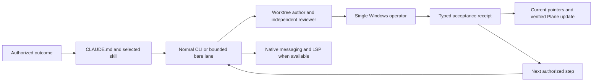

# CLWX-128 — Claude configuration and continuation gaps

## Identity and impact

- Observed September 9, 2026, from 02:59 UTC through the dated validation receipt; operator timezone Asia/Dubai.
- Owner: CLWX-128 (Claude CLI supervision); related CLWX-133 (release execution). Configuration author/reviewer lanes are separate from the active Windows operator.
- Environment: macOS development host; live Claude 2.1.265, newly launched CLI 2.1.266, Bedrock. Source audit began at `238d177d` on `fix/doc-tooling-steering`; instruction author worktree `/private/tmp/clawx-claude-config-20260909`.
- Status: configuration fixes and CLI probes verified; independent Claude review APPROVE with no blocking findings. This work does not prove an installed Windows candidate or GA.
- Known working baseline: ordinary CLI/review work was running. No prior receipt established native messaging or TypeScript LSP for this session.

## Reproduction and expected result

1. Read the original `ga-sprint-driver` ending, then inspect the lead's staged-candidate checkpoint. The lead deferred an already-authorized long install preparation to a later scheduler tick. Expected: preserve the checkpoint and continue the authorized outcome with an appropriate operation timeout.
2. Run `claude plugin list --json` and resolve `typescript-language-server` on PATH. The official TypeScript plugin was disabled and the executable absent. Expected: the selected tool starts and returns actual source symbols.
3. Run the bounded runner with only `ListAgents,SendMessage`. Its bare session exposes neither tool. Run a normal project-scoped CLI with those tools: both are exposed and delivery succeeds. Expected: select a capable lane; never mistake an allowlist for actual availability.
4. Inspect scoped instructions: Windows and principal-extension directories had `AGENTS.md` but no `CLAUDE.md` bridge. Expected: Claude gets the existing contract when entering those source areas.
5. Parse `.claude/agents/moe-product-manager.md` using YAML: its unquoted description contains `Read-only:` and fails strict parsing. Claude's runtime still listed the agent, so total runtime non-discovery is **not** claimed. Expected: portable valid frontmatter.
6. Read the legacy `windows-smoke` agent: it hard-coded a historical Ollama/Qwen setup, ports, seeding assumptions and an email-send canary. Expected: use the current candidate/skill/acceptance contract and explicit outbound gates.

No reproduction sends email, submits a form or mutates the Windows VM.

## Execution path and cause

- **High confidence:** missing executable/plugin enablement explains unavailable TypeScript code intelligence. A normal CLI returned symbols after installation.
- **High confidence:** bare versus normal session mode explains the observed native messaging tool difference. Same provider/model family, different actual tool lists; normal `SendMessage` returned success.
- **Medium confidence:** stop-oriented checkpoint wording contributed to the observed idle gap. The lead's own explanation referenced its bounded checkpoint. This does not establish the cause of every prior delay.
- **High confidence:** scoped `AGENTS.md` alone is not Claude's automatic instruction format. Bridges now share those contracts without duplicating the Codex orchestration brain.
- **High confidence:** old smoke-role assumptions diverged from current release instructions. The role now delegates procedure to the maintained smoke skill.
- The installed 2.1.266 update and the live lead's observed Opus model are separate facts. Session evidence records an automatic refusal-triggered Fable-to-Opus fallback. Do not treat it as an accidental preference edit or bypass it.

## Attempts and decisions

| Attempt | Result | Decision |
|---|---|---|
| Initial read-only bare research lane | Completed but web tools were unavailable | Parent verified primary documentation; no claim the research lane browsed |
| Bare native-messaging probe | No tools, nothing delivered | Preserve failed receipt; use normal CLI for this capability |
| Reply to completed one-shot relay | Recipient read all three instruction files and accepted them in its terminal; direct reply failed because the sender had exited | Keep a normal coordinator alive for bidirectional replies; do not reuse stale peer addresses |
| Normal native-messaging probe | Send succeeded, ID `402fb701-3094-4367-88f3-1f9aea1ff5fb` | Delivery/queueing is distinct from acknowledgement |
| Official TypeScript plugin plus executable | Normal Claude LSP returned `cn`, `formatRelativeTime`, `formatDuration`, `delay`, `truncate` and nested symbols | Keep project-scoped plugin; compiler dependency unchanged |
| Add a second entire orchestration framework | Not installed | Existing OMC plus focused project workflows avoids overlapping ownership |
| Rewrite all global hooks or restart the installer lead | Not performed | Preserve unrelated projects and the active operation |
| CLI validator alone | Did not diagnose the YAML failure | Explicit YAML parsing and runtime discovery supplement validator output |

## Fix and verification

- Revised `CLAUDE.md` and sprint skill: explicit worktree ownership, receipt identity, observed-model reporting, continuous authorized outcomes, synchronized affected pointers.
- Added scoped Claude bridges and four path-specific rule files. Fixed product-manager YAML; replaced stale Windows smoke instructions with the maintained domain procedure. Added command descriptions.
- Project settings select worktree base `head` and three official plugins. Existing Bash guard is invoked with a quoted path and timeout. No global permission/provider changes.
- Hook synthetic controls: ordinary command returns 0; nonsecret synthetic send returns 0; secret-pattern fixture returns 2. A path containing spaces works; temporary ledger contains masked recipient and length, no body or full recipient. This is not a universal MCP-send test.
- Normal CLI initialization lists all three project plugins. Actual LSP `documentSymbol` succeeds on `src/lib/utils.ts`. Normal native messaging succeeds; bare negative control remains documented.
- Skill quick validator passes. Explicit YAML covers 20 agents, 22 skills, four rules and three commands. JSON and whitespace checks are required after final integration.
- Evidence: private `artifacts/ga-autonomy-audit-20260909/` contains author/research receipts, normal/bare messaging streams, LSP stream, plugin inventory and configuration validation. Do not commit raw streams or machine authentication data.

Independent review: separate Claude Fable 5 / Bedrock session APPROVE; 49 frontmatter files parsed, links/settings/ownership checked. The live lead subsequently confirmed `/reload-plugins`: six plugins and one plugin LSP server. Sanitized checks and source digests: [configuration receipt](../evidence/claude-configuration-20260909.json). Installed Windows and release acceptance remain outside this verification.

## Resume here

Use [Claude CLI operations](../CLAUDE_CODE_OPERATIONS.md) and the existing completion plan. Plane synchronization verified: CLWX-128 comment `463d55c6-ffda-496c-93d3-fd915260812a` was fetched by detail and list; the 136-issue board snapshot was refreshed. Existing card state was preserved. Read the final review/readback evidence before changing status. The active release lead remains sole VM operator; source/configuration review can run independently. After the next safe CLI boundary, reload project plugins and re-read the revised instructions. Do not repeat unchanged full product gates for this documentation/configuration change.

Remaining release acceptance belongs to the candidate's existing cards. A successful configuration probe is not a GA verdict.

## Follow-up: instructions were configured, continuous control was not

At the owner's next idle-session report on September 9, a native `/goal` status check returned **No goal set**. The session still had the legacy `23 */2 * * *` GA task `cc2751ee`. This proves the first pass configured capabilities and continuation instructions, but did not activate a turn-to-turn controller. Separately, the Windows reboot had removed the QA interactive session: that installed-acceptance blocker remained real. Neither fact proves every other sprint criterion is blocked.

The follow-up uses one native Claude goal with an explicit executable-work boundary: read current sprint acceptance/dependencies, execute eligible work through assigned review and evidence, and stop with a criterion-level disposition when only concrete external blockers remain. A successful controller goal can therefore end with **GA RED**. Memory and exploration routing is maintained in [the operations runbook](../CLAUDE_CODE_OPERATIONS.md#route-tools-without-loading-everything); the current product plan remains the existing completion plan. Claude/Bedrock reviews are the default; plugin installation alone no longer triggers optional Codex spend.

Two terminal-delivery failures were preserved:

1. An unbracketed 2,197-character command delivered only its final 153 characters after the goal-status panel. No native goal was set. A successful AppleScript exit was insufficient evidence of complete input delivery; the exact low-level truncation cause is unproven.
2. Bracketed paste and an actual Return delivered the full `/goal` text while Claude was busy, but it entered the transcript as a `queued_command` attachment. A subsequent whole-command paste at idle likewise arrived as ordinary user text. These attempts steered work without activating the native handler. A short literal `/goal` command with Return then produced **Goal set** while work was active. Use direct short native commands; reserve collapsed paste for ordinary messages and verify native state separately.

The lead accepted the complete instructions, used native `CronDelete` to retire `cc2751ee`, and started independent read-only sprint analyses while preserving its VM lease. The scheduler readback contained no remaining tasks. Pending input, a delivered message, a running analysis and an active native goal are distinct states.

Private follow-up receipts remain under `artifacts/ga-autonomy-audit-20260909/`, including the preserved failed submission and the independent controller review. The [controller receipt](../evidence/claude-goal-controller-20260909.json) records final activation, checks and limitations; do not infer installed or release success from it.

### Recovery implementation and live verification

The owner extended the task to automatic blocker reporting/recovery and monitoring. A separate Claude Fable/Bedrock author implemented `.claude/hooks/ga-blocker-recovery.py` and its subprocess tests in `/private/tmp/clawx-blocker-hook-author-20260909`. The coordinator added the recovery policy/wiring and corrected an overly broad guard-refusal classification. Two separate Bedrock review worktrees independently **APPROVED** the final hook and each passed all eight tests. The earlier controller-guidance review also approved, with permission-mode and goal-lifecycle notes incorporated.

Enabled the additive `PostToolUseFailure` hook after review. At **05:37:23 UTC**, the existing lead ran the authorized synthetic negative control (exit 17); its native failure callback returned the fixed recovery context in **24 ms**, exit 0. At **05:37:26 UTC**, the lead ran the positive control successfully and continued work. The original failure remained an error; the hook did not conceal it or create a false product bug. Cancellation, malformed/oversized input and no-input-disclosure checks pass separately. The hook contains no network calls, subprocesses, filesystem writes or additional model invocation.

Native `/goal` status confirmed **Goal active**, and the lead advanced independent sprint work: `315d7c37` preserves Windows-lane blocker probes; `c93d8100` promotes CLWX-119 repeated-run evidence and board readbacks. This establishes observed progress and live hook activation. A separate end-of-turn evaluator verdict remains unobserved while the lead has active background work; native goal activity is not proof of indefinite unattended uptime.

A separate normal CLI 2.1.266/Bedrock control subsequently verified the full continuation mechanism: first turn reads one file and ends; native Stop-hook evaluator feedback starts the second turn without user input; the second turn reads a different file and completes successfully (exit 0, 41.36 seconds). The initial identical-file control was deduplicated, so it was preserved and corrected to distinct files. This proves evaluator/continuation behavior in the probe; the existing lead remains on 2.1.265. During monitoring the lead also committed the held distribution draft (`6f0ccc70`) and the remaining-criterion dependency/owner/resume map (`fe7fdda6`).

Memory/code-tool probes also passed using the installed Claude Mem MCP and project LSP. A failed launch exposed variadic `--tools` consuming a trailing positional prompt; streaming the prompt on stdin corrected it. Raw probes, failed attempts and review receipts remain private. Sanitized timestamps, source digests and callback evidence are in the linked controller receipt. Product acceptance is still **GA RED**.

## Recurrence: the controller accepted an incomplete completion claim

**September 9, later — OPEN pending the completion-guard validation below.** The
owner requested autonomous, board-driven execution through repair, integration,
testing and release, then explicitly challenged the repeated failure to do so.
The earlier configuration tests remain valid within their stated scope. They did
not establish this end-to-end behavior.

### Reproduction and confirmed mechanism

1. Freeze the candidate at `0f708082c941fbed007173c57232aec916f4eff1`
   (`0.4.3-moe.29`). Independent approval exists for CLWX-61 commits `c0437a97`,
   `cd88a205`, `2b5646a5`; CLWX-130 `75a40554`; and CLWX-102 `7615c43b`,
   `8923f132` in their author worktrees.
2. The lead reports that all executable sprint work is exhausted because the QA
   interactive desktop is unavailable. Native `/goal` reports achieved. The
   observed goal summary reported approximately 49 minutes and 577.8k tokens;
   this is a CLI usage display, not a verified billing amount.
3. Run `git log 0f708082..<reviewed-head>` and ancestry checks for those lanes.
   All six commits are absent. The candidate includes the earlier CLWX-130
   parent `41359e12`, but not its newly approved correction. Integration and a
   replacement build remain executable without the QA desktop.
4. Direct the lead to integrate those exact repairs. It acknowledges the
   mistaken stopping decision and cherry-picks all six without conflicts into
   `release/moe30-integration`. This is a decisive counterexample to the claim
   that every remaining operation was externally blocked.

**Expected:** review completion hands work to an integration owner; the controller
checks candidate contents and artifact provenance before accepting an exhausted
work claim. An unavailable Windows desktop blocks installed acceptance, not
independent source integration or hosted packaging.

**Actual:** a successful review was treated as the end of a workstream. No tool
failed, so `PostToolUseFailure` could not detect the omission. The goal evaluator
accepted the conversation's incomplete account rather than independently checking
Git. Official documentation explicitly says that the evaluator sees conversation
evidence and does not inspect files or run commands itself. The earlier receipt
even recorded this limitation; the coordinator failed to convert it into a
validation requirement. [Official goal behavior](https://code.claude.com/docs/en/goal)

### Instruction-to-evidence audit

| Owner requirement | Observed result | Missing control or remaining boundary |
|---|---|---|
| Submit instructions and make the session run | Earlier paste/native-command failures were corrected; actual `Goal set` and tool activity were verified | Command delivery, native activation and useful completion are separate assertions |
| Use Claude/Bedrock with isolated worktrees | Author/reviewer lanes and receipts exist | A worktree needs an explicit integration disposition; its existence or review approval is not release progress |
| Follow Plane acceptance through completion | Reviews and reports advanced; approved repairs stayed outside the candidate | Required handoff from review to integration was absent from the completion check |
| Detect, report, repair and retest blockers | Execution-error hook and bounded recovery worked in their tests | Successful commands can still leave a required stage undone; completion needs a different trigger |
| Continue independent work while Windows is blocked | Some source and documentation work continued | The lead stopped before one remaining independent integration/build stage |
| Keep current state recoverable | Current prose, machine pointers and historical records disagreed | At recurrence, `completion-state.json` and the sprint JSON still pointed to moe.28; reconcile affected pointers against source and artifact facts |
| Monitor until stable and autonomous | Two-turn Read control and live failure-hook callback passed | No representative test covered approved-but-unintegrated work, stale artifact identity or a false exhausted-work summary |
| Reach GA using the tested Windows artifact | Not established | Installed, Windows client, account/tenant and unaided stakeholder criteria remain separate required proof |

Stale pointers and the observed 81% context occupancy are **contributing risks**;
neither is proven to be the sole cause. The missing integration check is confirmed
by the Git counterexample and the immediate successful integration after direction.
Adding more plugins or another model retry does not repair that missing predicate.

### Correction and falsifiable validation contract

Keep native `/goal` as the continuation controller. Add a scoped, deterministic
command `Stop` gate that reads real Git and manifest state for registered release
lanes. It must not start builds, agents, GUI apps or remote mutations itself.
Missing integration or a stale artifact supplies a concrete continuation reason.
Repeated unchanged failure must remain explicitly STALLED/GA RED, never become a
pass merely to exit a loop. Command hooks support a blocking decision and a
separate force-stop result; neither an allowed stop nor a stopped session is GA
acceptance. [Official hook contract](https://code.claude.com/docs/en/hooks)

The gate's validation must cover the original omission, cherry-pick equivalence,
merged-then-reverted code, divergent reviewed files, missing/wrong-source manifests,
dirty candidate state, unrelated sessions/worktrees, malformed armed state and
bounded no-progress handling. A normal Claude CLI fixture must demonstrate the
actual Stop callback and automatic corrective work, not just invoke the hook as a
standalone script. Final results, independent reviews, source digests and live-lead
activation must be recorded before claiming this correction works.

Registration itself is a coverage boundary: a guard cannot certify an omitted
lane. New author/reviewer handoffs must register or explicitly disposition their
release-relevant work. Likewise, manifest reconciliation is narrower than checking
the downloaded installer bytes, running installed journeys or proving independent
review. Existing artifact/release gates remain responsible for those assertions.

Use the existing completion plan and Plane cards for product state. The private
gate contract and receipts are executable checks, not another current plan. The
product lead owns source/build/pointer reconciliation; the controller author and
reviewer own this defect. Authentication stays with the account holder. Do not
mine credential history or confuse that legitimate boundary with a source blocker.

Private direction and Git proof:
`artifacts/ga-autonomy-audit-20260909/missed-integration-direction-receipt.json`.
The replacement artifact's changing status belongs in `CURRENT_WINDOWS_RC.md`
and `COMPLETION_PLAN.md`, not this defect's historical reproduction.

### Independent RCA review and coordinator disposition

The separate read-only Claude/Bedrock RCA completed in 260.33 seconds. It
independently confirmed the missing commits and stale machine pointer, and
challenged two limits of the proposed gate: omitted lane registration and treating
a legitimate long build as a stall. Both require explicit coverage or an honest
scope limitation. Build status must be observed through the actual job receipt;
a timer, a documentation edit or a heartbeat is not acceptance progress.

The review is advisory. Its assertion that root performed the source integration
is corrected: root directed it; the existing Claude lead executed it. Its
cost-motivated stopping hypothesis has no decisive evidence and is not adopted as
a root cause. Its claim that exact tree comparison would accept a mutated reviewed
hunk is also not adopted: exact mode/blob comparison rejects that case. Changes
outside registered paths can still alter behavior, so integration review and tests
remain mandatory. Do not parse historical Markdown headings to pick a candidate;
bind the executable check to the actual release ref and reconcile the maintained
machine pointer explicitly.

### Compaction recurrence and recovery boundary

At `2026-09-09T07:27:20Z`, the lead recorded a real compaction boundary. The
native goal remained active and context occupancy fell from approximately 82% to
9%, but no immediate assistant tool activity followed. The owner reported that
idle state. Root delivered a resume instruction with Return; the lead then
searched for its earlier package-check procedure and compiled the existing
candidate for comparison. GitHub run `34323058772` continued building throughout
this assistant pause. No duplicate build was needed.

This is a second control assumption to correct: preserving the goal through
compaction does not prove that another turn will start immediately. Official
documentation describes background completion as a new-turn trigger and caps
goal idle check-ins at three between user prompts. Compaction hooks supply setup
or context, without continuation decision control. No documented ordering
guarantee among these events was found. [Goal lifecycle](https://code.claude.com/docs/en/goal),
[hook contracts](https://code.claude.com/docs/en/hooks).

The recovery is one bounded session-native build watchdog alongside the existing
goal, with exact run ownership and a deletion condition. Root requested its
creation through `CronList`/`CronCreate`; instruction delivery alone does not prove
creation, scheduled execution or cleanup. Those separate receipts must be
recorded before this recurrence is marked resolved. Do not install a hidden
keypress loop or have `PostCompact` recursively launch another Claude process.

### Implementation attempts and verification findings

The bounded Claude/Bedrock author timed out at 725.69 seconds after writing the
script. Its last test-file tool input was incomplete and had not executed. Root
recovered that text as data, completed its trailing assertion, and parsed the
file; no shell command from the interrupted input was executed. The first test
invocation used the wrong working directory and discovered zero tests, which is
not a pass. The corrected invocation discovered 17 tests: one unsupported
`git revert -q` fixture error and one real invalid-session disclosure failure.
The resumed author corrected those and completed 25 passing tests.

Before activation, root found and corrected additional boundary defects:

- Worktree enumeration silently truncated at 32, while the real repository had
  91 worktrees. It now inspects up to 256 and fails closed above the bound. A
  35-worktree regression and an independent 91-worktree probe demonstrate that
  candidate dirt beyond the old limit is detected.
- A candidate registered by SHA could report `PROVENANCE_RECONCILED` while its
  branch worktree contained an uncommitted regression. Conversely, a named branch
  could include unrelated detached-review dirt. Branch registrations now inspect
  that branch; SHA/tag registrations inspect matching checked-out revisions.
- An invalid repository path could block an unarmed session and create counter
  state. The hook now checks for that exact session's contract before repository
  diagnostics.
- Counter-write failure could keep producing first-attempt blocks. It now
  force-stops explicitly with GA RED; required receipt-write failure also cannot
  pass. Fault-injection tests cover both cases.

Two independent Claude reviewers initially approved the 27-test version; root's
SHA and isolation counterexamples override those approvals. Both reviewers were
asked to assess the final delta. The outer hook timeout is 20 seconds, preserving
margin around the local 10-second check budget and repository attribution.
Diagnostic commands use an absolute, shell-quoted script path. Stop guidance
restricts disarming to completion, cancellation or ownership transfer.

The final focused run reports **31 gate tests plus eight existing failure-hook
tests passing** in 17.810 seconds. One intervening run failed because an old
assertion expected the removed lowercase disarm wording; the replacement asserts
the ownership-transfer boundary and absence of a bypass command. Product tests
are separate from this Python/controller change.

Real-repository probes against the initial reviewed guard returned
`NOT_READY_INTEGRATE` for moe.29, with all three lanes `PENDING`; the new candidate
returned all three lanes `INTEGRATED`, pointer `OK`, and `NOT_READY_BUILD` while
its manifest was still absent. Each check took less than 0.3 seconds. These are
dated probe results, not current release status.

A normal CLI 2.1.266 fixture completed in 127.29 seconds without a second user
prompt: first-turn Read/checkpoint → actual Stop feedback → cherry-pick of the
reviewed fixture repair → synthetic manifest → real gate result
`PROVENANCE_RECONCILED`. Its first block was `BLOCKED_DIRTY` because the controller
was a dirty detached checkout at the same SHA; the final branch-scoping correction
removes that misleading fixture condition. The callback/continuation code was
unchanged by that correction, but the earlier fixture's script digest remains
distinct from the final digest. Synthetic artifact metadata is explicitly not
release proof.

The fixture recorded a provider `cyber` refusal for Fable and the CLI's automatic
fallback to Opus 4.8, both through Bedrock. Root did not select a different model
or reword the request to bypass that refusal. Consequently this is a normal-CLI
continuation result, not Fable-only validation. Preserve the event in the private
receipt and report observed models accurately.

### A timer cannot wake a busy foreground turn

The lead created watchdog `a484f16c` at `2026-09-09T07:34:53.126Z`, after
`CronList` returned no scheduled jobs. It then used foreground sleeps of 240 and
420 seconds while waiting for its installer download. Scheduled prompts run
between turns, so those waits delayed delivery. Root backgrounded the read-only
waits and directed the lead to consume the existing download's completion event.
The verifier helper also had no subprocess timeout on `gh run download`; the
lead owns that deadline/receipt correction. An unexpired 473,569,882-byte
installer artifact existed in GitHub, so another build was not the next action.
Do not confuse nested download files or a pending transfer with missing CI output.

The [operations runbook](../CLAUDE_CODE_OPERATIONS.md) now requires one owner,
one bounded background transfer and one session-native watchdog, with no extra
foreground sleep/poll loops. A scheduled delivery followed by tool activity and
eventual cleanup are separate acceptance checks. Until those are observed, the
watchdog is configured but its end-to-end recovery remains unverified.

Both final independent reviews returned **APPROVE**, including independent
reproductions of the SHA/branch and unarmed-repository cases. The exact reviewed
script/settings were integrated and armed for lead session
`a1c33a2c-3045-4b77-ba6a-e2b0dd8950bb`. Its direct check reconciled CLWX-61/130/102,
candidate `40cfe727`, the maintained source pointer and the moe.30 manifest.
That direct command is not evidence of a live Stop callback. Keep the remaining
live assertions explicit in the [sanitized validation receipt](../evidence/claude-completion-guard-20260909.json)
and retain In Progress while required unattended-wake/cleanup proof is absent.

### Live receipts inspected after integration

The session log contains native `scheduled_task_fire` for `a484f16c` at
`2026-09-09T07:47:35.288Z`, followed by Bash at `07:47:45.103Z`, additional
inspection and edits to the verifier. It was delivered after the foreground wait
was released; this is a real scheduled prompt, not merely a queued timer or an
instruction to create one.

The final command Stop hook returned successful scoped reconciliation at
`07:50:24.091Z` and `07:50:56.232Z`, with native `hook_success` receipts, exit 0,
and the expected explicit “not a GA verdict” message. The private hook receipt
matches the registered lead/candidate. A direct `check` command cannot create
that hook receipt. These observations establish actual scheduled continuation
and final hook activation; they do not guarantee indefinite unattended uptime.
The watchdog remains owned by the active artifact handoff and must be deleted
at its documented terminal boundary. Its cleanup is still tracked separately.
