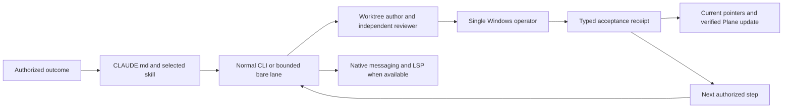

# CLWX-128 — Claude configuration and continuation gaps

## Identity and impact

- Observed September 9, 2026, from 02:59 UTC through the dated validation receipt; operator timezone Asia/Dubai.
- Owner: CLWX-128 (Claude CLI supervision); related CLWX-133 (release execution). Configuration author/reviewer lanes are separate from the active Windows operator.
- Environment: macOS development host; live Claude 2.1.265, newly launched CLI 2.1.266, Bedrock. Source audit began at `238d177d` on `fix/doc-tooling-steering`; instruction author worktree `/private/tmp/clawx-claude-config-20260909`.
- Status: configuration fixes and CLI probes verified; independent Claude review APPROVE with no blocking findings. This work does not prove an installed Windows candidate or GA.
- Known working baseline: ordinary CLI/review work was running. No prior receipt established native messaging or TypeScript LSP for this session.

## Reproduction and expected result

1. Read the original `ga-sprint-driver` ending, then inspect the lead's staged-candidate checkpoint. The lead deferred an already-authorized long install preparation to a later scheduler tick. Expected: preserve the checkpoint and continue the authorized outcome with an appropriate operation timeout.
2. Run `claude plugin list --json` and resolve `typescript-language-server` on PATH. The official TypeScript plugin was disabled and the executable absent. Expected: the selected tool starts and returns actual source symbols.
3. Run the bounded runner with only `ListAgents,SendMessage`. Its bare session exposes neither tool. Run a normal project-scoped CLI with those tools: both are exposed and delivery succeeds. Expected: select a capable lane; never mistake an allowlist for actual availability.
4. Inspect scoped instructions: Windows and principal-extension directories had `AGENTS.md` but no `CLAUDE.md` bridge. Expected: Claude gets the existing contract when entering those source areas.
5. Parse `.claude/agents/moe-product-manager.md` using YAML: its unquoted description contains `Read-only:` and fails strict parsing. Claude's runtime still listed the agent, so total runtime non-discovery is **not** claimed. Expected: portable valid frontmatter.
6. Read the legacy `windows-smoke` agent: it hard-coded a historical Ollama/Qwen setup, ports, seeding assumptions and an email-send canary. Expected: use the current candidate/skill/acceptance contract and explicit outbound gates.

No reproduction sends email, submits a form or mutates the Windows VM.

## Execution path and cause

- **High confidence:** missing executable/plugin enablement explains unavailable TypeScript code intelligence. A normal CLI returned symbols after installation.
- **High confidence:** bare versus normal session mode explains the observed native messaging tool difference. Same provider/model family, different actual tool lists; normal `SendMessage` returned success.
- **Medium confidence:** stop-oriented checkpoint wording contributed to the observed idle gap. The lead's own explanation referenced its bounded checkpoint. This does not establish the cause of every prior delay.
- **High confidence:** scoped `AGENTS.md` alone is not Claude's automatic instruction format. Bridges now share those contracts without duplicating the Codex orchestration brain.
- **High confidence:** old smoke-role assumptions diverged from current release instructions. The role now delegates procedure to the maintained smoke skill.
- The installed 2.1.266 update and the live lead's observed Opus model are separate facts. Session evidence records an automatic refusal-triggered Fable-to-Opus fallback. Do not treat it as an accidental preference edit or bypass it.

## Attempts and decisions

| Attempt | Result | Decision |
|---|---|---|
| Initial read-only bare research lane | Completed but web tools were unavailable | Parent verified primary documentation; no claim the research lane browsed |
| Bare native-messaging probe | No tools, nothing delivered | Preserve failed receipt; use normal CLI for this capability |
| Reply to completed one-shot relay | Recipient read all three instruction files and accepted them in its terminal; direct reply failed because the sender had exited | Keep a normal coordinator alive for bidirectional replies; do not reuse stale peer addresses |
| Normal native-messaging probe | Send succeeded, ID `402fb701-3094-4367-88f3-1f9aea1ff5fb` | Delivery/queueing is distinct from acknowledgement |
| Official TypeScript plugin plus executable | Normal Claude LSP returned `cn`, `formatRelativeTime`, `formatDuration`, `delay`, `truncate` and nested symbols | Keep project-scoped plugin; compiler dependency unchanged |
| Add a second entire orchestration framework | Not installed | Existing OMC plus focused project workflows avoids overlapping ownership |
| Rewrite all global hooks or restart the installer lead | Not performed | Preserve unrelated projects and the active operation |
| CLI validator alone | Did not diagnose the YAML failure | Explicit YAML parsing and runtime discovery supplement validator output |

## Fix and verification

- Revised `CLAUDE.md` and sprint skill: explicit worktree ownership, receipt identity, observed-model reporting, continuous authorized outcomes, synchronized affected pointers.
- Added scoped Claude bridges and four path-specific rule files. Fixed product-manager YAML; replaced stale Windows smoke instructions with the maintained domain procedure. Added command descriptions.
- Project settings select worktree base `head` and three official plugins. Existing Bash guard is invoked with a quoted path and timeout. No global permission/provider changes.
- Hook synthetic controls: ordinary command returns 0; nonsecret synthetic send returns 0; secret-pattern fixture returns 2. A path containing spaces works; temporary ledger contains masked recipient and length, no body or full recipient. This is not a universal MCP-send test.
- Normal CLI initialization lists all three project plugins. Actual LSP `documentSymbol` succeeds on `src/lib/utils.ts`. Normal native messaging succeeds; bare negative control remains documented.
- Skill quick validator passes. Explicit YAML covers 20 agents, 22 skills, four rules and three commands. JSON and whitespace checks are required after final integration.
- Evidence: private `artifacts/ga-autonomy-audit-20260909/` contains author/research receipts, normal/bare messaging streams, LSP stream, plugin inventory and configuration validation. Do not commit raw streams or machine authentication data.

Independent review: separate Claude Fable 5 / Bedrock session APPROVE; 49 frontmatter files parsed, links/settings/ownership checked. The live lead subsequently confirmed `/reload-plugins`: six plugins and one plugin LSP server. Sanitized checks and source digests: [configuration receipt](../evidence/claude-configuration-20260909.json). Installed Windows and release acceptance remain outside this verification.

## Resume here

Use [Claude CLI operations](../CLAUDE_CODE_OPERATIONS.md) and the existing completion plan. Plane synchronization verified: CLWX-128 comment `463d55c6-ffda-496c-93d3-fd915260812a` was fetched by detail and list; the 136-issue board snapshot was refreshed. Existing card state was preserved. Read the final review/readback evidence before changing status. The active release lead remains sole VM operator; source/configuration review can run independently. After the next safe CLI boundary, reload project plugins and re-read the revised instructions. Do not repeat unchanged full product gates for this documentation/configuration change.

Remaining release acceptance belongs to the candidate's existing cards. A successful configuration probe is not a GA verdict.

## Follow-up: instructions were configured, continuous control was not

At the owner's next idle-session report on September 9, a native `/goal` status check returned **No goal set**. The session still had the legacy `23 */2 * * *` GA task `cc2751ee`. This proves the first pass configured capabilities and continuation instructions, but did not activate a turn-to-turn controller. Separately, the Windows reboot had removed the QA interactive session: that installed-acceptance blocker remained real. Neither fact proves every other sprint criterion is blocked.

The follow-up uses one native Claude goal with an explicit executable-work boundary: read current sprint acceptance/dependencies, execute eligible work through assigned review and evidence, and stop with a criterion-level disposition when only concrete external blockers remain. A successful controller goal can therefore end with **GA RED**. Memory and exploration routing is maintained in [the operations runbook](../CLAUDE_CODE_OPERATIONS.md#route-tools-without-loading-everything); the current product plan remains the existing completion plan. Claude/Bedrock reviews are the default; plugin installation alone no longer triggers optional Codex spend.

Two terminal-delivery failures were preserved:

1. An unbracketed 2,197-character command delivered only its final 153 characters after the goal-status panel. No native goal was set. A successful AppleScript exit was insufficient evidence of complete input delivery; the exact low-level truncation cause is unproven.
2. Bracketed paste and an actual Return delivered the full `/goal` text while Claude was busy, but it entered the transcript as a `queued_command` attachment. A subsequent whole-command paste at idle likewise arrived as ordinary user text. These attempts steered work without activating the native handler. A short literal `/goal` command with Return then produced **Goal set** while work was active. Use direct short native commands; reserve collapsed paste for ordinary messages and verify native state separately.

The lead accepted the complete instructions, used native `CronDelete` to retire `cc2751ee`, and started independent read-only sprint analyses while preserving its VM lease. The scheduler readback contained no remaining tasks. Pending input, a delivered message, a running analysis and an active native goal are distinct states.

Private follow-up receipts remain under `artifacts/ga-autonomy-audit-20260909/`, including the preserved failed submission and the independent controller review. The [controller receipt](../evidence/claude-goal-controller-20260909.json) records final activation, checks and limitations; do not infer installed or release success from it.

### Recovery implementation and live verification

The owner extended the task to automatic blocker reporting/recovery and monitoring. A separate Claude Fable/Bedrock author implemented `.claude/hooks/ga-blocker-recovery.py` and its subprocess tests in `/private/tmp/clawx-blocker-hook-author-20260909`. The coordinator added the recovery policy/wiring and corrected an overly broad guard-refusal classification. Two separate Bedrock review worktrees independently **APPROVED** the final hook and each passed all eight tests. The earlier controller-guidance review also approved, with permission-mode and goal-lifecycle notes incorporated.

Enabled the additive `PostToolUseFailure` hook after review. At **05:37:23 UTC**, the existing lead ran the authorized synthetic negative control (exit 17); its native failure callback returned the fixed recovery context in **24 ms**, exit 0. At **05:37:26 UTC**, the lead ran the positive control successfully and continued work. The original failure remained an error; the hook did not conceal it or create a false product bug. Cancellation, malformed/oversized input and no-input-disclosure checks pass separately. The hook contains no network calls, subprocesses, filesystem writes or additional model invocation.

Native `/goal` status confirmed **Goal active**, and the lead advanced independent sprint work: `315d7c37` preserves Windows-lane blocker probes; `c93d8100` promotes CLWX-119 repeated-run evidence and board readbacks. This establishes observed progress and live hook activation. A separate end-of-turn evaluator verdict remains unobserved while the lead has active background work; native goal activity is not proof of indefinite unattended uptime.

A separate normal CLI 2.1.266/Bedrock control subsequently verified the full continuation mechanism: first turn reads one file and ends; native Stop-hook evaluator feedback starts the second turn without user input; the second turn reads a different file and completes successfully (exit 0, 41.36 seconds). The initial identical-file control was deduplicated, so it was preserved and corrected to distinct files. This proves evaluator/continuation behavior in the probe; the existing lead remains on 2.1.265. During monitoring the lead also committed the held distribution draft (`6f0ccc70`) and the remaining-criterion dependency/owner/resume map (`fe7fdda6`).

Memory/code-tool probes also passed using the installed Claude Mem MCP and project LSP. A failed launch exposed variadic `--tools` consuming a trailing positional prompt; streaming the prompt on stdin corrected it. Raw probes, failed attempts and review receipts remain private. Sanitized timestamps, source digests and callback evidence are in the linked controller receipt. Product acceptance is still **GA RED**.
