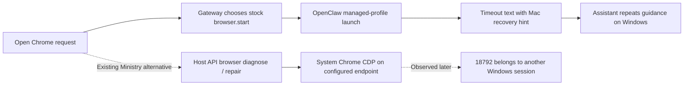

# CLWX-130 — Windows Chrome start times out and returns Mac recovery guidance

## Identity and impact

- Owner-reported September 8, 2026, screenshot 15:48:52 Asia/Dubai. Tool call occurred 11:44:02.283Z; result 11:44:20.134Z, approximately 17.9 seconds later.
- High priority: the principal cannot reliably open the browser needed for Outlook/Forms and receives instructions for a different operating system.
- Environment: GCP Windows Server 2022, interactive FreeRDP Session 2. Gateway PID 8280; Host API later observed on PID 388 in the same session. This is not Windows 10/11 client acceptance.
- Latest previously verified installed package is moe.25, source `8058e9b5b3050463c72a11c8e5da56616206f6e3`. The incident's exact installed package/hash was **not freshly reverified**. File product version `0.4.3.0` is insufficient to distinguish moe suffixes. The unbuilt candidate `f93ac8b3d8039428bfa6d0dde151b5bfe5d119f5` uses OpenClaw 2026.9.2; moe.25's source pins 2026.4.23.
- Known working baseline: [September 7 native Windows evidence](../evidence/WINDOWS_VM_DEVELOPMENT_2026-09-07.md) records two real system-Chrome launcher/Playwright DOM passes in Session 1 on isolated port 19492 (5,159 ms and 2,414 ms), preserving existing processes. Launcher SHA256 `1059abb73c282f8229fd0df4483a33289667f89aada8a83d5f5fd5e7143d0932`. This verifies the Ministry launcher path; it is not a same-artifact stock `browser.start` chat replay. The owner also remembers opening Chrome working; that exact chat/build is unverified.

## Reproduction and expected behavior

Observed input: `cna you open chrome`. The assistant selected stock `browser` with `{"action":"start"}`. It returned timeout text and suggested restarting the Gateway through the `OpenClaw.app` menubar. The footer still showed a connected Gateway.

Expected: opening Chrome should use the supported Windows path, preserve the user's browser state and return a bounded, truthful result. Recovery instructions must apply to the current OS. A browser reachable in another Windows session must not be treated as proof that the user's intended profile is attached.

Only one failing owner turn is captured. A fresh reproduction can launch/navigate Chrome: root must coordinate it with the actively testing owner. The investigation so far only read configuration, process/port metadata and allowlisted tool-result markers.

## Evidence and execution path

Private evidence root: `artifacts/ga-fable-20260908/graph-feedback/`. These files are ignored and must not be staged.

| Evidence | Observation | Limit |
|---|---|---|
| `owner-rdp-chrome-timeout.png`, `browser-screenshot-receipt.json` | Screenshot and image hash; visible timeout and Mac recovery text | Does not identify why startup timed out |
| `installed-status-and-trace.jsonl` | Exact call/result timestamps; tool result `isError:false` | Flag alone does not mean browser success |
| `browser-readonly-observation.jsonl`, 11:57:06Z | `browser.enabled:true`, `defaultProfile:openclaw`; Mac wording and timeout occur in tool result text | Current state is later than the failure |
| `browser-port-observation.jsonl`, 11:59:18Z | Gateway 18789 and control service 18791 belong to Session 2; control service returns HTTP 401 | HTTP 401 demonstrates a responding protected service, not a down Gateway |
| Same port receipt | CDP 18792: Chrome PID 4860, Session 1, HTTP 200; CDP 18800: PID 8056, Session 2, HTTP 200 | Port availability is not profile ownership or an authenticated Outlook session |

Source anchors at `f93ac8b3`: `electron/utils/openclaw-auth.ts` (`syncBrowserConfigToOpenClaw` and batch sync) defaults the stock browser profile to `openclaw`; `electron/services/chrome-cdp.ts` owns `diagnoseChromeCdp` / `ensureChromeCdpReady`; `electron/api/routes/browser.ts` exposes those services; `extensions/moe-principal-assistant/index.mjs` and `persona.mjs` describe them principally as Outlook/Forms recovery. The generic open-browser request has no equally explicit Ministry routing contract.

## Cause and confidence

**Confirmed:** stock tool selection, timeout content, non-error flag, and platform-inappropriate instructions. The Mac wording is present in the tool result, so it cannot be attributed solely to model invention. The default managed path and Ministry system-Chrome path coexist. Later port ownership spans two Windows sessions.

**Source-supported gap:** the generic launch intent can take the stock path rather than the Ministry recovery path. `diagnoseChromeCdp` returns `cdp_ready` immediately after a successful version probe; successful HTTP alone does not establish the current Windows session/profile.

**Not established:** the precise 11:44 startup cause. Fresh-profile bootstrap delay, a launch/exit timeout and contention require incident-time Gateway/browser logs. The later Session 1 listener does not prove it caused the stock start failure; Session 2's later managed Chrome may have started after the timeout. Do not state that the Gateway is down, Chrome is absent, or OpenClaw 9.2 caused an incident on an unreverified installed build.

## Attempts and decisions

- Read-only SSH observers captured process/session and HTTP status without restarting, signing in, killing Chrome or navigating tabs.
- Claude's bounded read-only source/history investigation hit its spending cap before a committed report. Its later assistant findings are preserved at `artifacts/ga-fable-20260908/browser-findings/partial-assistant.md`; CLI status remained failed and is not implementation evidence.
- Do not increase timeouts, disable stock browser globally or switch all requests to port 18792 without confirming the ownership boundary. Those actions could hide the cause or attach the wrong profile.
- Graph readiness work owns overlapping extension files on `lane/graph-readiness-feedback-20260908`, commit `73b77d0c`. Sequence browser edits after reconciling that dependency.

## Acceptance and resume

| Criterion | Current evidence |
|---|---|
| Reproduce reported timeout with exact artifact identity | Owner screenshot/trace PASS; fresh artifact identity NOT_RUN |
| Trace exact underlying startup failure | BLOCKED on incident-time detailed, redacted launch error |
| Route explicit Chrome opening through a supported Windows path | Source gap identified; `browser-fix` Claude lane implementing from `6ec32807` |
| Handle wrong-session/profile endpoint without touching another user | Endpoint ownership reproduced; guard under implementation |
| Windows guidance and typed failure controls | NOT_RUN |
| Independent source review and installed open → Outlook/Forms preview | NOT_RUN; account-holder sign-in remains separate |

Next agent: start from the receipts above, retrieve only the relevant incident-time Gateway error with private values removed, and bind the installed app to its exact build. Determine whether the stock launch timed out during bootstrap or after an RPC deadline; then implement the smallest routing/error repair with a wrong-session negative control. Keep one VM operator. No send/submit is authorized by this bug. Record source fix SHA, reviewer verdict and exact installed rerun before advancing the card.

## Author checkpoint — September 8, 12:24 UTC

The `browser-fix` author reached its explicit spending cap with preserved source edits, not a proven runtime hang. It reported 18 Chrome, 29 plugin and 66 adjacent focused tests passing. The uncommitted fix adds explicit Ministry Chrome opening through the existing Main repair route and checks Windows endpoint session/profile ownership before readiness. Typecheck/lint/harness/comms receipts were incomplete; independent review and installed acceptance remain pending. `browser-finish` now owns only missing validation, concrete corrections and a source commit. The exact incident-time stock-launch cause remains UNKNOWN.

Completion update: `a091a968b89c5127e41c55ab62bf942c56c08e46` is committed and the lane is clean. Typecheck, focused lint, explicit-base harness validation/dry-run, comms replay/compare and diff check pass; prior 113 unit passes were recovered from their retained receipts. Independent source review remains queued; no installed acceptance claim. Private completion: `artifacts/ga-fable-20260908/browser-finish/result.md`.

## Independent review of a091a968 — held for changes

The read-only reviewer reran 113 focused tests and reproduced three boundary defects in isolated probes. Result: REQUEST_CHANGES; source remains excluded from the release candidate.

1. `endpoint_owner_unverified` after launch kills the newly spawned Chrome even when the reported endpoint PID matches that spawn. With restricted Windows process metadata, a valid launch can repeatedly be terminated. Add a deterministic same-owned-PID/unknown-metadata control; do not kill a working browser solely because identity information is unavailable.
2. Same-session/different-profile conflicts are reported as a different Windows user session, directing the user to sign in to their own session. Separate profile conflict from confirmed foreign session; preserve truthful and actionable guidance.
3. Outlook and Forms drivers connect over CDP before calling the readiness repair fallback. A reachable endpoint bypasses the new ownership check entirely. The actual attach boundary must enforce ownership; a diagnosis-only guard cannot establish this property.

Additional source findings: ownership uses `debugPort` while readiness uses `cdpEndpoint`, permitting inconsistent-port evidence; derive or validate one endpoint identity. Default PowerShell probe parsing/error branches lack direct tests. Changes touching the Outlook driver must be owned together with CLWX-121's coupled subject/draft-tab guards; do not narrow the draft scan before binding subject verification to the owned tab.

Private review and probes: `artifacts/ga-fable-20260908/browser-review/result.json`, `/private/tmp/clwx130-review/`. Review execution was flagged MODEL_MISMATCH: initialization requested/reported Fable 5, while final usage also contains Opus 5; all observed usage reports Bedrock. No nested model CLI invocation was found in Bash tool records. This is a provenance exception, not a source approval or a confirmed routing root cause. Retain the concrete failing probes for the next author and require a fresh independent verdict after correction.

Current corrective dispatch: `browser-ownership-repair`, worktree `/private/tmp/clawx-browser-regression-20260908`, base `736ffe9e` (held browser source plus candidate `488ebe29`). CLWX-121 coupled guards are included under the same owner. Source correction, independent approval and installed acceptance remain pending.
