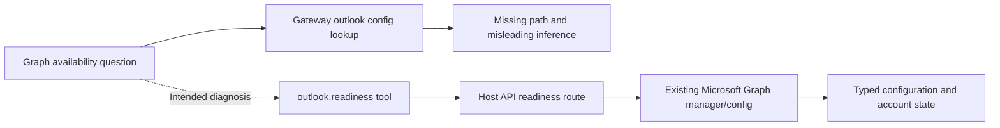

# CLWX-131 — Graph availability is diagnosed through a nonexistent Gateway path

## Identity and impact

- Owner screenshot: September 8, 2026, 15:40:41 Asia/Dubai. GCP Windows Server 2022 / FreeRDP Session 2; connected Gateway PID 8280.
- High priority: a principal asking whether email support is installed gets an inconclusive diagnosis and another permission question, instead of an actionable connection state.
- Related work: CLWX-39 owns client setup/sign-in, CLWX-40 Chrome-less Graph acceptance, CLWX-130 browser launch. Missing account configuration is distinct from this diagnosis defect.
- Incident package identity is not freshly reverified. Prior installed baseline is moe.25 / `8058e9b5`; source fix branch starts at candidate `f93ac8b3`.

## Reproduction and expected result

1. In the observed unsigned-in profile, ask `is the microsoft graph api installed`.
2. The assistant calls `gateway` with `action:config.schema.lookup`, `path:outlook` at 11:39:41.990Z.
3. At 11:39:43.784Z the tool returns a missing configuration-path result, with `isError:false`. The assistant infers possible alternative configuration and asks whether to try an Outlook tool.

Expected: use actual Main-owned readiness without browser navigation, authentication or mailbox mutation. Explain separately whether the integration exists, the public client is configured, an account is signed in, a mock is active and which transport is selected. Do not imply that a network API needs installing locally.

## Evidence and source path

Private `artifacts/ga-fable-20260908/graph-feedback/` holds `owner-rdp-graph-feedback.png`, `screenshot-receipt.json` and `installed-status-and-trace.jsonl`. The last contains a read-only renderer IPC observation at 11:44:52.945Z:

```json
{"handlerOk":true,"configured":false,"signedIn":false,"accountPresent":false,"grantedScopes":[],"mockMailbox":false,"effectiveMock":true}
```

This proves the handler is present and the profile lacks configuration/sign-in. It does not prove a live Graph request would work. `effectiveMock:true` must not be presented as a live mailbox connection. Browser readiness is a separate observation.



At `f93ac8b3`, `electron/services/microsoft-graph/manager.ts` already implements status and sign-in, `electron/main/microsoft-graph-ipc.ts` exposes `msgraph:status`, and `src/pages/Settings/MicrosoftGraphSection.tsx` contains setup. `electron/main/gateway-plugin-config-seed.ts` intentionally disables the separate OpenClaw Graph plugin: the app's Host API owns this integration. Enabling that plugin is not the demonstrated fix.

The Ministry extension lacks a read-only Outlook readiness tool at this base; `outlook.open` navigates a browser. This is the confirmed source-level diagnostic gap, not proof that Graph or Outlook support is absent.

## Fix and verification checkpoint

Source commit `73b77d0c` on `lane/graph-readiness-feedback-20260908` adds `POST /api/outlook/readiness`, the plugin tool and capability/manifest registrations, and appropriate guidance. Current worktree: `/private/tmp/clawx-graph-readiness-20260908`. Independent review approved it; integrated as `6ec32807` in the release candidate. It has not been installed.

| Check | Result / limit |
|---|---|
| Five focused suites, including `outlook-readiness-diagnostics.test.ts` | Root reran 83 tests: PASS |
| Focused ESLint | Zero errors; one test `any` warning |
| Task harness dry-run | Initial command lacked `--since` and included unrelated branch history: FAIL; rerun with `--since f93ac8b3`: PASS, no widened ownership |
| Communication replay/compare | PASS |
| Independent Claude review | APPROVE; `artifacts/ga-fable-20260908/graph-readiness-review/` |
| Installed capability question; live tenant | NOT_RUN |

Exact focused command:

```sh
pnpm exec vitest run tests/unit/outlook-readiness-diagnostics.test.ts tests/unit/outlook-routes-graph.test.ts tests/unit/host-api-capabilities-route.test.ts tests/unit/clwx86-capability-handshake.test.ts tests/unit/moe-principal-assistant-plugin.test.ts
pnpm harness run --spec harness/specs/tasks/outlook-readiness-capability-diagnosis.md --dry-run --since f93ac8b3
```

The author hit its spending cap after editing; root completed the listed checks and committed the checkpoint. That CLI failure is retained. Tests cover typed configuration/account states, unknown status failure, mock handling, no browser/mail mutation and capability skew; independent review must check semantic consistency and avoid claiming cached sign-in state proves a usable network session.

## Resume here

Independent source review is APPROVE. It noted a non-blocking explicit-demo wording issue: `mockMailbox:true` is present in structured data but the summary can say Microsoft cloud without mentioning fixtures. Track that wording correction here; it is not reachable in the observed `mockMailbox:false` incident. Reconcile overlapping extension files with CLWX-130 before packaging. Repeat the original capability question on the exact installed build and verify truthful state/next step without a fictional config lookup or browser mutation.

Graph connection/setup development runs separately on `lane/graph-connection-20260908`; public client registration and account-holder consent/sign-in cannot be invented or bypassed. This bug can fix diagnosis without declaring the tenant journey complete. Preserve email send/Forms submit gates throughout.
