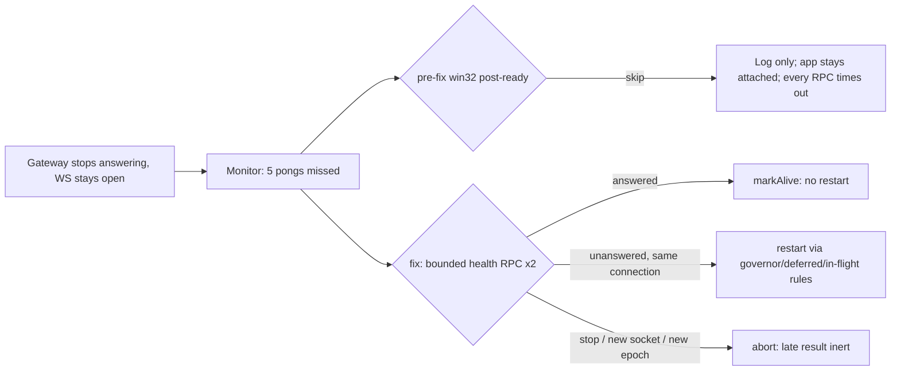

# CLWX-95 — Post-ready Windows Gateway hangs and the app never recovers it

## Identity and impact

- Reported/last verified: 2026-09-12, 07:50–07:56 UTC observation window on the QA Windows Server VM (controller-owned lane). This report was written 2026-09-12 by the isolated source author; the author did not access the VM.
- Owning card: CLWX-95 (turn lifecycle / mid-turn recovery). Related: CLWX-94, CLWX-96, CLWX-117 (chat watchdog), CLWX-125 (cold-turn terminal state). Severity: release-blocking for the Online chat journey once it occurs — every turn after the hang times out with no answer until the app is relaunched.
- Status: **observed on installed moe.41 → source mechanism confirmed → fix implemented and source-verified → PENDING_INDEPENDENT_REVIEW.** Not installed-verified. No GA claim.
- Environment (observation): installed `0.4.3-moe.41` (source `50731ae3`), Windows Server QA VM, interactive session, Online/cloud route via Cloud Run. Installer/asar hashes: see the moe.41 release manifest; not re-derived here. Environment (fix): worktree at base `b1907df3` (approved Forms fixes atop `50731ae3`), branch `fix/clwx95-windows-heartbeat`.
- Known working baseline: none for this failure class on Windows. The post-ready Windows heartbeat has been observability-only since `83f67e1e` (#762) and was deliberately kept so in `ba84cd98`.

## Reproduction and expected result

Installed reproduction is not on demand; the hang follows a Gateway that stops answering while its WebSocket stays open. Observed sequence on 2026-09-12 (controller evidence, summarised):

1. App running, Gateway connected and reported ready (`GATEWAY_READY` true; app/browser CDP reachable).
2. Between 07:50 and 07:56 UTC the app log shows consecutive missed heartbeats counting from 110 to 116, `chat.history` RPC timeouts at 30 s, and a `chat.send` RPC timeout at 120 s. A direct Gateway health call from the runner also timed out.
3. A bounded app chat turn returned `TIMED_OUT_MID_TURN` after 157 s with no answer. Cloud Run recorded only a `models` request during the probe — no chat request reached the provider.

Expected: after the pong threshold is exceeded and a bounded real RPC also goes unanswered, the app restarts the Gateway through its existing restart policy exactly once and the next turn gets a bounded terminal outcome from a live Gateway. A Gateway that merely misses pongs but still answers RPCs must not be restarted.

Focused source reproduction (this lane): `tests/unit/gateway-manager-heartbeat.test.ts` → "restarts a post-ready windows gateway once when missed pongs are corroborated by a failed bounded health probe". On unmodified `b1907df3` it fails with `expected "rpc" to be called 1 times, but got 0 times` — the heartbeat timeout takes the `platform=win32` skip and never probes or restarts. Seven of the twelve tests failed before the fix; all twelve pass after it.

## Evidence and execution path

| Timestamp / revision | Evidence locator | Observation | What it does not prove |
|---|---|---|---|
| 2026-09-12 07:50–07:56Z, installed moe.41 | Controller VM lane (app log, runner output, Cloud Run request log; private) | Missed heartbeats 110→116; `chat.history` 30 s and `chat.send` 120 s RPC timeouts; direct health timeout; turn `TIMED_OUT_MID_TURN` at 157 s; only a `models` request at Cloud Run | Why the Gateway stopped answering; whether the process was CPU-bound, deadlocked or blocked on I/O |
| 2026-09-12 05:55Z | Separate confirmed cloud 429 incident (controller) | Provider rate limiting earlier the same morning | Any causal link to the later hang — see below |
| `b1907df3` `electron/gateway/manager.ts` L1276–1302 (pre-fix) | Source | `shouldAttemptRecovery = shouldReconnect && state==='running' && (!isWindows \|\| initialReadyPending)`; on Windows post-ready it logs `recovery skipped (platform=win32)` and returns | That this line fired in the installed log (the log excerpt available to the author did not include it) |
| `b1907df3` `tests/unit/gateway-manager-heartbeat.test.ts` "keeps non-initial heartbeat recovery disabled on windows" | Source | The skip is an intentional, test-locked contract | — |
| `git log -S initialReadyPending` → `ba84cd98`; `83f67e1e` | Commit messages | Windows leniency exists because Defender scans/updates/synchronous Gateway work delay pongs without the Gateway being dead; earlier pong-triggered restarts caused cascades | That pong loss can never indicate a real hang |
| `electron/gateway/connection-monitor.ts` | Source | `onHeartbeatTimeout` is one-shot: `timeoutTriggered` stays latched until `markAlive()` | — |

Inference (not evidence): at the Windows interval of 60 s, a miss counter of 110 at 07:50 implies pongs stopped around 06:00 UTC, roughly five minutes after the 05:55 cloud 429 incident. That is temporal proximity only; nothing in the available material shows the 429 caused the hang, and this report makes no such claim.

Path at the failing revision: renderer send → Host API → Main `GatewayManager.rpc('chat.send')` → WS request → no response → `RPC timeout` → renderer watchdog `TIMED_OUT_MID_TURN`. In parallel `connectionMonitor.startPing` → `onHeartbeatTimeout` → `startPing` callback → Windows skip. Nothing else owns post-ready liveness: `startHealthCheck` only checks `ws.readyState === OPEN` and emits `error`; `onExit`/`onCloseAfterHandshake` never fire because neither the process nor the socket died.

## Cause and confidence

- Confirmed (source): on Windows, once `gatewayReady` is true, heartbeat loss can never trigger recovery, regardless of duration. The only recovery triggers are process exit and socket close, and a hung Gateway produces neither. Confidence high.
- Confirmed (source): the heartbeat timeout callback is one-shot until an alive signal, so any future corroboration design must re-arm explicitly when it cannot act, or it silently stops rechecking.
- Supported (installed observation): the 2026-09-12 Gateway was in exactly this state — open socket, ready flag true, all RPCs timing out, miss counter climbing past 110.
- Unknown: the Gateway-side cause of the hang (event-loop block, deadlock, provider-client stall). This fix restores recovery; it does not diagnose or remove the underlying stall. Competing hypotheses would be distinguished by a Gateway-side CPU/stack sample during a hang, which the author lane could not take.
- Disproved for this report: "the 05:55 cloud 429 caused the hang" — not disproved, but not supported; treated as a separate incident per the controller.

## Attempts, decisions and fix

| Attempt / commit | Change or experiment | Outcome | Decision / remaining limitation |
|---|---|---|---|
| Reproduction on `b1907df3` | New Windows post-ready tests against unmodified guard | FAIL (7/12) — `rpc` never called, `restart` never called | Defect reproduced at source |
| Rejected: drop the Windows guard, restart on pong loss | — | NOT_RUN | Would re-create the #762 cascade; pongs alone are not proof of death on Windows |
| Rejected: new health/recovery manager abstraction | — | NOT_RUN | Existing `restart()` governor, deferred-restart and in-flight join already own restart policy |
| Rejected: reuse `checkHealth()` as the probe | — | NOT_RUN | It swallows RPC outcomes (`allSettled`) and feeds IPC consumers; changing its shape widens the diff |
| Fix (this lane) | Windows post-ready pong threshold → up to two bounded `health` RPCs (10 s each, 15 s apart). Answered (success or Gateway-declared error) → `markAlive('health')`, no restart. Unanswered on both → `restart()`. Identity guard (same `ws`, `connectedAt`, lifecycle epoch, `shouldReconnect`, `running`) checked after every await; stop()/new connection make a late result inert. One corroboration in flight at a time. If `restart()` returns without replacing the connection (governor cooldown / joined / deferred) the monitor is re-armed so rechecking continues. Diagnostics gain `lastHeartbeatCorroborationAt/Result`. | PASS (12/12 heartbeat, 3/3 monitor, adjacent gateway suites green) | Non-Windows and initial-ready paths unchanged. Probe timing constants are engineering estimates, not tuned on the VM |

Write ownership: `electron/gateway/manager.ts`, `electron/gateway/connection-monitor.ts` (two additive members), the two focused tests, `harness/specs/tasks/fix-windows-post-ready-gateway-recovery.md`, this report. No renderer, Forms, board, plan or acceptance-script changes. Action gates untouched: recovery replays nothing; pending RPCs fail with the existing `Gateway stopped` error; no browser/auth/user-data reset.

## Verification and acceptance

Source revision: working tree over `b1907df3` (commit SHA recorded in the lane summary). Environment: macOS dev host, Vitest fake timers, mocked `rpc`/`restart`, no sockets, no Electron UI.

| Criterion | Command | Result | Notes |
|---|---|---|---|
| Defect reproduced before fix | `pnpm exec vitest run tests/unit/gateway-manager-heartbeat.test.ts` on unmodified manager | FAIL 7 / PASS 5 | Reproduction test fails on "rpc called 0 times" |
| Hung post-ready Windows recovers once; healthy-without-pong not restarted; Gateway-declared error = responsive; overlap → one probe/one restart; late probe after `stop()` or replaced socket inert; re-arm after non-replacing restart; initial-ready Windows and darwin paths unchanged | same, after fix | PASS 12/12 | |
| Monitor one-shot latch and explicit re-arm | `pnpm exec vitest run tests/unit/gateway-connection-monitor.test.ts` | PASS 3/3 | First attempt of the new test mis-traced tick order (latched tick still pings); expectation corrected, contract unchanged |
| Adjacent gateway suites | `… gateway-manager-diagnostics gateway-ready-fallback gateway-manager-restart-recovery` | PASS | |
| Typecheck | `node scripts/generate-ext-bridge.mjs && pnpm exec tsc --noEmit -p tsconfig.electron-typecheck.json` | PASS (0 errors) | Without the generated bridge the only error is the unrelated pre-existing `electron/main/index.ts` import |
| Lint | `pnpm exec eslint electron/gateway/manager.ts electron/gateway/connection-monitor.ts tests/unit/gateway-manager-heartbeat.test.ts tests/unit/gateway-connection-monitor.test.ts` | PASS | |
| Harness spec | `pnpm harness validate --spec harness/specs/tasks/fix-windows-post-ready-gateway-recovery.md --since b1907df3` | PASS | `--since main`/`origin/main` are not this lane's base and report unrelated files |
| Installed proof | — | NOT_RUN | Requires the controller VM lane on a candidate carrying this commit |
| Independent review | — | PENDING | Author does not approve own code |

Not run and not claimed: `pnpm test` (full), E2E, `comms:replay`/`comms:compare`, build/package, any VM action.

## Resume here

- Branch `fix/clwx95-windows-heartbeat`, worktree `/private/tmp/clawx-clwx95-heartbeat-20260912`, base `b1907df3`. Files: listed under write ownership above.
- First next action: independent review of the diff against this report and the task spec; stop condition = findings resolved or change rejected. Then: candidate build carrying the commit → installed Windows observation of (a) a healthy busy Gateway across ≥ 2 miss windows with no restart, (b) a forced hang recovering with exactly one `[gateway-refresh] mode=restart` and `lastHeartbeatCorroborationResult=unhealthy`. Independent of both: Gateway-side diagnosis of the stall itself (CPU/stack sample during a hang).
- Authority: none needed for review; VM work stays with the main interactive session per the lane contract.
- Not synchronized to Plane; no board write was made by this lane.
- Do not repeat: pong-only restart on Windows; a new recovery manager; reworking `checkHealth()`.
