# Windows build pipeline

Last reviewed: 2026-09-07.

This is the canonical operating guide for making Windows builds smoother, reproducible and easier to diagnose. It covers the GitHub/manual build pipeline and local preparation evidence. It does not replace the release gate, installer acceptance or VM smoke workflow.

Use this document when the goal is to prepare or repair the build lane, improve CI feedback, choose a safe build source, or explain what a Windows installer artifact proves. Use `windows-build-package` for the actual packaging commands and `windows-vm-smoke` or `ga-release-readiness` for installed evidence and release verdicts.

## Current build contract

The Windows release lane has four distinct evidence layers. Keep them separate in reports and docs.

1. **Source identity**: the selected Git revision, working tree cleanliness and dirty-state hash where allowed. Public release publication requires clean source.
2. **Compiled output receipt**: deterministic hashes for `dist/` and `dist-electron/`, plus entrypoint mtimes, recorded after the existing Vite/OpenClaw/skill bundle sequence succeeds.
3. **Installer identity**: electron-builder output, release manifest, build profile and seed policy. Direct electron-builder publication is blocked; packaging uses `--publish never`.
4. **Installed runtime evidence**: Windows environment, installer hop hash, installed app path/version/hash, Gateway/Host API, Electron safe-chat, Office checks and tenant-safe evidence where required.

A source/static pass does not prove the installed app. A successful installer build does not prove GA. GA requires the release evidence workflow and an installed Windows evidence bundle accepted by the release gate.

```mermaid
flowchart LR
  Source["selected clean source"] --> Preflight["preflight and toolchain"]
  Preflight --> Package["compile and bundle"]
  Package --> Receipt["source plus compiled-output receipt"]
  Receipt --> Builder["electron-builder --publish never"]
  Builder --> Artifact["installer and build provenance"]
  Artifact --> Installed["installed Windows evidence"]
  Installed --> Release["release evidence gate"]
```



## Canonical hosted Windows procedure

Use `.github/workflows/package-win-manual.yml` for reviewed hosted builds. Dispatch it with an exact branch, tag or SHA after root has selected the source. Do not dispatch from a working branch that contains private evidence or unreviewed history.

Default public build profile:

- `cloudGatewaySeedProfile: keyless-public`
- `requireCloudGatewaySeed: false`
- `requireAzureSpeechSeed: false`
- `requireMicrosoftGraphSeed: false` unless the selected release explicitly requires the non-secret Graph default

The keyless-public profile must not inject credential-bearing cloud gateway or Azure Speech seeds, even if repository secrets exist. `seeded-private` is reserved for private repositories and private/local testing. Public artifact upload is blocked unless the selected build provenance proves a keyless-public profile bound to the same clean source and manifest.

The package job currently performs these stages:

1. Check out the requested ref with full history.
2. Set up Node 24, the pinned .NET SDK and pnpm.
3. Restore the pnpm dependency cache immediately after the store path is known.
4. Run `pnpm install --frozen-lockfile`.
5. Save the pnpm cache immediately after install when the restore missed; cache save is non-fatal and explicitly reported in the summary.
6. Resolve the hosted build profile and reject contradictory public/seeded settings.
7. Prepare optional seeds according to the selected profile.
8. Record build-profile provenance.
9. Run `pnpm run preflight`.
10. Run `pnpm run prep:win-binaries`.
11. Run `pnpm run package` to compile, bundle, verify OpenClaw, write the fast harness artifact and record the compiled-output receipt.
12. Run `node scripts/run-electron-builder.mjs --win --publish never`.
13. Always write the allowlisted Windows package build summary. It includes the actual checkout SHA, the release source record `gitCommit`, the receipt `source.gitCommit`, tool versions, selected profile and step outcomes with Markdown escaping. Missing command-derived values render as `unavailable` instead of dumping raw process output.
14. For keyless-public builds, scan staged release output for blocked seed files.
15. Upload installer artifacts, blockmaps/update manifests and build provenance.

The build-provenance artifact must include:

- `.release-build-source.json`
- `.tmp/release-build-output.json`
- `.tmp/release-build-profile.json`
- `docs/release-manifests/*.json`; a manifest is mandatory for publication validation, not optional proof by itself

Publication from an existing Windows run is a separate job. It must download GA evidence, the selected Windows artifacts and build provenance; validate profile/source/receipt/manifest before any `gh release upload`; then upload only the checked `.exe` plus current approved docs.

## Canonical local Windows package command

For local packaging, use the existing script chain rather than hand-running electron-builder:

```bash
pnpm run package:win
```

For the explicit NSIS x64 target:

```bash
pnpm run build:win
```

The current `package:win` chain runs preflight, prepares Windows binaries, records the source context, builds Vite, bundles OpenClaw, verifies the OpenClaw bundle, writes the harness artifact, bundles plugins and preinstalled skills, records the compiled output receipt, and invokes the electron-builder wrapper with `--win --publish never`.

Do not run `electron-builder --publish always` or rely on electron-builder CI publish defaults. The wrapper rejects direct publication before spawning electron-builder and verifies source plus compiled-output receipt before and after the builder run.

## Directory map

Keep build and release material in these lanes:

| Path | Purpose | Public by default |
| --- | --- | --- |
| `docs/build/windows-build-pipeline.md` | Canonical build process and retrospective | Yes |
| `.github/workflows/package-win-manual.yml` | Hosted Windows build and checked publication workflow | Yes |
| `scripts/release-build-source.mjs` | Source and compiled-output receipt helpers | Yes |
| `scripts/run-electron-builder.mjs` | Safe electron-builder wrapper | Yes |
| `scripts/release-build-profile.mjs` | Public keyless profile validation | Yes |
| `release/` | Local packaged outputs | No; generated |
| `.tmp/release-build-profile.json` | Generated hosted build profile record | No; artifact only |
| `.tmp/release-build-output.json` | Generated compiled-output receipt | No; artifact only |
| `.release-build-source.json` | Generated source context | No; artifact only |
| `artifacts/windows-vm/` | Private VM logs, screenshots, transcripts and installed evidence working files | No |
| `docs/evidence/` | Reviewed public evidence summaries only | Selectively |
| `docs/plane-board/` | Board export and planning evidence | No unless explicitly reviewed |

Never publish raw VM recordings, screenshots, tenant transcripts, stakeholder messages, private Forms URLs, provider keys, passwords, Host API tokens or generated credential-bearing resources.

## CI improvement backlog

These are process improvements proposed for the workflow executor. Treat them as proposed until a reviewed workflow change lands and a later native run measures the result.

Implemented in the active workflow:

- Preflight, Windows binary preparation, compile/bundle and builder are separate workflow steps.
- Dependency install uses `pnpm install --frozen-lockfile`.
- pnpm cache restore and save happen adjacent to dependency install; cache save is non-fatal and reported.
- The allowlisted summary reports actual checkout SHA, source record SHA, build receipt SHA, selected profile, tool versions and step outcomes. It does not write a duration JSON artifact or claim measured speedup.

Still proposed for the workflow executor:

- Add measured stage durations after a later native run can verify the data is useful and stable.
- Cache downloaded toolchains where safe, but never cache compiled release output, credentials, generated seeds or private VM evidence.
- Keep `.NET`, Windows ASR helper requirements and native process fixtures deterministic so test failures identify missing prerequisites instead of timing out late.
- Preserve existing clean-source, keyless-public, no-direct-publish and compiled-receipt guards while improving diagnostics.

## Targeted smoke before full native builds

Before dispatching another full hosted Windows build after a source or workflow repair, run the smallest existing checks that can falsify the fix locally or in the clean public checkout:

```bash
pnpm exec vitest run tests/unit/release-publication-workflows.test.ts tests/unit/windows-build-summary.test.ts tests/unit/release-build-profile.test.ts tests/unit/release-build-source.test.ts tests/unit/run-electron-builder.test.ts tests/unit/windows-package-inspection.test.ts
pnpm run typecheck:scripts
```

Add the failing domain-specific test file when the fix belongs to a parser, subprocess, fixture or runtime boundary. Do not skip the full build after the smoke passes; the smoke exists to avoid spending another native run on a predictable setup or contract failure.

## September 7 retrospective

The September 7 build lane exposed repeated friction from treating symptoms as isolated failures. The durable fix is phase separation with evidence at each boundary.

| Run | Source | Result | Lesson |
| --- | --- | --- | --- |
| `34115779033` | `7cfad9bd` | Failed native preflight before installer: 16 files failed, 92 tests failed. | CRLF/shebang and subprocess boundaries must be proven on native Windows. |
| `34117459118` | `6c2834cb` | Failed native preflight before installer: 199 files and 1,982 tests passed, 11 skipped; two integration cases exceeded the default 5-second Vitest limit. | Keep assertions active, but give real cold/parser and controller-process tests bounded native budgets. |
| `34121639939` | `fed34dcb` | Failed after preflight and frontend/Electron compilation: 201 files, 2,007 tests passed, 11 skipped; UtilityProcess PDF probe refused a checkout fixture outside parser home/temp roots. | Stage public fixtures in owned temp storage while preserving parser sandbox refusals. |
| `34123550898` | `8d477e9e` | Failed with no installer: 201 files and 2,011 tests passed, 11 skipped; bundle verifier and seven artifact rows passed; `no-hostapi` transport timed out after 120 seconds. | All-plugin diagnostics loaded 102 plugins to inspect one. The scoped real-loader repair preserves source/network/inventory checks; both Windows diagnostics subsequently passed under the unchanged 120-second limit (42,413ms cold no-hostapi; 6,094ms full). A complete native package remains required. |

Lessons to preserve:

- CRLF and shell-boundary issues must be caught where Bash, PowerShell and YAML meet; do not paste complex PowerShell into Bash strings when a script file or encoded remote helper is available.
- Native process fixtures need deterministic setup and cleanup; a test that depends on a leftover listener, stale task or inherited process is not proving the lane.
- Cold-start proof must wait for app readiness, including Gateway and enabled composer state. Port listeners alone are insufficient.
- Parser budgets and fixture locations belong in tests. Do not paper over parser timeouts by skipping product assertions or raising timeouts without explaining the work avoided.
- Clean tests should not require a completed build unless they are explicitly build-output tests. Use minimal fixtures for workflow/profile guards.
- Public snapshot selection must exclude private runtime evidence and stakeholder history while preserving buildable source and reviewed public summaries.
- Source, artifact, installed evidence and release approval are separate. Do not attach a fresh HEAD to stale artifacts, and do not call a candidate GA until installed evidence proves the exact selected artifact.
- Interactive VM installation evidence needs visible-session proof and recorded operator-safe steps; SSH-only install shortcuts can miss installer UI behavior.

No September 7 native run produced a moe.21 installer. Do not use any run/source pair above as a default in commands or future docs; update status from the actual next successful run before making release claims.

## Agent and skill surfaces

The build-pipeline procedure has matching project surfaces for Codex, OMX compatibility and Claude:

- `.agents/skills/windows-build-pipeline/SKILL.md`
- `.agents/skills/windows-build-pipeline/agents/openai.yaml`
- `.codex/skills/windows-build-pipeline/SKILL.md`
- `.claude/skills/windows-build-pipeline/SKILL.md`
- `.codex/agents/windows-build-engineer.toml`
- `.claude/agents/windows-build-engineer.md`

These mirrors exist because the repository supports multiple local agent entrypoints. Keep this document as the canonical build procedure and keep the skill bodies short. Codex skill structure follows the official Codex skill package format at `https://developers.openai.com/codex/skills`, including `SKILL.md` plus optional `agents/openai.yaml`; Codex custom-agent TOML follows `https://developers.openai.com/codex/subagents`, where `name`, `description` and `developer_instructions` are the required identity/instruction fields. Claude project skills follow `https://docs.anthropic.com/en/docs/claude-code/skills`, including `allowed-tools` for skill tool grants; Claude project subagents follow `https://docs.anthropic.com/en/docs/claude-code/sub-agents`, including `.claude/agents/` markdown files with YAML frontmatter and `tools` for subagent tool allowlists.

## Review checklist for future build changes

Before changing the Windows build workflow or scripts, verify:

- The workflow still blocks direct publish and uploads artifacts only after profile/source/receipt checks.
- Public builds cannot include credential-bearing cloud gateway or Azure Speech seeds.
- The build-provenance artifact includes source, compiled-output receipt and profile records.
- Tests cover failure ordering, public/private profile contradictions and missing provenance.
- Package execution still delegates runtime acceptance to installed Windows evidence rather than marking artifacts GA from CI alone.
