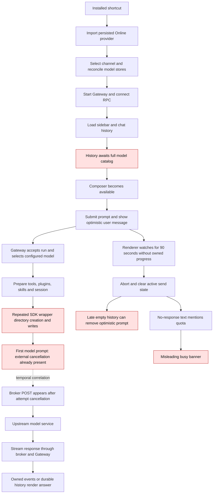

# CLWX-125: Windows first-response investigation

Owner: runtime/release engineering. Plane: **CLWX-125**, In Progress, urgent. Related: CLWX-22, CLWX-95 and CLWX-117. This is a dated investigation record, not another current release plan. [Current status](../COMPLETION_PLAN.md), [candidate](../CURRENT_WINDOWS_RC.md), [workflow matrix](../APP_WORKFLOWS_TEST_MATRIX.md).

## Question and current result

Why did an earlier Windows Online turn answer, while the current standard-user turn fails? Restore a reliable first response without losing the submitted prompt, inventing a quota diagnosis or replaying work on an unintended local model.

**Observed:** moe.24 installs correctly but fails the ordinary first-turn test. Its runtime spends approximately 112 seconds before `prompt.submitted`; the attempt immediately records an external cancellation. The configured model idle timeout is 600 seconds and the trajectory says `idleTimedOut:false`. This locates the failure before useful model execution. The cancellation producer still needs direct binding. CPU profiling has identified repeated SDK alias writes as a substantial preparation cost; the bounded repair is under test. `timedOut:true` alone does not prove which timer fired: the pinned runtime classifies some ordinary abort messages as timeouts.

## Product flow and failure map

Solid edges show the implemented path. Red nodes identify a reproduced failure or a source-supported defect. Dashed edges identify evidence that is correlated by time but lacks a propagated turn identifier.



The startup history wait is real, but it completed at 06:09:47Z, before this prompt. Removing it alone is not yet proved to repair the later first-turn preparation delay. The arrow from the watchdog to this attempt's cancellation remains a hypothesis until cancellation provenance or a controlled reproduction binds it.

## Controlled comparison: what actually worked before

| Observation | Revision / environment | Result and limit |
|---|---|---|
| Established-profile ordinary Online turn | moe.22 `a4efc7e4`, existing Server 2022 administrator profile | Sent 03:36:50.847Z; answer observed 03:38:15.937Z: **85,090 ms**, plus 30-second stable terminal window, PASS |
| Fresh-profile ordinary Online turn | Same moe.22 revision, newly provisioned standard user | Sent 04:46:10.933Z; actual Online answer persisted 04:49:01.613Z: **170,680 ms**. Driver failed, UI falsely degraded to local; not a successful acceptance run |
| Current first turn | moe.24 `b814f804`, same standard-user profile after upgrade | Sent 06:11:28.506Z; no displayed answer by 06:14:29.063Z. Empty conversation and generic error banner; FAIL |

Current root and standard-user provider configurations use different Cloud Run endpoints. The established profile, model metadata and cache history also differ. The first row is therefore not a controlled version-only baseline. The fresh-profile failure already existed in moe.22. No evidence supports blaming the entire regression on the moe.24 version bump.

The relevant moe.22-to-moe.24 production diff is nine files in `electron/` and `src/`, primarily startup/provider provisioning, channel UI and silent fallback handling. Commit `7f4b06d3` removes automatic local replay on silence and clears its replay payload. Both versions already reject events belonging to watchdog-terminated runs. The earlier late Online result must not be described as proof that the old renderer safely accepted every late final.

## Exact latest timeline

Source `b814f804036fc2f9f32d3326c8694f4ae2ef7805`; hosted run `34189597051`; installer SHA256 `83af6d00071992b3e34b5430e3e3eb4c848804054cd90d23afbdc3deafc271dd`; installed ASAR SHA256 `656dde43f1a2b3597bd5d35f9bca72dc0ad2527909b0eb499b0f9971d3a56aa5`.

| UTC time | Boundary / observation | Evidence class |
|---|---|---|
| 06:03:28.105 | Standard-user assisted upgrade exits 0; installed hashes match | Installed identity |
| 06:09:39.469 | Initial `chat.history` times out at 35 seconds | Main log |
| 06:09:47.783 | Gateway history response completes in 43,336 ms | Gateway log |
| 06:11:28.506 | Driver clicks Send | UI action; not proof of durable acceptance |
| 06:11:28.642 | Broker `/v1/models` HTTP 200, 0.956 s | Server access log, time/route correlation |
| 06:11:30.601 | Target session initialization begins | Gateway log |
| 06:11:30.950 | Configured catalog ready, 0 ms, three entries | Gateway log |
| 06:11:59.662–.673 | MoE document, Outlook and Forms tools register | Gateway log; registration does not execute a tenant action |
| 06:12:05.466 | Another `chat.history` times out at 30 seconds | Main log |
| 06:12:36.265 | Four unrelated provider plugins fail validation | Gateway log; causal contribution not yet measured |
| 06:13:20.665 | Runtime trajectory `session.started` | Target session/run trajectory |
| 06:13:20.789 | `prompt.submitted` | Target session/run trajectory |
| 06:13:20.807 | `model.completed`: externalAbort/aborted/timedOut true, idleTimedOut false | Target session/run trajectory |
| 06:13:21.080 | Broker `/v1/chat/completions` request starts; HTTP 200; total 37.222 s | Time/route correlation only; no first-token or delivered-answer proof |
| 06:13:51.126 | Embedded failover decision surfaces timeout | Gateway log; classification is not the original cancellation timestamp |
| 06:14:29.063 | Driver ends NO_RESPONSE, zero visible messages | Installed UI failure |

The session index retains the expected Online model, but its referenced transcript file does not exist. A retrospective scan uses the exact synthetic prompt and Gateway session index, independently of the earlier helper's 125-second binding limit. The original failed acceptance receipt remains unchanged. Trajectory evidence must not be mislabeled as a persisted assistant answer.

## Measured preparation cost and repair boundary

The same installed `b814f804` build was restarted under the standard user with a temporary, environment-gated CPU profiler. Profile data was captured from **06:58:03.254Z to 07:01:03.995Z**; the sampled interval was **180.796 seconds**. Defender, VM size, provider configuration and watchdog limits remained unchanged. This is diagnostic evidence, not acceptance of a modified artifact.

The ordinary synthetic turn was sent at **06:58:08.144Z**. The renderer entered an owned run by 06:58:11.712Z and returned to idle at **06:59:48.279Z**, without a displayed answer. The original driver ended at 07:01:09.782Z with `ASSISTANT_EMPTY_SILENCE_ON_SEND`, an inline error chip, no answer, and seven rendered message elements. This differs from the previous zero-message `NO_RESPONSE` receipt; both are failures. Exact-token retrospective correlation binds this diagnostic to the existing `agent:main:main` session. Its actual failover record selects `ollama-ollamalo/qwen2.5:3b-instruct`, despite the composer showing Online. The session contains the earlier local-fallback history; the driver’s NewSession action did not establish a fresh session. This run therefore profiles runtime preparation and exposes a separate session/model mismatch; it is **not an Online acceptance test or a controlled provider-identical comparison** with the earlier cloud attempt. The additional observer used an incorrect exact message selector, so its zero message count is invalid and is excluded. Its sending/run/channel attributes remain useful. It observed no renderer WebSocket RPC frames and therefore does not establish an exact `chat.abort` timestamp.

| Profile call path | Inclusive sampled time | Interpretation |
|---|---:|---|
| `loadOpenClawPlugins` | 95.215 s | Repeated plugin runtime work |
| `ensureOpenClawPluginSdkAlias` | 54.133 s | Materializes generated SDK alias files on each load |
| `writeRuntimeModuleWrapper` | 52.370 s | Reads SDK sources and rewrites generated wrappers |
| Native `writeFileUtf8` / `mkdir` under SDK alias creation | 29.706 s / 12.395 s self time | Synchronous filesystem cost inside the measured path |
| Provider built-in model suppression | 36.346 s | Catalog provider hooks also enter plugin loading |
| `createOpenClawTools` / web-search construction | 27.304 s / 20.627 s | Additional preparation after the observed renderer idle transition |

Inclusive rows overlap and must not be added. Each function is counted once per sample. SDK alias preparation alone accounts for **45.277 seconds before the observed renderer idle transition**. This establishes a substantial cause of preparation cost; it does not prove that removing it alone satisfies end-to-end response latency.

The pinned implementation in `loader-DeOtDUYt.js` unconditionally runs synchronous directory creation and writes for every generated SDK wrapper. The source repair `ba459ef1` compares the expected generated content with the existing file and skips unchanged writes. Missing/stale files and changed source exports must still regenerate correctly. Plugin availability and registry activation semantics remain unchanged. The installed falsifier is a repeat profile plus a stable ordinary first response; 29 focused bundle/patch tests, typecheck, communication checks, bundle verification and actual-diff harness validation pass. Root review confirms the narrow content-comparison behavior; native fixture validation passes as recorded below; installed response validation remains pending.

A native Windows fixture executed the actual installed SDK helper and the reviewed repair at **07:13:43Z**, using packaged Node 22.16.0 and all **295 SDK modules**. The unchanged baseline repeated **297 directory calls and 296 writes**; the repair performed **zero directory calls and zero writes**, preserved every wrapper byte, and repaired exactly one deliberately stale wrapper with one write. The warm repeat took **357 ms baseline / 280 ms patched**. Initial baseline materialization took 3,805 ms. These are single fixture timings with different cache states, not an app-level speedup claim. No installed files or provider configuration changed and no model request was made. Receipt: `artifacts/windows-vm/20260908-connection-rca/sdk-native-benchmark.json`.

The diagnostic also identified a test-driver defect: its New Chat click occurred before composer/history readiness, and the sidebar deliberately does nothing when it currently sees zero messages. The driver then equated an empty DOM with a fresh session. The next driver revision must require a confirmed session-key transition after hydration before it can send or claim freshness. The seven old Main messages and actual local model route invalidate that run's Online/fresh-session claim.

The original runtime entry was restored at **07:04:02.339Z**, with SHA256 `77e5b2f586902a6135cc8f63505195def17191b31cadd604f8407ff8581ec0fa`; the original ASAR hash still matches. The owned app exited and its three listeners were gone. VM lifecycle and the separate browser/model service were preserved.

The independent UI/driver repair is **`aa398dfb`**, based on reviewed history repair `f5875b54`. A baseline regression reproduced prompt loss (`expected [] to deeply equal ['user']`). The repair passes 137 focused tests, two Electron interactions, typecheck, lint with zero errors, communication replay/compare and actual-diff harness validation. Review removed broad timestamp-based history filtering, added exact run ownership and hard-delete cleanup, and ensured a generic error cannot receive an answered verdict. Installed validation remains pending.

Driver follow-up **`141841df`** now waits for composer/history readiness and requires a stable session-key transition to an empty `agent:*:session-*`. Its 32 focused driver tests and three Electron interactions pass, including the actual sidebar no-op during history hydration. Root review confirms that failure to prove freshness returns before Send. It changes no Sidebar behavior.

A read-only live probe at **07:21:34Z** confirms an enabled/default Online account, available key and a matching `default/probe` result (`success:true`, `valid:true`, HTTP 200). The default runtime configuration is Online, but the existing Main session retains local model metadata. This narrows the mismatch; it does not identify which pre-send reconciliation gate ran in the failed diagnostic. The pinned clear response can retain runtime model fields when already aligned with the default, while the renderer currently rejects such acknowledgements; that adjacent contract mismatch needs its own regression and is not established as the cause of the observed local route.

An SDK-only diagnostic was prepared at **07:19:49Z** with original loader/entry backups and unchanged ASAR/provider settings. It has not produced an accepted response or a second CPU result. It will be restored or superseded by a separately hash-bound integrated diagnostic; neither counts as a released installer.

Allowlisted receipts: `artifacts/windows-vm/20260908-connection-rca/cpu-hot-paths.json`, `cpu-summary.json`, `profile-completed.json`, `retrospective-turn-correlation-v4.json` and the restoration receipt. Raw CPU/log/diagnostic UI files remain protected and untracked.

## Hypotheses and falsifiers

| Hypothesis | Current support | Discriminating experiment |
|---|---|---|
| Cold preparation outlasts the renderer watchdog; cancellation reaches the attempt before model work | Strong: 112-second preparation, 90-second source watchdog and immediate externalAbort; producer still needs binding | Record owned send/run/watchdog timestamps and profile the exact preparation interval; reproduce baseline cancellation with controlled delayed initialization |
| The broker rejected the key or exhausted quota | Not supported by the observed access records, which show 200 rather than 401/403/429 | Bind per-turn request identity and inspect typed status/SSE outcome, without logging credentials or payloads |
| Model generation itself caused the first cancellation | Not supported as the initiating event: attempt cancellation precedes the observed broker POST; first-token timing remains unknown | Record request start/first event/terminal event under the same turn identifier |
| Defender alone explains the delay | Unproved: 49,927 scans and repeated runtime files establish activity, not exclusive causality | CPU stack profile plus phase timings; keep Defender and VM configuration unchanged |
| Empty history plus timeout erases the submitted prompt | Source-supported; screenshot is consistent | Fake-timer regression with a delayed empty history result after timeout; preserve session/new-run ownership |
| Upgrading all upstream code is the immediate fix | Unverified; current upstream has different OpenClaw and IPC/recovery architecture | Compare the responsible function and its regression before choosing a narrow backport |

No uncontrolled timeout increase, broad rollback, security exclusion or compute resize is an experiment in this record.

## Upstream and known useful history

[Upstream assessment](../UPSTREAM_MERGE_ASSESSMENT_2026-08-20.md) binds `ValueCell-ai/ClawX` main `6a938757` to version 0.5.6 / OpenClaw 2026.7.1-2. The installed fork uses OpenClaw 2026.4.23. Commit counts are not compatibility scores. Missing upstream ancestry is not a missing fix when the behavior was backported.

| Reference | Existing code / test to reuse | What it proves |
|---|---|---|
| `61be816e` | `electron/utils/agent-config.ts`; `tests/unit/fresh-install-boot-chain.test.ts` | A concrete default model must exist before a fresh Gateway can bind |
| `38085ba3` | `electron/main/cloud-gateway-provider-seed.ts`; `electron/utils/channel-config.ts` | Preserve explicit channel choice and use existing atomic Windows configuration writes |
| `10449b96`, `7f4b06d3` | `electron/services/providers/channel-router.ts`; `src/stores/chat.ts` | Retain run ownership and avoid false local replay; not a cold-latency cure |
| `a4efc7e4` | `electron/services/providers/provider-runtime-sync.ts`; `electron/utils/openclaw-auth.ts` | Preserve managed cloud aliases and modality metadata |
| `f5875b54` | `scripts/openclaw-chat-history-patch.mjs`; actual pinned-handler regression | History can return without loading the entire model catalog; source-verified, not yet installed |

These samples retain their commit and test provenance. `sendGeneration` ownership in `src/stores/chat.ts` prevents an old run from clearing a newer send; the history patch test executes the pinned handler and resolver with only IO/context boundaries stubbed. Keep these protections while correcting the timeout/history race. The user-held trim branch remains held.

### Reusable samples and retrieval

The `38085ba3` startup fix preserves an explicit channel choice. Its surrounding seed validation and atomic writer remain part of the implementation:

```ts
const current = await getSetting('preferredChannel').catch(() => undefined);
if (current === undefined || current === null) {
  await setSetting('preferredChannel', 'online');
}
```

The source-verified `f5875b54` history helper uses persisted/configured thinking defaults without starting the full catalog load. Actual turn execution retains its model-resolution path:

```js
function resolveChatHistoryThinkingLevelWithoutCatalog(params) {
  const persisted = params.entry?.thinkingLevel;
  if (persisted) return persisted;
  return resolveThinkingDefault({
    cfg: params.cfg,
    provider: params.provider,
    model: params.model,
    catalog: []
  });
}
```

Retrieve the complete implementation and its regression from git; these commands do not change the checkout:

```sh
git show 61be816e -- electron/utils/agent-config.ts tests/unit/fresh-install-boot-chain.test.ts
git show 38085ba3 -- electron/main/cloud-gateway-provider-seed.ts electron/utils/channel-config.ts tests/unit/cloud-gateway-provider-seed.test.ts
git show f5875b54 -- scripts/openclaw-chat-history-patch.mjs tests/unit/openclaw-chat-history-patch.test.ts
```

The first two repairs address historical boot defects. The history helper addresses the measured history/catalog wait and still requires installed validation. None of these snippets establishes that cold first-turn preparation is repaired.

## Test criteria and experiment discipline

1. Bind source, installer/ASAR hashes, profile, OS, configured provider route, cache state and diagnostic changes before each experiment. Change one proposed cause per comparison; record unavoidable cold/warm cache differences.
2. Reproduce the baseline with the actual handler or installed app. A mocked successful model response does not validate cold initialization or the broker.
3. Separately time click, Gateway acceptance, preparation, provider request, first owned progress, answer and terminal quiet period. A port or enabled composer is not end-to-end readiness.
4. First Online response must contain the exact synthetic token once, with provider provenance, no local replay, no visible error, and all sending/run/tool/degrade flags idle for 30 seconds. Record latency; do not hide it inside the quiet window.
5. Cold initialization, warm next turn, timeout, cancel-next and late-result isolation need distinct cases. After a failed send, the submitted prompt and accurate terminal error must remain visible across history refreshes.
6. The acceptance driver must observe the generic error banner as well as run errors and tool error chips. Recordings must cover submission through the full terminal window; partial clips prove only the captured interval.
7. Run focused regression, relevant Electron interaction, typecheck/lint and communication/harness gates for changed behavior, then independent review and native installed retest. Reuse unchanged package evidence with its revision.
8. Publish or hand off only after the repaired artifact meets its acceptance criteria. Server 2022 proof does not establish Windows 10/11, tenant sign-in, actual microphone or unaided stakeholder acceptance.

## Environment and evidence handling

The Windows guest is hosted on **GCP and accessed from the local Mac**; this work did not create a local hypervisor VM. Its creation timestamp is June 9, 2026, verified from Compute metadata. The August history records reuse of that existing VM; September work established a persistent Windows development checkout and a standard-user acceptance profile. [Setup and access procedure](../../windows-pilot/vm-testing/README.md), [native development history](WINDOWS_VM_DEVELOPMENT_2026-09-07.md).

This Codex session exposes no Plane, WhatsApp or project-memory MCP. The actual available capability inventory was checked. Plane work uses the repository's project-scoped API writers with detail/list readback; repository history and authorized local stakeholder evidence provide context. An external MCP is not part of the shipped assistant's model or email request path.

Raw logs and broker access records remain in protected local storage; CPU profiles remain private. Only allowlisted timing, state and artifact evidence belongs in git or Plane. Diagnostic scripts/results are under `artifacts/windows-vm/20260908-connection-rca/`; installed receipts and screenshots remain under the linked September 8 connection evidence. CPU instrumentation must be backed up, hash-bound and restored before any artifact acceptance claim.
