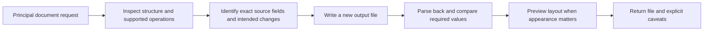
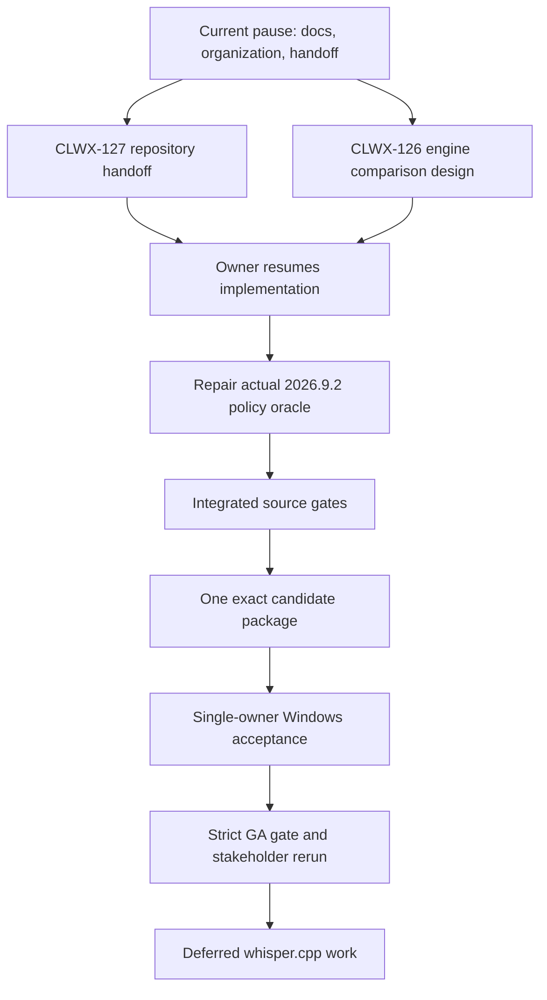

# OpenClaw and Windows improvement study — September 8, 2026

**Current mode:** research, repository organization and handoff. The owner resumed execution after the first planning checkpoint, then paused new implementation, packaging and VM/model work before the next sprint. Completed source integration and current blockers are tracked in [COMPLETION_PLAN.md](../COMPLETION_PLAN.md) and the [state vector](../completion-state.json). ASR remains deferred.

**Decision state: documentation and planning only.** This document records findings and proposes improvements; it does not approve a migration, install community skills, publish an installer or establish release acceptance. [COMPLETION_PLAN.md](../COMPLETION_PLAN.md) remains the current work-order authority.

**Recommendation:** keep the Ministry application and its existing Main/Gateway/tool boundaries. Evaluate a coherent OpenClaw upgrade in isolation, strengthen the existing Outlook and document adapters using the useful examples, and require installed evidence before selecting a release. A wholesale AionUi migration or a bundle of community skills has not been justified by the observed failures.

Evidence labels: **Verified** means inspected source, metadata or a named observed test; **Proposed** means a design/experiment; **Unknown** means no adequate proof yet. Source inspection is not Windows execution. Rolling documentation must be checked against the exact package selected later.

## Requirements carried forward

| Owner/stakeholder requirement | Current finding | Planned outcome / owner card |
|---|---|---|
| Karunesh must connect and test ordinary email/document work | His moe.21 connection failure blocked all downstream journeys. Later repairs have scoped diagnostic positives, not his acceptance. | Reliable provisioned first turn, useful unprovisioned state, unaided rerun; CLWX-125, CLWX-73, CLWX-110 |
| Explain why earlier code worked and stop repeated blind builds | The RCA distinguishes old artifact behavior, profile/cache differences, history delay, SDK work, model routing and lifecycle cancellation. | Preserve baseline, change one boundary, run a discriminating comparison; CLWX-125 |
| A regular Windows machine should need no development setup | Current app bundles document parsers/helpers, but public Online provisioning and authenticated Microsoft access are separate prerequisites. | Standard-user Windows 10/11 installation and supported onboarding without manual Node/Python/WSL setup; CLWX-25 |
| Use a high-quality cloud model | Deployed build-source provenance maps `moe-demo-pro` to Gemini 2.5 Pro. Workload quality is still not established by the name alone. | Compare quality and latency on the same de-identified task set; CLWX-125, CLWX-115 |
| Study/upgrade OpenClaw and reuse examples | The shipped backend is older than current upstream; newer capabilities cross Node, Electron, SDK and plugin boundaries. | Version-coherent upgrade proposal with keep/drop decisions for each local patch; CLWX-22, CLWX-106 |
| Understand Windows PDF, Excel and Outlook support | Local file parsing, model inference, browser authentication and Graph authorization are different operations. | Explicit tool/transport capability matrix and content-level tests; CLWX-61, CLWX-77, CLWX-115, CLWX-123 |
| Iterate on the VM and control compute/credit use | Native development checkout and caches already exist. Server evidence is not fresh client acceptance. | Use local/native focused checks before hosted packages; measure CPU/I/O/model wait before requesting more compute; CLWX-25, CLWX-107 |
| Map communication and document blockers on Plane | Source map, dated RCA and board updates exist; the current handoff cards are CLWX-126 engine comparison and CLWX-127 repository organization/handoff. | This study, the communication map, [COMPLETION_PLAN.md](../COMPLETION_PLAN.md) and evidence-linked existing-card updates |
| Provide a testable Windows download; private Google Storage is acceptable | Diagnostic private distribution has prior authorization; current artifact lacks full acceptance. | Later verify exact downloadable bytes/expiry and declared limitations before handoff; CLWX-106, CLWX-110 |
| Leave microphone settings for later | Explicit owner scope decision. | **ASR/microphone DEFERRED**; retain package-integrity checks and Windows client acceptance |

The latest locally refreshed stakeholder evidence is recorded in [the connection report](../evidence/WINDOWS_STAKEHOLDER_CONNECTION_2026-09-08.md). This session has no callable WhatsApp or Plane MCP. Earlier authorized WhatsApp intake used the local bridge's read-only SQLite store; store freshness does not guarantee every thread is synchronized. Plane documentation uses the verified project API, with readback. No new stakeholder message is part of this study.

## OKR acceptance and state vector

**Scoped objective:** a principal installs the identified Windows pilot artifact and completes the advertised email, document, form, policy and reminder journeys without developer intervention. Existing fleet/production KRs remain visible as a separate milestone; this refinement does not mark them complete or remove their original acceptance text. The [machine-readable state vector](../completion-state.json) carries both observed dimensions and planned work/dependencies.

| Pilot acceptance ID | Falsifiable criterion | Current state / owning cards |
|---|---|---|
| P-KR1 installation and setup | Exact artifact installs on fresh Windows 10/11 as standard user with zero manual runtime dependencies; unprovisioned state is actionable; supported Online setup produces a verified first answer | PARTIAL / client and first-turn evidence missing; CLWX-25/125 |
| P-KR2 reliable execution | Existing-Main, fresh-session and next-turn answers use the requested effective route; cancel and controlled disconnect end visibly; late events cannot revive a run or duplicate a write | PARTIAL: moe.25 Existing Main, fresh and next Online turns pass; same-candidate recovery/client proof remains open; CLWX-94/95/96/125 |
| P-KR3 document fidelity | D0 and all five Ministry prompts pass through ordinary in-app tool selection; all P3 obligations, P4 typed values and required P5 fields match source; generated outputs reopen; no Python/CLI installation needed | PARTIAL / P3 FAIL; CLWX-22/77/115 |
| P-KR4 Microsoft journeys | Actual authorized tenant read/search/draft/reply and both Forms previews preserve reviewed state; mandatory dispatch proof uses separately authorized actions and exact-state verification; invalid grants/IDs/confirmation refuse | PARTIAL/BLOCKED: Graph draft repair is reviewed; account-holder tenant proof and current-candidate installed Microsoft acceptance remain open; CLWX-61/73/123 |
| P-KR5 advertised local/policy/reminder behavior | Declared on-device document grounding works with non-loopback egress blocked; correct policy source is cited; supported reminder appears at its recorded time | PARTIAL / on-device FAIL; CLWX-42/67/117 |
| P-KR6 performance and recovery | Comparable cold/warm startup and first/next output timings, sample size and p90 recorded against an explicit product budget; full rehearsal completes and recovery leaves the next ordinary turn usable | PARTIAL / budget and rehearsal open; CLWX-43/107 |
| P-KR7 release and stakeholder outcome | Same source/profile/artifact satisfies strict gate and declared scope; public/keyless checks pass; downloaded bytes match; Karunesh completes an unaided rerun on supported Windows | NOT_RUN / prior external failure unresolved; CLWX-106/110/125 |
| F-KRs production/fleet | Real Ministry identity/hostname, durable backend dedupe/delivery, metering/quotas and rollout/capacity decisions meet original CLWX-22 KRs | BLOCKED; retained separate production/fleet milestone |
| D-ASR future work | whisper.cpp model/adapter selected through the deferred memory/quality plan | DEFERRED from pilot; CLWX-87. Design complete does not mean ASR implemented. |

Every observed acceptance record names source revision, artifact hash where relevant, environment/account class, timestamp, command or observation, result and evidence location. Neither a source test nor a plan can change a missing installed criterion to PASS. Ready remains evidence-complete review state; Done remains human-owned.

## Supplied sources: what they contribute

| Supplied URL | What was inspected | Useful contribution and limitation |
|---|---|---|
| [clawbot Outlook listing](https://clawbot.ai/skills/outlook.html) | Listing, then linked [jotamed/outlook](https://clawhub.ai/jotamed/outlook) | Graph mail/calendar workflow example. The listing is discovery material; its singular installation command is not the current documented CLI. Registry permissions and executable actions need separate review. |
| [MS Outlook + Teams Assistant](https://openclawai.io/skills/skill/ms-outlook-teams-assistant) | Published instructions and advertised source links | Inbox triage, drafts, dismiss/snooze concepts. Advertised COM implementation needs classic Outlook/Python; source provenance was unresolved because advertised GitHub/raw paths returned 404 in this review. |
| [Skywork Outlook guide](https://skywork.ai/skypage/en/openclaw-outlook-integration/2052368894653313024) | Guide and its architecture claims | Discovery lead for Graph/MCP separation. No concrete, reproducible MCP implementation was identified there; technical decisions below rely on actual code and Microsoft/OpenClaw documentation. |
| [VoltAgent catalogue](https://github.com/VoltAgent/awesome-openclaw-skills) | README, [document category](https://github.com/VoltAgent/awesome-openclaw-skills/blob/main/categories/pdf-and-documents.md), bounded source follow-up | Useful discovery index. A listing is not an audit or a Windows acceptance result. Only one of the four document references below was directly observed in that category. |
| [AionUi](https://github.com/iOfficeAI/AionUi) | Repository and targeted source review | Reference for document workflows, capability discovery and agent integration. Its complete runtime is a different product; transferable examples and their dependencies are assessed below. |

## Current architecture and failure boundaries

The [communication map](../architecture/OPENCLAW_WINDOWS_COMMUNICATION_MAP.md) is anchored to moe.25 source `8058e9b5`, with OpenClaw `2026.4.23`. It maps renderer → Main Host API/IPC → GatewayManager → OpenClaw WebSocket request/result/events → provider or plugin tool. Documents execute in the Gateway plugin; Outlook/Forms tools call Main's authenticated Host API and browser services. A cloud model receives tool results but does not acquire direct access to a Windows disk merely by being configured.

| Boundary | Verified local evidence | Consequence for improvement |
|---|---|---|
| Startup vs usable chat | Gateway running, ready, composer ready and a terminal model answer are separate states. Moe.25 later passed Existing Main, fresh conversation and next Online turns on the installed Server lane, but this remains existing-profile Server evidence. | Preserve distinct timestamps and failure states. A newer model or Outlook skill cannot fix readiness, client setup or stakeholder acceptance by itself. |
| Selected vs effective model | A historical Online-labelled Main session still carried local model metadata. Moe.25 accepted turns correlate to `custom-moecloud/moe-demo-pro`, and deployed build-source provenance maps that alias to Gemini 2.5 Pro through the broker/LiteLLM path. | Verify a turn's session override, broker route and actual provider; model identity still does not prove task quality. |
| Preparation vs generation | Earlier failing cloud diagnostic spent 75.061 seconds preparing, then only 24.933 seconds in the model window before abort. | Measure host preparation separately from provider latency; do not blame model quality for pre-model delay. |
| Lifecycle vs watchdog | Reviewed `155e7a73` recognizes actual `phase:start` once for the owned run/session/generation and preserves cancellation. | Keep the regression oracle when evaluating newer OpenClaw event shapes. |
| File discovery vs correct answer | P3 found/read its PDF but omitted the August 29 Head Office deadline. | Test extraction coverage and answer coverage separately; successful tool execution is insufficient. |
| Chrome vs Outlook auth | Earlier installed browser attach reached `cdp_ready`, then inbox access returned `needs_signin`. | Report the authentication stage accurately; browser repair cannot authenticate the user. |
| Graph vs browser IDs | [Outlook routes](../../electron/api/routes/outlook.ts) choose transport by configuration and reject Graph IDs on browser-only operations. | Complete a coherent workflow within one adapter; never mix read IDs and reply/attachment operations silently. |

See the [RCA](../evidence/WINDOWS_FIRST_RESPONSE_RCA_2026-09-08.md) for measured timelines, baseline failures and the reusable commit samples `61be816e`, `38085ba3`, `7f4b06d3`, `f5875b54`, `141841df`, `155e7a73`. Earlier positives used different profiles/cache/history and sometimes diagnostic code; this is not evidence that one whole older revision can safely replace the current fork.

## OpenClaw upgrade: source candidate reviewed, package proof open

Verified on September 8: npm `latest` and the [official release](https://github.com/openclaw/openclaw/releases/tag/v2026.9.2) identify `2026.9.2`. The [published package metadata](https://registry.npmjs.org/openclaw/2026.9.2) declares Node `>=22.22.3 <23 || >=24.15.0 <25 || >=25.9.0`. Current rolling installation recommendations and this package's engine range differ; a later implementation must satisfy the chosen supported runtime and the actual package, not copy a minimum from one page.

| Component | Existing moe.25 baseline | Current source-candidate status |
|---|---|---|
| OpenClaw | `2026.4.23` | Reviewed candidate uses exact `2026.9.2`; source/package integrity and real Ministry registry/PDF proof were reviewed, but no hosted package or installed proof exists. |
| Electron / embedded Node | Electron `40.8.4` / Node `24.14.0` | Candidate uses Electron `42.0.0` with embedded Node `24.15.0`, satisfying the `2026.9.2` engine floor in source review. |
| Bundled Windows helper Node | `22.16.0` in [downloader](../../scripts/download-bundled-node.mjs) | Candidate aligns helper Node to `24.15`; bundle checks are source-level only until packaging installs those bytes. |
| Playwright | `1.59.1` declared by this fork | Candidate pins Playwright `1.62.1`; the browser driver still needs installed Windows validation. |
| Channel plugins | Version family pinned around the older backend | Reviewed source keeps the shipped Ministry tool surface coherent with the selected SDK; actual packaged Gateway inventory remains a release-gate item. |
| Local bundle patches | History, pricing cache, SDK alias and self-import compatibility repairs | Reviewed source retains/adapts/removes patches against behavior-specific tests. The held policy oracle below remains the one known source gate. |

The selected reviewed source candidate is `release/moe26-plan-execution` at `f93ac8b3d8039428bfa6d0dde151b5bfe5d119f5`, with native Ollama repair integrated as `0b46e833`. The branch reserves `0.4.3-moe.26`; it is clean source, not pushed, packaged, installed or published. The interrupted earlier experiment is superseded by this reviewed candidate state; [COMPLETION_PLAN.md](../COMPLETION_PLAN.md) is the current pointer.

The [version-bound Windows documentation](https://github.com/openclaw/openclaw/blob/v2026.9.2/docs/platforms/windows.md) describes native Windows Hub/CLI and WSL paths. The Hub publishes independently; a matching `v2026.9.2` Windows Hub EXE was not established in this review. It is not our Ministry installer, and using OpenClaw as the embedded backend does not require adopting its separate Hub or asking principals to install WSL.

The [version-bound Skills CLI](https://github.com/openclaw/openclaw/blob/v2026.9.2/docs/cli/skills.md) documents scoped, versioned skill installation and Gateway-authoritative inventory. A skill supplies instructions; plugins/MCP servers supply executable capabilities and credentials. Installing a skill in a developer's workspace does not prove it is available in the packaged Gateway. The proposed release inventory must bind each selected skill/plugin to its source, version, dependencies, permissions and actual Gateway, with missing requirements visible. No catalogue installation commands were executed for this study.

The [previous ClawX upstream comparison](../UPSTREAM_MERGE_ASSESSMENT_2026-08-20.md) inspected `ValueCell-ai/ClawX` at `6a938757`, which uses OpenClaw `2026.7.1-2`. That is the application upstream, distinct from OpenClaw's latest backend. The measured 198 upstream-only commits are not 198 missing capabilities: copied/squashed backports already exist. This study does not approve a broad upstream merge or release the hold on `7add864b`.

**Current source-gate blocker:** full preflight at `5251ea8d` produced **2,180 pass / 5 fail / 29 skip**. Four failures were repaired and reviewed in `42265f97` with 35 focused tests passing. Held repair `24e1cfd3` is excluded because its full policy-pipeline oracle still fails against actual OpenClaw `2026.9.2`: the historical fixture treats literal `canvas` as the runtime surface, while `2026.9.2` keeps `canvas` as a policy family and promotes `show_widget` as the OpenClaw-group core tool. The versioned source references are [tool-catalog.ts](https://github.com/openclaw/openclaw/blob/v2026.9.2/src/agents/tool-catalog.ts#L309-L320) and [tool-policy.ts](https://github.com/openclaw/openclaw/blob/v2026.9.2/src/agents/tool-policy.ts#L56-L60). This is guidance for the next oracle repair, not an installed runtime PASS.

## llama.cpp versus Ollama — execution follow-up

The owner asked whether llama.cpp would be a better local engine. **Recommendation:** compare it in the next sprint, but do not replace the reviewed native Ollama source candidate until an equivalent same-machine workload proves better tool fidelity, memory, latency and vanilla-Windows packaging. This is a dependency assessment, not authorization or proof of a migrated product.

Primary references:

- [Ollama `POST /api/chat`](https://docs.ollama.com/api/chat) supports `tools`, runtime `options`, `keep_alive` and timing fields including `load_duration`, `prompt_eval_count`, `prompt_eval_duration`, `eval_count` and `eval_duration`.
- [Ollama OpenAI compatibility](https://docs.ollama.com/api/openai-compatibility) supports `/v1/chat/completions` and lists its accepted request fields; the list does not include native `options` or `keep_alive`.
- [Ollama v0.32.14 OpenAI adapter source](https://github.com/ollama/ollama/blob/v0.32.14/openai/openai.go#L105-L124) defines `ChatCompletionRequest` without top-level native `Options`/`KeepAlive`; [conversion to native chat](https://github.com/ollama/ollama/blob/v0.32.14/openai/openai.go#L641-L716) maps only selected OpenAI fields into `api.ChatRequest.Options`.
- [Ollama context-length docs](https://docs.ollama.com/context-length) define context as tokens in memory, warn that larger context increases memory, recommend at least 64k for large-context agent/coding work and show `OLLAMA_CONTEXT_LENGTH=64000 ollama serve` plus `ollama ps` for allocated context/offload checks.
- [Ollama Windows docs](https://docs.ollama.com/windows) describe native Windows support, Windows 10 22H2+ requirements, localhost API, no-admin home-directory install, 4GB binary-space need and separate model storage that can be tens to hundreds of GB.
- [OpenClaw Ollama provider docs](https://docs.openclaw.ai/providers/ollama) say OpenClaw uses Ollama's native `/api/chat` endpoint and warns that OpenAI-compatible `/v1` breaks tool calling in OpenClaw; the lean `openclaw infer model run` smoke intentionally skips full chat tools, memory and session context.
- [llama.cpp server docs](https://github.com/ggml-org/llama.cpp/blob/master/tools/server/README.md) describe an OpenAI-compatible server, timing/context reporting and function/tool calling through `--jinja`; [llama.cpp releases](https://github.com/ggml-org/llama.cpp/releases) list Windows x64 CPU and accelerated assets, with `b10853` marked pre-release on September 8, 2026. [Build docs](https://github.com/ggml-org/llama.cpp/blob/master/docs/build.md#for-windows-users) document Windows Vulkan prerequisites and CMake commands.

Measured versus unmeasured state:

| Question | Existing Ollama evidence | llama.cpp evidence here | Consequence |
|---|---|---|---|
| Tiny direct local answer | `native-context-diagnostic.json`: 27.396s wall time; 23.331s load (**85.2%** of wall), 2.348s prompt eval, 1.473s decode; 51 prompt tokens and 13 output tokens. | Not run. | The VM can run the model, but this is a tiny no-tool native diagnostic, not an app turn or benchmark. |
| Memory/allocation | Native diagnostic reports `size: 3,368,466,512` bytes (**3.137 GiB**, 3.368 GB), `sizeVram: 0`, `contextLength: 32768`. | Not run. | CPU local operation is possible for this model; larger prompts/context may require more memory. |
| App provider route | `local-provider-policy.json` shows `api: "openai-completions"`, no context fields and `injectNumCtxForOpenAICompat: null`. | Not applicable. | The captured installed/local policy did not prove native OpenClaw Ollama routing. The integrated candidate source now repairs this, but installed proof is still open. |
| App-sized prompt | Historical evidence records a 32,283-character direct synthetic request at 8,192 context producing no content before a 120.215s abort. The failed app metadata had 33,177 system chars + 33,102 schema chars + 47 tools + 7,721 skill-description chars. | Not run. | The real on-device risk is prompt/tool-schema processing, not just model load. Character counts are not token counts, but the combined system+schema text was 66,279 chars before user content/history. |
| Tool calling | Native Ollama and OpenClaw docs support tools through `/api/chat`; the old compatibility route is the wrong control surface for OpenClaw tool calling. | llama.cpp docs support tool calling through `--jinja`, but no Ministry tool schema was tested. | Use the same actual candidate inventory on both engines; preserve the old 47-tool case as a separate baseline before claiming one engine is better. |
| Vanilla Windows packaging | Ollama has a native Windows app and localhost API, but model files are separate large assets. | llama.cpp has Windows binaries, but model download/hashes, server lifecycle and updates would be owned by ClawX. | Neither engine is a free “regular Windows machine” fix unless the installer/onboarding owns prerequisites and validates them. |

The direct Ollama diagnostic proves native API allocation and one tiny response on the guest. It does **not** prove the 33k+33k app prompt because the diagnostic used 51 prompt tokens, no tools, no session/history, no document work and no app Gateway route. The historical 47-tool shape is a baseline from the failed app session; the actual candidate inventory must be recaptured after the `f93ac8b3` source is packaged or run in the intended source harness.

Next-sprint matched experiment:

1. Run four safe, no-secret Ollama native `/api/chat` probes with max output 8: unloaded tiny prompt, warm tiny prompt, app-sized no-tools prompt, and app-sized prompt plus the actual candidate tool schema.
2. Run the current app/provider route as a control and verify whether the candidate uses native `api: "ollama"` rather than `openai-completions`.
3. If llama.cpp is still a candidate, run one pinned Windows CPU binary or source build with the identical GGUF weights and model hash (an equivalent model is a separate, confounded comparison), same quantization, `--ctx-size 32768`, fixed `--threads`, same prompts and same tools.
4. Capture HTTP status, first-byte/first-token time, elapsed time, terminal state, prompt tokens/cache tokens, generated tokens, memory/RSS or process working set, context size, CPU/GPU split, and whether a valid tool call or grounded answer was produced.
5. Stop a cell after one 120s direct timeout or two repeated app failures; stop immediately on model crash, unload loop, runaway memory pressure, invalid tool-call encoding, non-loopback egress or manual-runtime dependency.

Adoption decision: if native Ollama with the full app-like prompt/tool payload passes, keep the native Ollama route and package/prove it. If no-tools passes and tools fail, propose a simple-chat-only local scope to the owner; advertised offline agent acceptance remains blocked unless the owner explicitly changes release scope. If Ollama fails but llama.cpp passes the identical workload, open a separate packaging workstream for llama.cpp. If both fail on CPU, local agent mode is not a GA default on vanilla Windows.

## Cloud model: capability, routing and quality

**Verified configured intent:** [LiteLLM configuration](../../services/litellm-gateway/litellm_config.yaml) maps `moe-demo-pro` to `vertex_ai/gemini-2.5-pro`, and `moe-demo` to Flash. The MoE plugin uses the model supplied by OpenClaw; OpenClaw itself is the orchestration backend, not the intelligence model.

**Verified deployed-source scope:** moe.25 Existing Main, fresh and next turns used `custom-moecloud/moe-demo-pro`. The read-only cloud inspection recorded broker revision `clawx-model-broker-00001-jss` forwarding that alias to the owned Cloud Run LiteLLM service, whose deployed build-source archive maps `moe-demo-pro` to `vertex_ai/gemini-2.5-pro`. Direct image-content extraction timed out, so this is deployed build-source provenance, not byte-level container attestation. **Unknown:** that model name alone does not prove it is the best available model for principal tasks.

**Proposed comparison:** first bind the exact client provider → broker alias → deployed router revision → actual model. Run the same de-identified greeting, circular/deadline, spreadsheet, policy and email-draft tasks on the existing route and at most two available alternatives. Score required-fact recall, unsupported claims, tool/schema correctness, draft-field fidelity, latency and cost per successfully completed task. Keep generation settings and artifact constant. Require zero unauthorized actions and complete required-field/deadline recall; select a model only from measured results. Do not expose infrastructure model names or costs in the principal UI.

Changing only the model cannot resolve pre-model initialization, missing credentials, unreachable Chrome or unsupported document tools. Likewise, a local parser does not imply offline privacy: its extracted contents may be sent to the selected Online model. Local/offline acceptance requires an independently verified on-device path.

## Windows PDFs, Excel and Word

Current [MoE tool registration](../../extensions/moe-principal-assistant/index.mjs) and [document implementation](../../extensions/moe-principal-assistant/doc-tools.mjs) already provide bounded discovery, PDF/DOCX/XLSX reads, DOCX/XLSX writes and image input with shipped JavaScript dependencies. They register before school/persona configuration. A principal should not install Python, pandoc or a CLI toolchain to use these paths.

The current [OpenClaw PDF documentation](https://docs.openclaw.ai/tools/pdf) describes model-backed PDF analysis, usable local/media references and file-root restrictions. Native PDF input is specific to Anthropic/Google provider implementations; other providers use extraction. Tool availability depends on resolving a suitable authenticated model. Published `2026.9.2` source includes `document-extract` with the `pdf` contract and `clawpdf` extraction; this is not evidence of a general Excel/Word converter.

Our OpenAI-compatible `custom-moecloud` route must not be assumed to use native Google PDF input just because its downstream model is Gemini. Test its actual selected mode and file policy. Keep deterministic text extraction (`document.read_pdf`) separate from a model's analysis. For P3, first verify that every source obligation is in extracted text, then require the answer to retain each date, recipient and action with a page/section locator. OCR, tables and password handling are separate cases; do not silently turn a partial extraction into a complete summary.

### Document skill references

The following are inspected source references, **not installed or executed skills**. The mirror is [LeoYeAI/openclaw-master-skills](https://github.com/LeoYeAI/openclaw-master-skills); it is not proof of original authorship or redistributable licensing. Only `markdown-converter` was directly observed in VoltAgent's document category. The other three were found independently during source follow-up.

| Reference at inspected commit | Useful idea | Windows / reuse decision |
|---|---|---|
| [excel-xlsx](https://github.com/LeoYeAI/openclaw-master-skills/blob/43d9a8c788f442b6a7986b8431b295b47c9763e1/skills/excel-xlsx/SKILL.md) | Distinguish date serials, display formats, formulas/caches, merged cells and precision-sensitive IDs | Guidance, not an executable adapter. Per-skill license unresolved; independently author requirements/tests rather than copy text. |
| [word-docx](https://github.com/LeoYeAI/openclaw-master-skills/blob/43d9a8c788f442b6a7986b8431b295b47c9763e1/skills/word-docx/SKILL.md) | Treat paragraphs/runs/sections, fields and tracked changes as distinct OOXML structures | Existing simple letter/memo tools remain the baseline. Rich editing/layout fidelity is additional work; license unresolved. |
| [markdown-converter](https://github.com/LeoYeAI/openclaw-master-skills/blob/43d9a8c788f442b6a7986b8431b295b47c9763e1/skills/markdown-converter/SKILL.md) | Normalize multiple formats before downstream reasoning | `uvx markitdown` adds runtime/cache/dependency assumptions; optional Azure processing changes data flow. Developer-side experiment only; license unresolved. |
| [pdf](https://github.com/LeoYeAI/openclaw-master-skills/blob/1ef17f1333825c98a8dcc165ff5d7601e39c3d29/skills/pdf/SKILL.md) | Separate reading, tables, forms, page operations and OCR | Python/CLI dependencies do not match our principal install contract; source declares proprietary terms. No code or instruction text copied. |

**Proposed Excel fixture:** create a sheet with an ID `001234`, a long identifier stored as text, blank vs zero, a date with an explicit format, a formula with a stale cached result, multiple sheets and merged headers. Read it, generate a requested derivative to a new path, reopen it and verify cell types/values and required formatting. Report formula text versus calculated value honestly; file creation alone does not prove Excel recalculation or macro execution. Source files must remain unchanged.

**Proposed PDF obligation record**, authored for this plan, not a copied tool schema:

```json
{"sourcePage": 3, "action": "submit the return", "recipient": "Head Office", "dueDateText": "August 29", "evidencePresent": true}
```

The fixture supplies the actual page and source text; the example does not assert the failing circular's page number. Build the list from all relevant sections before summarizing. Assert full obligation coverage and flag uncertainty instead of inventing a date.

## Outlook: reuse the existing adapter boundary

The app already has a [Microsoft Graph service](../../electron/services/microsoft-graph/) and an [Outlook adapter](../../electron/services/microsoft-graph/outlook-adapter.ts), plus browser-backed [Outlook routes](../../electron/api/routes/outlook.ts). Graph is configuration/auth dependent, not absent. Default browser operation and optional Graph paths have different coverage. Read/search/draft/send support does not establish reply/forward/attachments parity.

| Option | Fit | Proposed disposition |
|---|---|---|
| Existing user Chrome / Browser v2 | Current product integration; requires reachable CDP and account-holder sign-in | Finish authenticated acceptance and clear failure-stage reporting first. Preserve reviewed compose state and existing tabs/drafts. |
| Existing Graph adapter | Avoids DOM dependence for covered operations; requires Entra registration, delegated authorization and tenant policy | Evaluate completeness and onboarding as a bounded future improvement. Reuse this adapter before introducing another token store or mail client. |
| `jotamed/outlook` registry skill | Concrete Graph mail/calendar examples with write/send permissions | Reference only until source, runtime dependencies, token storage and dispatch semantics are reviewed. Prompt wording alone cannot enforce our send contract. |
| COM Outlook/Teams listing | Requires installed/signed-in desktop Outlook and Python `pywin32`; provenance unresolved in this review | Exclude from the vanilla-Windows default. Microsoft lists OOM/COM support for classic Outlook, not new Outlook. |
| Generic new Outlook MCP server | Adds another auth/tool/transport layer | No identified implementation demonstrates better coverage than our existing adapter; no adoption decision. |

[Microsoft's compatibility matrix](https://support.microsoft.com/en-us/outlook/getstarted/feature-comparison-between-new-outlook-and-classic-outlook) establishes the classic/new Outlook distinction. [Graph permissions](https://learn.microsoft.com/en-us/graph/permissions-reference) separate reading/writing mail from sending; [create-message](https://learn.microsoft.com/en-us/graph/api/user-post-messages?view=graph-rest-1.0) and [sendMail](https://learn.microsoft.com/en-us/graph/api/user-sendmail?view=graph-rest-1.0) are separate operations, and `sendMail` returns request acceptance, not delivery proof. Reviewed S4 source repair removes the erroneous `Mail.Send` requirement from draft creation while preserving send confirmation/state gates. Live tenant consent, draft creation and dispatch evidence remain unproved.

**Proposed adapter contract:** connect → identify transport/account readiness → list/read → prepare draft → reopen and compare recipients/subject/body → dispatch only the explicitly authorized reviewed state → report accepted/verified/unknown accurately. Bind message IDs to transport. No automatic browser fallback after an uncertain Graph send, and no blind retry of an uncertain write. First validate no-send refusal and draft-only behavior; actual dispatch needs its separate existing authorization and evidence.

## AionUi examples

Inspected AionUi commit `6a7fed3d580170b1271b8f09e8b3bf63786d4e89` and OfficeCLI commit `0a450e43389531eadf05510dff209d541c1dec1e`. This was a bounded source review, not an installation or fixture comparison. AionUi's [package metadata](https://github.com/iOfficeAI/AionUi/blob/6a7fed3d580170b1271b8f09e8b3bf63786d4e89/package.json) declares Apache-2.0; individual imported components still need their own notices/license review before copying.

| Source example | What to reuse in our plan | What does not transfer automatically |
|---|---|---|
| [Backend binary resolver](https://github.com/iOfficeAI/AionUi/blob/6a7fed3d580170b1271b8f09e8b3bf63786d4e89/packages/desktop/src/process/backend/binaryResolver.ts#L68) and [installation diagnostics](https://github.com/iOfficeAI/AionUi/blob/6a7fed3d580170b1271b8f09e8b3bf63786d4e89/packages/desktop/src/process/startup/backendInstallDiagnostics.ts#L135) | Report selected executable/resource/manifest facts and the precise startup stage. Map to ClawX's existing diagnostics and GatewayManager. | AionUi resolves its AionCore binary. Its PATH fallback is not permission to hide a missing bundled ClawX dependency behind a developer installation. |
| [Backend startup result](https://github.com/iOfficeAI/AionUi/blob/6a7fed3d580170b1271b8f09e8b3bf63786d4e89/packages/desktop/src/process/startup/backendStartup.ts#L7) and [API client](https://github.com/iOfficeAI/AionUi/blob/6a7fed3d580170b1271b8f09e8b3bf63786d4e89/packages/desktop/src/renderer/api/client.ts#L1) | Small typed success/error envelopes and explicit readiness. | Retain Main-owned transport and the OpenClaw run/session contract. AionCore startup success does not demonstrate OpenClaw chat-event compatibility. |
| [Windows PATH handling](https://github.com/iOfficeAI/AionUi/blob/6a7fed3d580170b1271b8f09e8b3bf63786d4e89/packages/desktop/src/process/startup/windowsPath.ts#L158) | Test Explorer-launched behavior against terminal-launched behavior; diagnose missing prerequisites precisely. | Prefer exact bundled executable paths in ClawX. Do not adopt broad registry/profile PATH merging without a reproduced discovery gap. |
| [Bounded skill-file reads](https://github.com/iOfficeAI/AionUi/blob/6a7fed3d580170b1271b8f09e8b3bf63786d4e89/packages/desktop/src/process/services/skills/skillFiles.ts#L16) | Absolute roots, realpath containment and traversal refusal inform local preview/file fixtures. | Skill-root containment is not itself a complete Windows document authorization policy; keep our allowed-root and OneDrive handling. |
| [OfficeCLI document interface](https://github.com/iOfficeAI/OfficeCLI/blob/0a450e43389531eadf05510dff209d541c1dec1e/src/officecli/Core/IDocumentHandler.cs#L59), [get/query envelopes](https://github.com/iOfficeAI/OfficeCLI/blob/0a450e43389531eadf05510dff209d541c1dec1e/src/officecli/CommandBuilder.GetQuery.cs#L75), [preview modes](https://github.com/iOfficeAI/OfficeCLI/blob/0a450e43389531eadf05510dff209d541c1dec1e/src/officecli/CommandBuilder.View.cs#L14) | Separate inspect/query/edit/preview/readback; expose unsupported properties instead of silent omission. Useful for future rich Word/Excel/PowerPoint tasks. | CLI/schema support is not fidelity proof against Ministry fixtures. PowerPoint remains an explicit capability gap in our native tools. |
| [OfficeCLI project/runtime](https://github.com/iOfficeAI/OfficeCLI/blob/0a450e43389531eadf05510dff209d541c1dec1e/src/officecli/officecli.csproj#L1) and [installer](https://github.com/iOfficeAI/OfficeCLI/blob/0a450e43389531eadf05510dff209d541c1dec1e/src/officecli/Core/Installer.cs#L114) | Candidate for a later bundled Office helper if measured fidelity justifies it. | .NET 10 self-contained publishing does not mean principals install .NET, but the binary still needs package-size, CPU, DLL/import, license, signing and standard-user acceptance. Its user-PATH/skill/MCP installer must not become a principal setup step. |

**Proposed reusable workflow**, independent of adopting OfficeCLI:



Use AionUi's examples to improve our diagnostic/result contracts and validation. Do not import its HTTP/client transport, general browser MCP, database, automatic skill installation or whole agent runtime into the Ministry app. These are broader product choices and do not resolve the demonstrated defect by themselves.

## Deferred ASR direction

The owner selected [whisper.cpp](https://github.com/ggml-org/whisper.cpp) for a memory-efficient ASR plan after the initial five-source study. The detailed [deferred ASR plan](WHISPER_CPP_WINDOWS_ASR_PLAN_2026-09-08.md) specifies quantized model candidates, CPU-only Windows operation, model/process lifetime and proposed measurable memory/quality limits. ASR remains outside this release; this adds a post-release design direction, not a new release gate.

## Current next sequence

The current source/release sequence is maintained in [COMPLETION_PLAN.md](../COMPLETION_PLAN.md). Do not restart completed S1–S4 source lanes from this older study. The next implementer should resume from the frozen `f93ac8b3` source candidate, the excluded `24e1cfd3` policy-oracle finding and the current cards CLWX-126/CLWX-127.

| Order | Work package | Exit evidence before moving on |
|---|---|---|
| 1 | Repair the held policy oracle from actual OpenClaw `2026.9.2` tool catalog/policy evidence; CLWX-106/117 | Focused regression proves `canvas` policy-family handling and `show_widget` runtime/default-surface behavior without weakening local-tool denial. Independent review approves. |
| 2 | Run integrated source gates on the frozen candidate plus approved oracle fix | Report exact source, command, pass/fail/skip counts and remaining unsupported installed scopes. No source-test pass may become release acceptance. |
| 3 | Package one exact candidate only after the owner resumes execution | Hosted/package receipts bind source/profile/dependencies/helper Node/Electron/OpenClaw integrity and no key seed. |
| 4 | Install and test the changed candidate on the single Windows lane | Installed identity, startup, Online, local/on-device, document, Microsoft, recovery and latency evidence use the same artifact and preserve no-send/no-submit gates. |
| 5 | Complete client/stakeholder/release handoff | Representative Windows 10/11 or declared equivalent, authenticated account-holder proof, Karunesh unaided rerun, download hash/expiry and strict GA gate are recorded before any public release claim. |

An agent may work in the existing VM development checkout under established operator controls, but a principal installation must not depend on that checkout, globally installed tools or populated caches. Readiness measurements use one VM owner and one clearly identified artifact.

## Concurrent-agent plan and sequential gates

**Current mode:** documentation/planning. Root owns integration and the live VM; authors do not approve their own changes. The active handoff is [COMPLETION_PLAN.md](../COMPLETION_PLAN.md), CLWX-126 and CLWX-127. Use this table as next-sprint routing only.

| Lane | Role / exclusive ownership when resumed | Can run alongside | Must wait for |
|---|---|---|---|
| CLWX-127 handoff/docs | Writer/root; repository guide, completion pointers, board/state consistency | Read-only research/review | No implementation or package work during the current pause |
| CLWX-126 local engine comparison | Dependency researcher/test planner; matched Ollama versus llama.cpp experiment design and acceptance | Policy-oracle source review | No runtime/model calls until implementation resumes |
| Policy-oracle repair | One executor; held `24e1cfd3` versus actual OpenClaw `2026.9.2` `canvas`/`show_widget` behavior | Docs/tester preparation | Current pause lifted; focused regression and independent review required |
| Candidate integration/package | Root/build owner; frozen `f93ac8b3` plus approved policy fix only | Read-only review | Source gates green; one exact package; no competing candidate mutation |
| Windows acceptance/release | Sole VM operator, then independent verifier | Documentation only | Packaged candidate, exact hashes, assisted/fresh-client install, Microsoft/account-holder proof, stakeholder rerun and strict gate |
| Deferred ASR | Future runtime/package lane | Post-release source/corpus prep | ASR remains post-release; same-machine benchmarks and package acceptance happen later |



Do not parallelize changes to the same dependency tree, provider configuration, installed application, signed-in Chrome profile or artifact pointer. Tool metadata/model mapping can be read concurrently; model-performance comparisons must avoid competing CPU/network jobs. If an engine comparison shows no measured advantage, preserve the accepted candidate and record the decision rather than force a runtime swap or weaken an oracle.

## Acceptance and experiment design

| Experiment | Required observation | Negative control / limit |
|---|---|---|
| Startup/model | Capture launch, transport connection, Gateway ready, history ready, Send, model dispatch, first output and terminal state; record effective provider/session | Ready/Online indicators alone fail the answer criterion; wrong session or generic-error text cannot be a pass |
| Backend migration | Fresh and existing profiles; same task oracle and provider; installed package owns its Node/runtime | Global Node/OpenClaw and development dependencies unavailable; restore exact previous profile/artifact if migration fails |
| Local file access | Desktop/Documents/Downloads, spaces/Unicode, OneDrive redirected/local files, duplicate names, unavailable placeholders | Denied roots, missing file, ambiguous discovery and incomplete extraction return typed outcomes; do not silently choose the first file |
| PDF/Office | P3 complete deadline/recipient/action coverage; PDF text vs scan; XLSX/DOCX create/reopen content proof | Stale formula caches, leading zeros, blanks, unsupported operations and malformed files must not produce invented success |
| Outlook/Forms | Read/draft/preview/reopen fidelity and transport identity; correct tenant session | Expired sign-in, insufficient grants, mismatched recipients/subject, Graph/browser ID mixing and missing confirmation refuse safely |
| Lifecycle | Cancel during preparation and generation; late old events ignored; next ordinary send succeeds | No cancelled-run revival, duplicate answers or uncertain-write replay |
| Performance | At least five comparable cold and five warm observations per candidate on the same machine; report sample size, median, p90, preparation vs model latency | No causal claim from one sample; 300/360-second probe ceilings are not user-experience targets. Record an explicit product-budget disposition before release. |
| Model quality | Fixed, de-identified task corpus; complete required-fact recall; no unauthorized writes; cost per successful task | Model name/support does not prove quality. Keep route/config constant when evaluating a code change. |
| Release | Exact source/profile/artifact hashes, packaged dependency checks, fresh client acceptance and external rerun | Skipped required checks remain blocking. ASR is explicitly deferred, not a fabricated pass. |

For future runtime changes, begin with a harness task referencing `gateway-backend-communication`; use focused unit/Electron checks, typecheck/lint and communication replay/compare, then relevant bundle verification. Native checks must precede another hosted build when they can expose the same defect. No test/build commands are part of this planning pass.

## Alternatives, risks and unresolved decisions

| Decision | Considered alternatives | Proposed choice / remaining uncertainty |
|---|---|---|
| Runtime improvement | Stay on patched April runtime; coherent latest-backend experiment; wholesale ClawX/AionUi migration | Preserve April as baseline and compare a bounded upgrade. Latest is a candidate, not a guaranteed fix. Avoid broad migration until a measured gap requires it. |
| Document architecture | Existing bundled adapters; upstream PDF analysis; external Office/conversion skill | Keep deterministic existing tools; compare upstream PDF for a specific fidelity gap; adopt an external runtime only if value exceeds install/package burden. |
| Email transport | Existing browser; existing Graph adapter; community Graph skill; classic-Outlook COM | Browser acceptance first, Graph coverage assessment next. Tenant authorization and source provenance remain real dependencies. |
| Compute | Bigger VM; fewer overlapping tasks; reduce preparation/IO/tool work | Measure saturation first. More CPU cannot authenticate Outlook or remove a lifecycle ownership defect. Existing VM shutdown/resize holds remain. |
| Skill reuse | Copy instructions/code; independently implement useful behavior; install catalogue wholesale | Prefer small, tested behavior changes. Resolve per-file provenance/license before copying; catalogue license is not every skill's license. |
| Distribution | Private expiring GCS; public release | Private diagnostic testing and GA remain distinct. No distribution during this pause; release notes must disclose provisioning and scope. |

Open decisions are tracked, not guessed: supported Electron/Node tuple for the selected backend; live cloud model mapping and measured choice; remaining Graph parity/tenant grants; concrete latency budget; representative Windows 10/11 lane; P3 fidelity fix selection. None requires another blind build to document.

## Stop condition for this pass

The study is complete when all five supplied sources have a traceable assessment, reuse decisions have owners and testable exits, the communication map and current release scope agree, Plane has the evidence-linked planning update, and unfinished runtime work is clearly paused. This is completion of research/documentation, **not GA completion**. Implementation resumes only after the owner lifts the current pause.

## Historical planning and Plane evidence

**Historical 09:26Z S0 snapshot:** the authorized Plane API update used the CLWX project identity `81a2ea23-e060-49b4-a344-1ab0339f46d5`. The dated amendment marker is `CLWX-STUDY-20260908`. Four descriptions were updated and read back at 09:21:15Z, preserving their original requirements and states. Six comments were independently read back through both detail and list endpoints:

| Card | Recorded result | Verified comment ID |
|---|---|---|
| CLWX-22 | Pilot OKRs, acceptance criteria, source decisions and parallel/sequential plan; original fleet KRs retained | `8d679e2b-693f-4a83-962e-ba13f1d83f5e` |
| CLWX-87 | Deferred whisper.cpp design and proposed memory/quality acceptance | `904976d5-bf4a-46b2-aa11-e899ee7f2d4d` |
| CLWX-125 | Stakeholder connection/first-response acceptance and exact-artifact evidence requirements | `ea2e38a1-50b1-47e0-84b0-d94735dcad72` |
| CLWX-106 | Runtime compatibility, package integrity and sequential installed release gates | `cc5295d3-6870-428d-8b44-b4ad35e8065e` |
| CLWX-115 | Comment linking P3 document-fidelity failure to proposed fixtures and acceptance | `bcf6fd81-5131-471c-bd7f-1e238e73b2b1` |
| CLWX-73 | Comment separating browser readiness, tenant authentication and Graph coverage | `8e621f0e-a1ae-4dee-8243-0fba94e15848` |

That [board export](../plane-board/CLWX-board-export.json) contained 125 issues and six states at the historical snapshot. No issue was promoted then: CLWX-115 remained Backlog, CLWX-73 retained its earlier Ready scope, and the four amended cards remained In Progress. Local receipts are under `artifacts/plane/20260908-study/`; no credentials or stakeholder message contents were added to this study. The current board has since added CLWX-126 for the local engine comparison in Backlog and CLWX-127 for repository organization/handoff in In Progress; [COMPLETION_PLAN.md](../COMPLETION_PLAN.md) is the current board/work-order summary.

The independent read-only reviewer found no remaining planning blockers after source/candidate and archived-checklist ambiguities were corrected. Markdown parsing, local-link checks and state dependency validation covered the authored documents. That graph and the `moe.25 ordinary turns NOT_RUN` claim are historical to the 09:26Z S0 snapshot; later execution evidence records moe.25 Existing Main, fresh and next Online turns as PASS. ASR stays DEFERRED and the representative Windows-client gate stays BLOCKED. These are documentation checks; no new product test, installation, build, benchmark or stakeholder handoff was performed during this research update.
