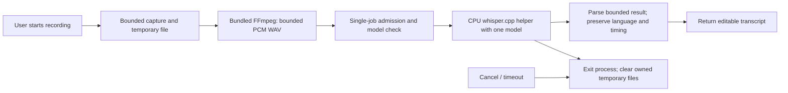

# Deferred Windows ASR: memory-efficient whisper.cpp

**Execution update, September 8:** the owner has now authorized Claude CLI implementation on a separate backlog branch (`lane/whisper-cpp-backlog-20260908`). The current GA candidate still excludes ASR. Adapter source tests, binary/model provenance, Windows memory/accuracy and installed microphone acceptance remain distinct gates. The design below remains the implementation basis.

**Original planning direction, September 8:** plan to use [whisper.cpp](https://github.com/ggml-org/whisper.cpp) efficiently. ASR/microphone remains **outside the current release**. This is a post-release design under CLWX-87, linked from the [main source study](OPENCLAW_WINDOWS_IMPROVEMENT_STUDY_2026-09-08.md) and [completion plan](../COMPLETION_PLAN.md). No binary/model was downloaded, built or tested for this study.

## Proposed design

Use a bundled CPU-only `whisper-cli.exe` in a short-lived child process. Load one quantized English model only when a transcription is requested; allow one job at a time; exit the process after completion/cancellation. Keep model weights on disk rather than resident in Electron or the Gateway. Start by comparing `base.en-q5_1` with `base.en-q8_0`; choose the smaller model only if it meets the same accuracy criteria. `tiny.en` is an explicit lower-resource candidate; `small.en` is an optional quality experiment, not a silent retry/default.

This avoids persistent ASR memory while idle and isolates native allocation lifetime. It trades repeated model loading for lower idle memory. A persistent worker with an idle timeout can be considered later only if measured repeated-dictation latency justifies its memory cost.

Transcription produces editable text; it must not automatically send an email or submit a form. Local inference needs no cloud key once its binary and model are available. Keep any existing cloud ASR option separate and explicit; no silent audio upload when a local model fails.

## Primary-source evidence and candidate identity

The September 8 [latest release API](https://api.github.com/repos/ggml-org/whisper.cpp/releases/latest) identified asset tag **`b4938`**, whose [release page](https://github.com/ggml-org/whisper.cpp/releases/tag/b4938) describes version **`v1.9.3`**. Both checked release records name commit `371b5a7561823ab2bb32142d2751e35e7534727b`. Record the resolved tag/commit, downloaded bytes and binary version again when implementation resumes.

The CPU x64 asset `whisper-bin-x64.zip` was listed as 8,361,840 bytes, with API digest `sha256:c2a4b60edb11f7e11a9191ffb50929535527d4d91c9903dbe3e554583bbbc63d`. **Metadata only:** it was not downloaded, hashed or executed here. Validate actual bundled executables/DLLs, architecture and CPU requirements; archive size is not installed size or RAM use. CUDA/BLAS packages are not the vanilla-Windows baseline.

The [tagged README](https://github.com/ggml-org/whisper.cpp/blob/b4938/README.md) documents Windows, CPU inference and quantized models. Its nominal memory table gives roughly 273 MB for tiny, 388 MB for base and 852 MB for small; these are not quantized Windows peak-process measurements. Smaller weights do not eliminate decoder state, work buffers, audio, allocator or child-process overhead.

The [model documentation](https://github.com/ggml-org/whisper.cpp/blob/b4938/models/README.md) links the [converted model repository](https://huggingface.co/ggerganov/whisper.cpp/tree/main). Observed file sizes below are discovery metadata, not pinned download receipts:

| Candidate | Approximate model file | Purpose |
|---|---|---|
| `base.en-q5_1` | 59.7 MB | First memory/accuracy experiment |
| `base.en-q8_0` | 81.8 MB | Higher-precision comparison; proposed fallback choice if q5 fails accuracy |
| `tiny.en-q8_0` | 32.2 MB | Lower-resource comparison; must disclose and measure quality tradeoff |
| `small.en-q5_1` | 190 MB | Optional quality comparison only after base fails the task corpus |

These are English-only models; Trinidadian English names and accent accuracy must be tested. Quantization quality and Windows RAM savings are **unknown until measured**. Pin the selected model to a resolved repository revision and verified SHA256/LFS identity before distribution; do not load a mutable `main` download silently.

The [CLI](https://github.com/ggml-org/whisper.cpp/blob/b4938/examples/cli/README.md) exposes model/file/thread/language, CPU-only and JSON-output options. Its advertised input formats and the top-level README differ; normalize to a known 16 kHz mono PCM16 WAV instead of depending on optional decoders. The [API](https://github.com/ggml-org/whisper.cpp/blob/b4938/include/whisper.h) also offers library integration, but this plan prefers process isolation over a native Electron addon. The [stream example](https://github.com/ggml-org/whisper.cpp/blob/b4938/examples/stream/README.md) has continuous microphone/SDL2 assumptions; it is a reference, not the initial product architecture.

## Memory policy — proposed, not implemented

| Allocation or work | Planned bound / lifecycle |
|---|---|
| Model | One selected model per ASR job. No pre-load at app startup; no simultaneous base/small contexts. Process exit releases process-owned allocations. OS file caching may remain and must not be reported as an application leak. |
| Jobs | One active ASR helper; reject a second request with a clear busy state or retain only a path/metadata in a bounded queue. Never queue full audio buffers. |
| Input | Initial clip mode: at most 5 minutes and 16 MiB of encoded upload; enforce duration during capture and decode, not only after loading the complete file. |
| Audio copies | Write bounded chunks to a private temporary file; avoid retaining base64 plus decoded Buffer plus full float samples in Main/renderer. Feed paths to child processes. |
| Decoded data | At 16 kHz mono, PCM16 uses 32,000 bytes/s and float32 uses 64,000 bytes/s: a 5-minute float copy is 19.2 MB. Account for every simultaneous copy and cap decode output. |
| Threads | Start with `max(1, min(4, available logical CPUs - 1))`; compare two vs four threads on 4-vCPU machines. Do not claim more threads are faster or memory-neutral. Keep UI/Gateway responsive. |
| FFmpeg/helper | Normalize and transcribe sequentially initially, reducing overlapping peaks; bound stderr/stdout collection and output JSON size. |
| Completion/error | In `finally`, close handles and remove only job-owned derived files. Preserve an explicitly user-owned source. No transcript or audio bodies in diagnostic logs. |
| Cancellation | Cancel the owned helper/process tree, wait for exit and report a typed terminal result. The next recording must work without app restart. |

For longer recordings, plan disk-backed ingestion and a fixed decode window with tested overlap/deduplication and timestamp continuity. Do not assume Whisper's internal 30-second processing window means its CLI holds only 30 seconds of audio in RAM. Test words/dates across chunk boundaries before enabling a long-meeting mode. VAD may reduce processed silence but adds its own model/state and can clip speech; compare memory and recognition with VAD disabled/enabled before adopting it.

## Existing code to reuse and change later

| Existing owner | Verified behavior / future change |
|---|---|
| [asr-ipc.ts](../../electron/main/asr-ipc.ts) | Owns saveBlob, normalization and provider selection. It currently prefers configured Azure, then platform-native paths, then Python-style Whisper CLI. Bound input/copies and add an explicit Windows whisper.cpp route through this owner. |
| [Windows adapter](../../electron/main/asr-native-windows.ts) | Currently invokes `WinSpeechRecognize.exe` / System.Speech, with typed timeout/error handling. Reuse the supervision contract, not its speech engine implementation. |
| [Mac whisper.cpp adapter](../../electron/main/asr-native-mac.ts) | Useful example of native CLI invocation/result parsing. Its Homebrew paths, Metal timings, cached model search and platform assumptions are not Windows acceptance evidence. |
| [ASR packaging](../../scripts/build-windows-asr-helper.mjs) and [installed evidence](../../scripts/installed-release-evidence.mjs) | Add pinned Windows whisper binaries/model/notice verification in the future workstream. Retain currently required helpers until an explicit migration removes their callers and revises their package contract. |
| [CLWX-87 corpus](../../eval/fixtures/clwx87-asr-manifest.json), [WER script](../../windows-pilot/scripts/pilot-asr-wer.ps1) and [microphone E2E](../../tests/e2e/chat-mic-wav.spec.ts) | Extend genuine failure coverage and representative recordings; test native Windows adapter invocation and cleanup separately from audio accuracy. |

**Not a binary rename:** the current fallback passes Python flags such as `--output_format`/`--output_dir` and selects `small.en`; whisper.cpp uses a different CLI/output contract and an explicit model file. Never substitute `whisper-cli.exe` behind that path without an adapter and tests. Locale `en-TT` should map to supported language `en` while retaining locale metadata; sanitizing it into `enTT` is not correct language mapping.

## Proposed acceptance criteria for CLWX-87

All thresholds below are **initial engineering targets**, not approved/measured product guarantees. Revisit only through a recorded decision with evidence; do not quietly raise a budget to obtain a pass.

| Criterion | Proposed measurable target |
|---|---|
| Hardware/class | Clean Windows 10/11 standard user, 4 logical CPUs / 8 GiB RAM, CPU-only/no CUDA, no Python, no global Whisper/Node and no developer caches |
| Default memory | Compare base q5/q8. Target helper-tree peak Working Set and private bytes each ≤700 MiB for accepted ≤5-minute clips; additionally target ≤512 MiB for q5 on 10–30s clips. Report maximum and p95, not weights size alone. |
| Low-resource option | Tiny q8 target ≤450 MiB helper-tree peak; promote it only if the task accuracy criterion holds or the lower-quality option is explicitly documented |
| Whole-app overhead | Measure renderer/Main/Gateway plus FFmpeg/helper. Parent process incremental private bytes target ≤64 MiB, measured against an idle baseline with unrelated model jobs stopped |
| Idle/cancel cleanup | No ASR helper or model-resident worker within 5s of normal completion, cancellation or timeout; no growing job/temp-file count after 20 repeated clips; parent returns within 32 MiB of its pre-series private-byte baseline after 30s idle |
| Speed | On the declared machine, p95 saved-audio-to-text ≤8s for 5s clips and ≤45s for 30s clips. Measure cold model load separately; 5-minute clips target real-time factor ≤1.5. UI remains usable. |
| Accuracy | Fixed corpus with at least 40 clips/2,000 reference words, including Trinidadian speakers, MoE vocabulary, dates/numbers, clean/noisy audio and silence. Proposed clean-speech aggregate WER ≤15%; publish every subgroup and entity-error result. Compare System.Speech and available existing cloud evidence without concealing worse subgroups. |
| Critical facts | Exact dates/numbers and named entities in a small curated acceptance subset; report uncertain/incorrect transcription for user review rather than automatic downstream action |
| Silence and failures | Silence yields no invented sentence; missing/corrupt model, unsupported CPU, denied recording, oversized input and helper crash return typed actionable outcomes; next job succeeds after correction |
| Distribution/privacy | Exact binary/model hashes and notices; no administrative install or first-recording package download; local transcription works with non-loopback network blocked; no silent cloud fallback |

Observe process memory throughout capture → save → normalization → model load → inference → cleanup, including child processes. Use identical audio, threads, decoding parameters and CPU load across candidates; collect at least 20 timing/memory runs per selected candidate and report sample size. Disk-cold and OS-cache-warm observations are separate. The [upstream benchmark](https://github.com/ggml-org/whisper.cpp/blob/b4938/examples/bench/README.md) helps isolate model compute, but it cannot replace end-to-end app measurements.

## Delivery and sequencing

1. **Now:** finish this plan and update CLWX-87/OKR scope. No ASR source or release dependency changes.
2. **After current release and a resumed ASR workstream:** pin/review binary and model provenance; collect the existing and representative reference corpus in parallel with adapter/package design.
3. Implement the supervised Windows adapter and bounded capture/normalization. Run focused invocation/error/cleanup tests; do not install CMake/Python on the principal machine.
4. Compare quantization/model candidates sequentially on the same Windows hardware, one helper at a time. Select the smallest passing candidate; document rejected alternatives.
5. Package once the measured dependency/quality criteria pass; verify offline first use, actual microphone, cancellation, repeated jobs and unaided user workflow on that exact installer.

whisper.cpp [source license](https://github.com/ggml-org/whisper.cpp/blob/b4938/LICENSE) is MIT; the converted model repository identifies MIT terms. Retain the relevant source/model notices, verify the selected model's provenance, and preserve FFmpeg's existing notices. A successful metadata fetch is not release-artifact verification.

No persistent server, continuous listening, GPU package, automatic larger-model retry or cloud upload is selected for the initial design. Their benefits and costs can be evaluated later without reopening the current release scope.
